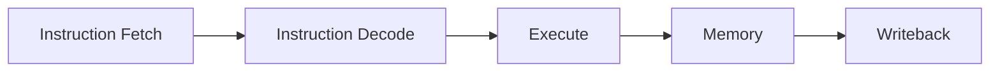
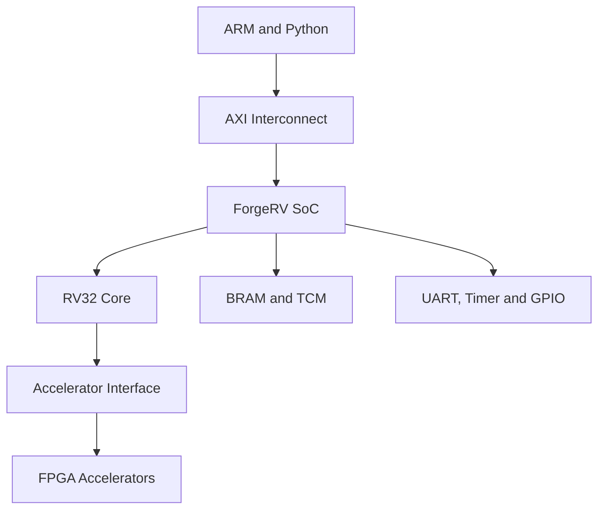

# RISC-V FPGA CPU

A custom RISC-V processor implemented in SystemVerilog for the PYNQ-Z2 FPGA.

The final architecture and specialized use case are currently being defined.

ForgeRV will be a custom 32-bit RISC-V processor and small SoC implemented from scratch
on the PYNQ-Z2 development board in Verilog, SystemVerilog, Python and C. 

The complete processor would ideally support:
|Area|Planned Feature|
|---|---|
|ISA| RV32IMC|
|Pipeline| Five-stage, single-issue, in-order |
|Memory| BRAM/TCM initially, caches later on |
|Arithmetic| Harware Multiplication and Division |
|System| CSRs, exceptions and interrupts | 
|Control Flow| Branch Prediction and return-address stack | 
|Hazards| Forwarding, stalls abd pipeline flushing |
|System| CSRs, exceptions, timer and external interrupts |
|Protection| Physical Memory Protection |
|Debugging| Halt, step, register inspection and performance counters|
|On board Communication|AXI4 memory-mapped and AXI4-Stream|
|Special Feature| Custom Accelerator and DSP instruction extension |

## Core Pipeline

Instruction Fetch: 
 - Holds program counter
 - Requests instruction/s from memory
 - Calculates next sequential address
 - Redirects execution after jums, branches and exceptions

Instruction Decode: 
 - Decodes opcode and function fields
 - Reads register file
 - Generates immediate values
 - produces control signals for later stages 
 - Detects some pipeline dependencies

Execute:
 - Runs ALU
 - Compares branch operands and calculates branch targets
 - Calculates store/load addresses
 - Runs multiply/divide instructions

Memory:
 - Performs loads and stores
 - Handles byte enables and alignment of data
 - Communicates with memory and peripherals

Writeback:
 - Writes result into one of 32 registers
 - Selects between ALU, memory, multiplication, etc. 
 - Never writes to x0, which is always 0 

## System Level Architecture 

