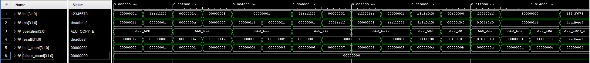

# Phase 1 — RV32I Arithmetic Logic Unit

## Objective

The objective of this phase was to implement and verify the first datapath component of ForgeRV: a 32-bit combinational Arithmetic Logic Unit (ALU).

The ALU receives two 32-bit operands, `lhs` and `rhs`, together with an operation selector. It produces a 32-bit result without using a clock or internal state. The future ForgeRV decoder will select the operation and determine whether each operand comes from a register, an immediate, the program counter, or another datapath source.

The implemented operations cover the arithmetic, comparison, logical, and shift behavior required by the RV32I datapath. An internal `COPY_B` operation is also provided for instructions that need to pass an immediate or second operand directly to writeback.

## ALU Interface

```systemverilog
module rv32_alu (
    input  logic [31:0]       lhs,
    input  logic [31:0]       rhs,
    input  rv32_pkg::alu_op_t operation,
    output logic [31:0]       result
);
```

| Port | Direction | Width | Description |
|---|---|---:|---|
| `lhs` | Input | 32 bits | Left-hand ALU operand |
| `rhs` | Input | 32 bits | Right-hand ALU operand or decoded immediate |
| `operation` | Input | 4 bits | Enumerated ALU operation selected by the decoder |
| `result` | Output | 32 bits | Combinational result of the selected operation |

## Operation Enumeration

The ALU operation names are stored in `rv32_pkg.sv` using a SystemVerilog enumerated type. This makes the control signals readable and avoids using unexplained numeric constants throughout the design.

```systemverilog
package rv32_pkg;

    typedef enum logic [3:0] {
        ALU_ADD    = 4'd0,
        ALU_SUB    = 4'd1,
        ALU_SLL    = 4'd2,
        ALU_SLT    = 4'd3,
        ALU_SLTU   = 4'd4,
        ALU_XOR    = 4'd5,
        ALU_SRL    = 4'd6,
        ALU_SRA    = 4'd7,
        ALU_OR     = 4'd8,
        ALU_AND    = 4'd9,
        ALU_COPY_B = 4'd10
    } alu_op_t;

endpackage
```

## ALU Implementation

```systemverilog
module rv32_alu (
    input  logic [31:0]       lhs,
    input  logic [31:0]       rhs,
    input  rv32_pkg::alu_op_t operation,
    output logic [31:0]       result
);

    import rv32_pkg::*;

    always_comb begin
        case (operation)
            ALU_ADD:    result = lhs + rhs;
            ALU_SUB:    result = lhs - rhs;
            ALU_SLL:    result = lhs << rhs[4:0];
            ALU_SLT:    result = {31'b0, $signed(lhs) < $signed(rhs)};
            ALU_SLTU:   result = {31'b0, lhs < rhs};
            ALU_XOR:    result = lhs ^ rhs;
            ALU_SRL:    result = lhs >> rhs[4:0];
            ALU_SRA:    result = $signed(lhs) >>> rhs[4:0];
            ALU_OR:     result = lhs | rhs;
            ALU_AND:    result = lhs & rhs;
            ALU_COPY_B: result = rhs;
            default:    result = 32'b0;
        endcase
    end

endmodule
```

The `always_comb` block represents combinational hardware. Every possible operation assigns `result`, including the `default` case, so the ALU does not infer a latch.

Vivado maps the arithmetic operators onto FPGA hardware. Addition and subtraction can use the Zynq-7020 carry-chain resources, while the bitwise operations are implemented in parallel LUT logic. The variable shifts infer barrel-shifter logic.

## Operation Summary

| ALU operation | Expression | Function |
|---|---|---|
| `ALU_ADD` | `lhs + rhs` | 32-bit addition |
| `ALU_SUB` | `lhs - rhs` | 32-bit subtraction |
| `ALU_SLL` | `lhs << rhs[4:0]` | Logical left shift |
| `ALU_SLT` | `$signed(lhs) < $signed(rhs)` | Signed less-than comparison |
| `ALU_SLTU` | `lhs < rhs` | Unsigned less-than comparison |
| `ALU_XOR` | `lhs ^ rhs` | Bitwise exclusive OR |
| `ALU_SRL` | `lhs >> rhs[4:0]` | Logical right shift |
| `ALU_SRA` | `$signed(lhs) >>> rhs[4:0]` | Arithmetic right shift |
| `ALU_OR` | `lhs \| rhs` | Bitwise OR |
| `ALU_AND` | `lhs & rhs` | Bitwise AND |
| `ALU_COPY_B` | `rhs` | Pass the right-hand operand through unchanged |

## ADD — Addition

`ALU_ADD` adds the two 32-bit operands and retains the lower 32 bits of the result.

```text
lhs    = 10
rhs    = 20
result = 30
```

Example assembly instruction:

```assembly
add x3, x1, x2
```

This means:

```text
x3 <- x1 + x2
```

Signed and unsigned addition use the same hardware because two's-complement addition produces the same output bits in both interpretations. RV32I does not expose a carry flag or generate a signed-overflow exception for `ADD`.

Wraparound example:

```text
0xFFFFFFFF + 0x00000001 = 0x00000000
```

The internal carry-out is discarded.

## SUB — Subtraction

`ALU_SUB` subtracts `rhs` from `lhs` and retains the lower 32 bits.

```text
lhs    = 20
rhs    = 10
result = 10
```

Example assembly instruction:

```assembly
sub x3, x1, x2
```

This means:

```text
x3 <- x1 - x2
```

Wraparound example:

```text
5 - 7 = -2 = 0xFFFFFFFE
```

ForgeRV does not require separate signed and unsigned subtraction operations because the lower 32 result bits are identical. Signedness only changes how those bits are interpreted.

## SLL — Shift Left Logical

`ALU_SLL` shifts `lhs` to the left and fills the vacant low-order positions with zeros.

```text
0x00000001 << 31 = 0x80000000
```

Only `rhs[4:0]` is used as the shift amount. Five bits represent every valid RV32 shift distance from 0 through 31.

Consequently:

```text
rhs = 33 = 0b100001
rhs[4:0] = 0b00001 = 1

0x00000001 << 1 = 0x00000002
```

The register and immediate instructions use the same ALU operation:

```assembly
sll  x3, x1, x2
slli x3, x1, 5
```

The decoder will determine whether the shift amount comes from a register or the instruction immediate.

## SLT — Signed Set Less Than

`ALU_SLT` interprets both operands as signed two's-complement numbers. The result is `1` when `lhs` is less than `rhs`; otherwise it is `0`.

```text
lhs = 0xFFFFFFFF = -1 signed
rhs = 0x00000001 =  1 signed

-1 < 1 -> result = 0x00000001
```

The explicit `$signed` conversions are required because the input ports are otherwise treated as unsigned vectors.

Example instruction:

```assembly
slt x3, x1, x2
```

## SLTU — Unsigned Set Less Than

`ALU_SLTU` compares the same bit patterns as unsigned integers.

```text
lhs = 0xFFFFFFFF = 4,294,967,295 unsigned
rhs = 0x00000001 = 1 unsigned

4,294,967,295 < 1 -> result = 0x00000000
```

This deliberately produces the opposite result from the signed comparison of `0xFFFFFFFF` and `1`.

Example instruction:

```assembly
sltu x3, x1, x2
```

## XOR — Bitwise Exclusive OR

`ALU_XOR` compares corresponding operand bits. A result bit is `1` when the two input bits differ.

```text
0 XOR 0 = 0
0 XOR 1 = 1
1 XOR 0 = 1
1 XOR 1 = 0
```

Tested example:

```text
0xA5A5F0F0 XOR 0x5A5A0FF0 = 0xFFFFFF00
```

Example instruction:

```assembly
xor x3, x1, x2
```

## SRL — Shift Right Logical

`ALU_SRL` shifts `lhs` to the right and inserts zeros into the vacated high-order positions.

```text
0x80000000 >> 31 = 0x00000001
```

The original sign bit is not preserved because this is a logical shift.

Example instruction:

```assembly
srl x3, x1, x2
```

## SRA — Shift Right Arithmetic

`ALU_SRA` shifts `lhs` to the right while copying the original sign bit into the vacated high-order positions.

```text
0x80000000 interpreted as signed = -2,147,483,648

0x80000000 >>> 31 = 0xFFFFFFFF
```

The `$signed(lhs)` conversion and `>>>` operator cause sign extension. This is the essential difference between `SRA` and `SRL`.

Example instruction:

```assembly
sra x3, x1, x2
```

## OR — Bitwise OR

`ALU_OR` produces `1` when either corresponding input bit is `1`.

```text
0xF0F00000 OR 0x00000F0F = 0xF0F00F0F
```

Example instruction:

```assembly
or x3, x1, x2
```

## AND — Bitwise AND

`ALU_AND` produces `1` only when both corresponding input bits are `1`.

```text
0xFFFF00FF AND 0x0F0FF0F0 = 0x0F0F00F0
```

Example instruction:

```assembly
and x3, x1, x2
```

## COPY_B — Pass Right Operand

`ALU_COPY_B` copies `rhs` directly to `result`:

```text
lhs    = 0x12345678
rhs    = 0xDEADBEEF
result = 0xDEADBEEF
```

`COPY_B` is an internal ForgeRV datapath operation rather than a separately encoded RV32I instruction. It is useful when an instruction such as `LUI` needs to place a decoded immediate into a destination register without performing arithmetic.

## Why There Is No Separate ADDI Operation

At the ALU level, `ADD` and `ADDI` perform identical addition:

```text
ADD  -> lhs is a register, rhs is a register
ADDI -> lhs is a register, rhs is a sign-extended immediate
```

The future operand-selection multiplexers and decoder determine the source of `rhs`. The ALU therefore needs only one `ALU_ADD` operation.

## Testbench Strategy

The testbench is self-checking. Its `check_alu` task:

1. Applies an operation and two operands.
2. Waits `1 ns` for the combinational result to propagate.
3. Compares `result` against the expected 32-bit value using case inequality (`!==`).
4. Prints `PASS` or `FAIL`.
5. Increments the test and failure counters.

No clock is required because `rv32_alu` contains only combinational logic.

The testbench finishes successfully only when every expected result matches. Any failure increments `failure_count`, prints the incorrect inputs and outputs, and causes `$fatal` at the end of the test sequence.

## Testbench Source

```systemverilog
`timescale 1ns / 1ps

module rv32_alu_tb;

    import rv32_pkg::*;

    logic [31:0] lhs;
    logic [31:0] rhs;
    alu_op_t     operation;
    logic [31:0] result;

    integer test_count;
    integer failure_count;

    rv32_alu dut (
        .lhs       (lhs),
        .rhs       (rhs),
        .operation (operation),
        .result    (result)
    );

    task automatic check_alu (
        input alu_op_t     test_operation,
        input logic [31:0] test_lhs,
        input logic [31:0] test_rhs,
        input logic [31:0] expected_result,
        input string       test_name
    );
        begin
            operation = test_operation;
            lhs       = test_lhs;
            rhs       = test_rhs;

            #1;

            test_count = test_count + 1;

            if (result !== expected_result) begin
                failure_count = failure_count + 1;

                $display(
                    "FAIL: %s lhs=%h rhs=%h expected=%h result=%h",
                    test_name,
                    lhs,
                    rhs,
                    expected_result,
                    result
                );
            end
            else begin
                $display(
                    "PASS: %s result=%h",
                    test_name,
                    result
                );
            end
        end
    endtask

    initial begin
        lhs           = 32'b0;
        rhs           = 32'b0;
        operation     = ALU_ADD;
        test_count    = 0;
        failure_count = 0;

        check_alu(ALU_ADD, 32'd10, 32'd20,
                  32'd30, "ADD normal");

        check_alu(ALU_ADD, 32'hFFFF_FFFF, 32'd1,
                  32'h0000_0000, "ADD wraparound");

        check_alu(ALU_SUB, 32'd20, 32'd10,
                  32'd10, "SUB normal");

        check_alu(ALU_SUB, 32'd5, 32'd7,
                  32'hFFFF_FFFE, "SUB wraparound");

        check_alu(ALU_SLL, 32'h0000_0001, 32'd31,
                  32'h8000_0000, "SLL by 31");

        check_alu(ALU_SLL, 32'h0000_0001, 32'd33,
                  32'h0000_0002, "SLL lower five bits");

        check_alu(ALU_SLT, 32'hFFFF_FFFF, 32'd1,
                  32'd1, "SLT negative less than positive");

        check_alu(ALU_SLT, 32'd1, 32'hFFFF_FFFF,
                  32'd0, "SLT positive not less than negative");

        check_alu(ALU_SLTU, 32'hFFFF_FFFF, 32'd1,
                  32'd0, "SLTU maximum not less than one");

        check_alu(ALU_SLTU, 32'd1, 32'hFFFF_FFFF,
                  32'd1, "SLTU one less than maximum");

        check_alu(ALU_XOR, 32'hA5A5_F0F0, 32'h5A5A_0FF0,
                  32'hFFFF_FF00, "XOR");

        check_alu(ALU_OR, 32'hF0F0_0000, 32'h0000_0F0F,
                  32'hF0F0_0F0F, "OR");

        check_alu(ALU_AND, 32'hFFFF_00FF, 32'h0F0F_F0F0,
                  32'h0F0F_00F0, "AND");

        check_alu(ALU_SRL, 32'h8000_0000, 32'd31,
                  32'h0000_0001, "SRL by 31");

        check_alu(ALU_SRA, 32'h8000_0000, 32'd31,
                  32'hFFFF_FFFF, "SRA sign extension");

        check_alu(ALU_COPY_B, 32'h1234_5678, 32'hDEAD_BEEF,
                  32'hDEAD_BEEF, "COPY_B");

        if (failure_count == 0) begin
            $display(
                "All %0d rv32_alu tests passed.",
                test_count
            );
        end
        else begin
            $fatal(
                1,
                "%0d of %0d rv32_alu tests failed.",
                failure_count,
                test_count
            );
        end

        $finish;
    end

endmodule
```

## Test Coverage

| Test | Operation | `lhs` | `rhs` | Expected result | Purpose |
|---:|---|---:|---:|---:|---|
| 1 | ADD | `0x0000000A` | `0x00000014` | `0x0000001E` | Normal addition |
| 2 | ADD | `0xFFFFFFFF` | `0x00000001` | `0x00000000` | 32-bit wraparound |
| 3 | SUB | `0x00000014` | `0x0000000A` | `0x0000000A` | Normal subtraction |
| 4 | SUB | `0x00000005` | `0x00000007` | `0xFFFFFFFE` | Negative result/wraparound |
| 5 | SLL | `0x00000001` | `31` | `0x80000000` | Maximum RV32 left shift |
| 6 | SLL | `0x00000001` | `33` | `0x00000002` | Only `rhs[4:0]` controls shifting |
| 7 | SLT | `0xFFFFFFFF` | `0x00000001` | `0x00000001` | Signed `-1 < 1` |
| 8 | SLT | `0x00000001` | `0xFFFFFFFF` | `0x00000000` | Signed `1 < -1` is false |
| 9 | SLTU | `0xFFFFFFFF` | `0x00000001` | `0x00000000` | Unsigned maximum is not below one |
| 10 | SLTU | `0x00000001` | `0xFFFFFFFF` | `0x00000001` | Unsigned one is below maximum |
| 11 | XOR | `0xA5A5F0F0` | `0x5A5A0FF0` | `0xFFFFFF00` | Bitwise XOR pattern |
| 12 | OR | `0xF0F00000` | `0x00000F0F` | `0xF0F00F0F` | Bitwise OR pattern |
| 13 | AND | `0xFFFF00FF` | `0x0F0FF0F0` | `0x0F0F00F0` | Bitwise AND pattern |
| 14 | SRL | `0x80000000` | `31` | `0x00000001` | Logical zero fill |
| 15 | SRA | `0x80000000` | `31` | `0xFFFFFFFF` | Arithmetic sign extension |
| 16 | COPY_B | `0x12345678` | `0xDEADBEEF` | `0xDEADBEEF` | Right operand passthrough |

## Vivado Testbench Output

The relevant XSim console output was:

```text
PASS: ADD normal result=0000001e
PASS: ADD wraparound result=00000000
PASS: SUB normal result=0000000a
PASS: SUB wraparound result=fffffffe
PASS: SLL by 31 result=80000000
PASS: SLL lower five bits result=00000002
PASS: SLT negative less than positive result=00000001
PASS: SLT positive not less than negative result=00000000
PASS: SLTU maximum not less than one result=00000000
PASS: SLTU one less than maximum result=00000001
PASS: XOR result=ffffff00
PASS: OR result=f0f00f0f
PASS: AND result=0f0f00f0
PASS: SRL by 31 result=00000001
PASS: SRA sign extension result=ffffffff
PASS: COPY_B result=deadbeef
All 16 rv32_alu tests passed.
```

## Waveform Verification



The waveform displays the following signals:

- `lhs[31:0]`: first operand applied by the testbench.
- `rhs[31:0]`: second operand or shift amount.
- `operation[3:0]`: enumerated ALU operation decoded by Vivado.
- `result[31:0]`: combinational ALU output.
- `test_count[31:0]`: number of checks completed at the selected simulation time.
- `failure_count[31:0]`: accumulated test failures.

Each change in `operation`, `lhs`, and `rhs` is followed by the expected `result`. The `failure_count` remains zero for the entire run. The value pane can show `test_count = 15` depending on the selected cursor time or final simulation delta; the XSim summary is produced only after all 16 `check_alu` calls complete and confirms that all 16 passed.

## Result

The Phase 1 ALU implementation passed all 16 directed tests with zero failures. The verified design correctly implements:

- 32-bit addition and subtraction with RV32 wraparound behavior.
- Logical left and right shifts using the lower five shift-amount bits.
- Arithmetic right shifting with sign extension.
- Signed and unsigned less-than comparisons.
- Parallel XOR, OR, and AND operations.
- Direct propagation of the right-hand operand.

The ALU is ready to be integrated with the ForgeRV register file, immediate generator, decoder, and later Execute-stage pipeline registers.
