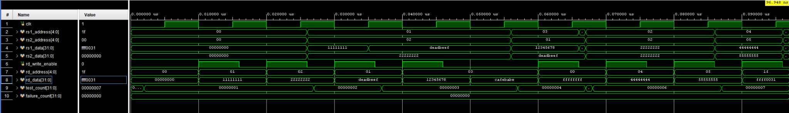

# Phase 2 — RV32 Register File

## Objective

The objective of Phase 2 was to implement and verify ForgeRV's integer register file: the small, fast storage structure that holds the architectural registers `x0` through `x31`.

The register file provides two independent combinational read ports and one synchronous write port. This matches the requirements of common RISC-V instructions, which can read two source registers and write one destination register.

For example:

```assembly
add x3, x1, x2
```

requires the processor to:

1. Read `x1` and `x2` simultaneously.
2. Send both values to the ALU.
3. Write the ALU result into `x3` on a later clock edge.

## Register-File Architecture

The register file contains 32 entries, each 32 bits wide:

```text
32 registers × 32 bits = 1,024 bits
```

The internal storage declaration is:

```systemverilog
logic [31:0] registers [0:31];
```

Each array index corresponds directly to a RISC-V register number:

| Array entry | RISC-V register |
|---:|---|
| `registers[0]` | `x0` |
| `registers[1]` | `x1` |
| `registers[2]` | `x2` |
| ... | ... |
| `registers[31]` | `x31` |

Five address bits are sufficient to select one of the 32 registers because:

```text
2^5 = 32
```

## Interface

```systemverilog
module rv32_regfile (
    input  logic        clk,

    input  logic [4:0]  rs1_address,
    input  logic [4:0]  rs2_address,
    output logic [31:0] rs1_data,
    output logic [31:0] rs2_data,

    input  logic        rd_write_enable,
    input  logic [4:0]  rd_address,
    input  logic [31:0] rd_data
);
```

| Port | Direction | Width | Function |
|---|---|---:|---|
| `clk` | Input | 1 bit | Rising-edge clock used by the write port |
| `rs1_address` | Input | 5 bits | Selects the first source register |
| `rs2_address` | Input | 5 bits | Selects the second source register |
| `rs1_data` | Output | 32 bits | Current value of the first source register |
| `rs2_data` | Output | 32 bits | Current value of the second source register |
| `rd_write_enable` | Input | 1 bit | Enables a destination-register write |
| `rd_address` | Input | 5 bits | Selects the destination register |
| `rd_data` | Input | 32 bits | Value written into the destination register |

The signal names correspond to the RISC-V instruction fields:

- `rs1`: source register 1.
- `rs2`: source register 2.
- `rd`: destination register.

For most instructions, the future decoder will extract these addresses from:

```text
instruction[19:15] -> rs1_address
instruction[24:20] -> rs2_address
instruction[11:7]  -> rd_address
```

## Register-File Implementation

```systemverilog
module rv32_regfile (
    input  logic        clk,

    input  logic [4:0]  rs1_address,
    input  logic [4:0]  rs2_address,
    output logic [31:0] rs1_data,
    output logic [31:0] rs2_data,

    input  logic        rd_write_enable,
    input  logic [4:0]  rd_address,
    input  logic [31:0] rd_data
);

    logic [31:0] registers [0:31];

    assign rs1_data =
        (rs1_address == 5'd0)
        ? 32'b0
        : registers[rs1_address];

    assign rs2_data =
        (rs2_address == 5'd0)
        ? 32'b0
        : registers[rs2_address];

    always_ff @(posedge clk) begin
        if (rd_write_enable && (rd_address != 5'd0))
            registers[rd_address] <= rd_data;
    end

endmodule
```

## Combinational Read Ports

Both read ports are combinational:

```systemverilog
assign rs1_data =
    (rs1_address == 5'd0)
    ? 32'b0
    : registers[rs1_address];
```

Changing `rs1_address` or `rs2_address` selects a new register without waiting for a clock edge.

For example:

```text
rs1_address = 5'd1 -> rs1_data displays x1
rs1_address = 5'd8 -> rs1_data displays x8
```

The two independent ports allow both source operands to be available to the ALU simultaneously. No read-enable signal is required; instructions that do not need one of the ports simply ignore that output.

## Synchronous Write Port

Register writes occur only on a rising clock edge:

```systemverilog
always_ff @(posedge clk) begin
    if (rd_write_enable && (rd_address != 5'd0))
        registers[rd_address] <= rd_data;
end
```

A write requires both:

- `rd_write_enable = 1`.
- `rd_address` must not be zero.

Example:

```text
rd_write_enable = 1
rd_address      = 5'd4
rd_data         = 32'd100

At the next rising edge:
x4 <- 100
```

If `rd_write_enable` is zero, the selected register retains its previous value.

## Register x0

RISC-V specifies that `x0` always reads as zero. Any attempted write to `x0` must have no effect.

Reads are forced to zero using:

```systemverilog
(rs1_address == 5'd0) ? 32'b0 : registers[rs1_address]
```

Writes are rejected using:

```systemverilog
rd_write_enable && (rd_address != 5'd0)
```

The physical contents of `registers[0]` therefore do not matter because the module never exposes them and never intentionally writes them.

## Why There Is No Reset

The register-file module intentionally has no reset input.

RISC-V guarantees the value of `x0`, but it does not require every other general-purpose register to be cleared when the processor resets. Registers `x1` through `x31` are undefined until software initializes them.

Resetting the complete array would:

- Add reset routing to all register bits.
- Consume unnecessary FPGA resources.
- Potentially interfere with efficient register-file memory inference.

The future CPU reset will instead reset essential control state such as the program counter, pipeline-valid bits, control registers, and exception state. Assembly programs must initialize every ordinary register before relying on its value.

## How Instructions Use the Register File

| Instruction | Read port 1 | Read port 2 | Write destination |
|---|---|---|---|
| `add x3,x1,x2` | `x1` | `x2` | `x3` receives ALU result |
| `addi x3,x1,5` | `x1` | Ignored | `x3` receives ALU result |
| `lw x3,0(x1)` | `x1` | Ignored | `x3` receives memory data |
| `sw x3,0(x1)` | `x1` | `x3` | No register write |
| `beq x1,x2,label` | `x1` | `x2` | No register write |
| `jal x1,label` | Usually ignored | Ignored | `x1` receives return address |

The register file does not decode or execute any of these instructions. It responds only to the addresses, data, and write-enable signal supplied by the decoder and writeback logic.

## Testbench Strategy

The testbench generates a 10 ns clock period:

```systemverilog
initial begin
    clk = 1'b0;
    forever #5 clk = ~clk;
end
```

Two reusable tasks perform the verification:

- `write_register`: drives the destination address and data on a falling edge, asserts write enable, and allows the write to occur at the following rising edge.
- `check_reads`: selects two source registers, waits for combinational propagation, and compares both outputs against their expected values.

Driving write inputs on the falling edge avoids a race with the register file's rising-edge write logic.

The read checker uses case inequality (`!==`) so that an unknown `X` value also counts as a failure.

## Testbench Source

```systemverilog
`timescale 1ns / 1ps

module rv32_regfile_tb;

    logic        clk;

    logic [4:0]  rs1_address;
    logic [4:0]  rs2_address;
    logic [31:0] rs1_data;
    logic [31:0] rs2_data;

    logic        rd_write_enable;
    logic [4:0]  rd_address;
    logic [31:0] rd_data;

    integer test_count;
    integer failure_count;

    rv32_regfile dut (
        .clk             (clk),
        .rs1_address     (rs1_address),
        .rs2_address     (rs2_address),
        .rs1_data        (rs1_data),
        .rs2_data        (rs2_data),
        .rd_write_enable (rd_write_enable),
        .rd_address      (rd_address),
        .rd_data         (rd_data)
    );

    initial begin
        clk = 1'b0;
        forever #5 clk = ~clk;
    end

    task automatic write_register (
        input logic [4:0]  address,
        input logic [31:0] data
    );
        begin
            @(negedge clk);

            rd_write_enable = 1'b1;
            rd_address      = address;
            rd_data         = data;

            @(posedge clk);
            #1;

            rd_write_enable = 1'b0;
        end
    endtask

    task automatic check_reads (
        input logic [4:0]  address_1,
        input logic [4:0]  address_2,
        input logic [31:0] expected_1,
        input logic [31:0] expected_2,
        input string       test_name
    );
        begin
            rs1_address = address_1;
            rs2_address = address_2;

            #1;

            test_count = test_count + 1;

            if ((rs1_data !== expected_1) ||
                (rs2_data !== expected_2)) begin

                failure_count = failure_count + 1;

                $display(
                    "FAIL: %s rs1=x%0d data=%h expected=%h rs2=x%0d data=%h expected=%h",
                    test_name,
                    address_1,
                    rs1_data,
                    expected_1,
                    address_2,
                    rs2_data,
                    expected_2
                );
            end
            else begin
                $display(
                    "PASS: %s rs1=%h rs2=%h",
                    test_name,
                    rs1_data,
                    rs2_data
                );
            end
        end
    endtask

    initial begin
        rs1_address     = 5'd0;
        rs2_address     = 5'd0;
        rd_write_enable = 1'b0;
        rd_address      = 5'd0;
        rd_data         = 32'b0;

        test_count      = 0;
        failure_count   = 0;

        #1;

        check_reads(
            5'd0, 5'd0,
            32'b0, 32'b0,
            "x0 reads as zero"
        );

        write_register(5'd1, 32'h1111_1111);
        write_register(5'd2, 32'h2222_2222);

        check_reads(
            5'd1, 5'd2,
            32'h1111_1111, 32'h2222_2222,
            "simultaneous reads"
        );

        write_register(5'd1, 32'hDEAD_BEEF);

        check_reads(
            5'd1, 5'd2,
            32'hDEAD_BEEF, 32'h2222_2222,
            "register overwrite"
        );

        write_register(5'd3, 32'h1234_5678);

        @(negedge clk);
        rd_write_enable = 1'b0;
        rd_address      = 5'd3;
        rd_data         = 32'hCAFE_BABE;

        @(posedge clk);
        #1;

        check_reads(
            5'd3, 5'd1,
            32'h1234_5678, 32'hDEAD_BEEF,
            "disabled write ignored"
        );

        write_register(5'd0, 32'hFFFF_FFFF);

        check_reads(
            5'd0, 5'd1,
            32'b0, 32'hDEAD_BEEF,
            "write to x0 ignored"
        );

        check_reads(
            5'd2, 5'd2,
            32'h2222_2222, 32'h2222_2222,
            "same register on both read ports"
        );

        write_register(5'd4, 32'h4444_4444);
        write_register(5'd5, 32'h5555_5555);

        check_reads(
            5'd4, 5'd5,
            32'h4444_4444, 32'h5555_5555,
            "back-to-back writes"
        );

        write_register(5'd31, 32'hFFFF_0031);

        check_reads(
            5'd31, 5'd0,
            32'hFFFF_0031, 32'b0,
            "highest register address"
        );

        if (failure_count == 0) begin
            $display(
                "All %0d rv32_regfile tests passed.",
                test_count
            );
        end
        else begin
            $fatal(
                1,
                "%0d of %0d rv32_regfile tests failed.",
                failure_count,
                test_count
            );
        end

        $finish;
    end

endmodule
```

## Test Coverage

| Test | Operation | Expected result |
|---:|---|---|
| 1 | Read `x0` using both ports | Both ports return `0x00000000` |
| 2 | Write `x1` and `x2`, then read simultaneously | `rs1_data=0x11111111`, `rs2_data=0x22222222` |
| 3 | Overwrite `x1` | `x1=0xDEADBEEF`; `x2` remains unchanged |
| 4 | Attempt to overwrite `x3` with write enable low | `x3` retains `0x12345678` |
| 5 | Attempt to write `0xFFFFFFFF` into `x0` | `x0` still returns zero |
| 6 | Select `x2` on both read ports | Both outputs return `0x22222222` |
| 7 | Write `x4` and `x5` on consecutive clock edges | Both new values are retained correctly |
| 8 | Write and read the highest address, `x31` | `x31=0xFFFF0031` and `x0=0` |

## Vivado Testbench Output

The relevant XSim console output was:

```text
PASS: x0 reads as zero rs1=00000000 rs2=00000000
PASS: simultaneous reads rs1=11111111 rs2=22222222
PASS: register overwrite rs1=deadbeef rs2=22222222
PASS: disabled write ignored rs1=12345678 rs2=deadbeef
PASS: write to x0 ignored rs1=00000000 rs2=deadbeef
PASS: same register on both read ports rs1=22222222 rs2=22222222
PASS: back-to-back writes rs1=44444444 rs2=55555555
PASS: highest register address rs1=ffff0031 rs2=00000000
All 8 rv32_regfile tests passed.
$finish called at time : 97 ns
```

The simulation completed with zero functional failures.

## Waveform Verification



The waveform shows:

- `clk`: the 10 ns testbench clock.
- `rs1_address` and `rs2_address`: the two independently selected source registers.
- `rs1_data` and `rs2_data`: the corresponding combinational read values.
- `rd_write_enable`: high only when a write is intended.
- `rd_address`: the destination selected for the next rising-edge write.
- `rd_data`: the value presented to the write port.
- `test_count`: the number of completed read checks at the selected cursor time.
- `failure_count`: zero throughout the complete simulation.

The waveform demonstrates that ordinary writes become visible after rising clock edges. During the disabled-write test, `rd_data` changes to `0xCAFEBABE` while `rd_write_enable` remains low, so `x3` correctly retains `0x12345678`. During the attempted `x0` write, `rd_data` is `0xFFFFFFFF`, but reading address zero still returns `0x00000000`.

The displayed value `test_count = 7` reflects the selected waveform cursor time or the final recorded delta before the last counter update. The XSim summary is printed only after all eight `check_reads` calls complete and confirms that every test passed.

## Simulator Messages

Vivado emitted the warning:

```text
Module rv32_regfile doesn't have a timescale but at least one module in design has a timescale.
```

This does not affect the design. The synthesizable register-file module contains no delay statements and therefore does not rely on a timescale. The testbench defines:

```systemverilog
`timescale 1ns / 1ps
```

The directive is needed because the testbench uses `#` delays to generate the clock and allow combinational propagation.

An earlier `Spawn failed: The operation completed successfully` message was also non-fatal. Vivado subsequently compiled, elaborated, and executed the register-file simulation successfully.

## Result

The Phase 2 register file passed all eight directed tests with zero failures. The verified module provides:

- 32 entries of 32-bit architectural register storage.
- Two independent combinational read ports.
- One rising-edge synchronous write port.
- Write-enable protection.
- A permanently zero `x0` register.
- Correct overwrites, simultaneous reads, back-to-back writes, and access to `x31`.

The register file is ready to be connected to the ForgeRV instruction decoder, immediate generator, ALU operand multiplexers, and writeback path.
