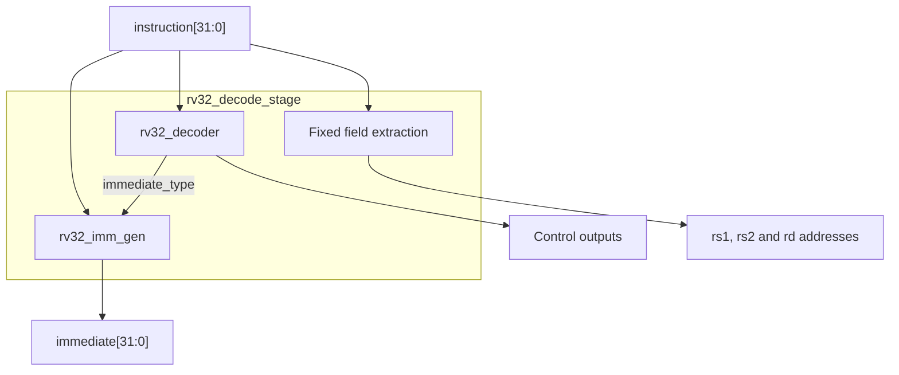
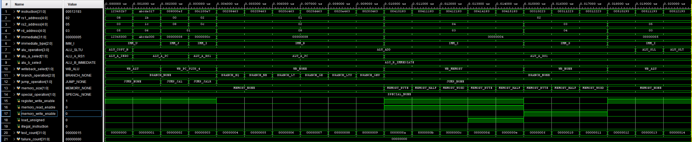
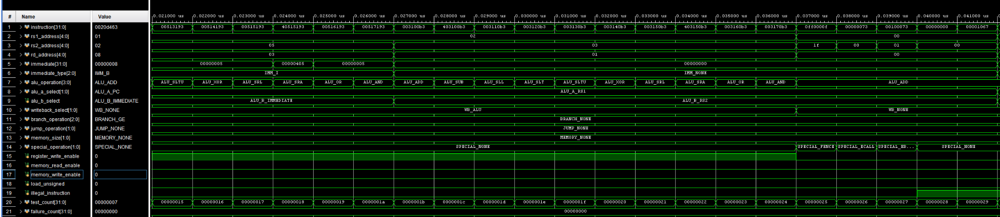
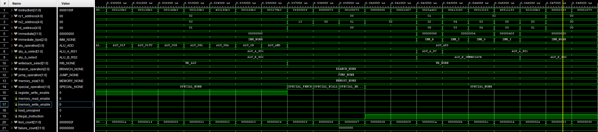

# Phase 3.1 — RV32 Immediate Generator

## Objective

The immediate generator extracts an immediate constant from a 32-bit RISC-V instruction and converts it into the 32-bit value required by the rest of the CPU.

RISC-V instructions always occupy 32 bits in our RV32I core, but different instruction formats store their immediate bits in different positions. The immediate generator rearranges those bits, inserts required zero bits, and sign-extends signed immediates to 32 bits.

This module is combinational. It does not require a clock or reset.

## Immediate encoding reference


The diagram uses the older names **SB-type** and **UJ-type**. These are normally called **B-type** and **J-type** in current RISC-V documentation.

RISC-V keeps the opcode and register fields in consistent instruction positions. Immediate bits are rearranged between formats so the processor needs less hardware to select and assemble them. For signed immediates, `instruction[31]` is always the sign bit.

Image source: [RISC-V: Immediate Encoding Variants](https://stackoverflow.com/questions/39427092/risc-v-immediate-encoding-variants)

## Module interface

| Signal | Direction | Width | Purpose |
| --- | --- | ---: | --- |
| `instruction` | Input | 32 bits | Complete RISC-V instruction |
| `immediate_type` | Input | 3 bits | Selects the immediate format |
| `immediate` | Output | 32 bits | Reconstructed and extended immediate value |

The instruction decoder will eventually examine the opcode and select the correct `immediate_type`. The immediate generator only performs the requested extraction.

## Immediate-type definition

Add this type to `rv32_pkg.sv`:

```systemverilog
typedef enum logic [2:0] {
    IMM_NONE = 3'd0,
    IMM_I = 3'd1,
    IMM_S = 3'd2,
    IMM_B = 3'd3,
    IMM_U = 3'd4,
    IMM_J = 3'd5
} imm_type_t;
```

## Original RTL implementation

The first implementation constructs a complete 32-bit result for every immediate format and then selects one result with a `case` statement. It is compact, readable, and useful as a reference model.

```systemverilog
module rv32_imm_gen (
    input logic [31:0] instruction,
    input rv32_pkg::imm_type_t immediate_type,
    output logic [31:0] immediate
);

    import rv32_pkg::*;

    always_comb begin
        case (immediate_type)
            IMM_I: immediate = {{20{instruction[31]}}, instruction[31:20]};
            IMM_S: immediate = {{20{instruction[31]}}, instruction[31:25], instruction[11:7]};
            IMM_B: immediate = {{19{instruction[31]}}, instruction[31], instruction[7], instruction[30:25], instruction[11:8], 1'b0};
            IMM_U: immediate = {instruction[31:12], 12'b0};
            IMM_J: immediate = {{11{instruction[31]}}, instruction[31], instruction[19:12], instruction[20], instruction[30:21], 1'b0};
            IMM_NONE: immediate = 32'b0;
            default: immediate = 32'b0;
        endcase
    end

endmodule
```

Conceptually, before synthesis optimization, this can be viewed as five 32-bit immediate candidates feeding a 5-to-1, 32-bit multiplexer.

## Optimized bit-multiplexer implementation

File: `rtl/core/rv32_imm_gen.sv`

The settled implementation builds the selection logic around the shared bit positions deliberately chosen by the RISC-V instruction encoding. Instead of constructing five complete candidates, it selects only the instruction source needed by each output-bit group.

```systemverilog
module rv32_imm_gen (
    input logic [31:0] instruction,
    input rv32_pkg::imm_type_t immediate_type,
    output logic [31:0] immediate
);

    import rv32_pkg::*;

    always_comb begin
        immediate = 32'b0;

        if (immediate_type != IMM_NONE) begin
            immediate[31] = instruction[31];
            
            if (immediate_type == IMM_U) immediate[30:20] = instruction[30:20];
            else immediate[30:20] = {11{instruction[31]}};
            
            if (immediate_type == IMM_U || immediate_type == IMM_J) immediate[19:12] = instruction[19:12];
            else immediate[19:12] = {8{instruction[31]}};
            
            case (immediate_type)
                IMM_B: immediate[11] = instruction[7];
                IMM_J: immediate[11] = instruction[20];
                IMM_U: immediate[11] = 1'b0;
                default: immediate[11] = instruction[31];
            endcase

            if (immediate_type == IMM_U) immediate[10:5] = 6'b0;
            else immediate[10:5] = instruction[30:25];

            case (immediate_type)
                IMM_I: immediate[4:1] = instruction[24:21];
                IMM_J: immediate[4:1] = instruction[24:21];
                IMM_S: immediate[4:1] = instruction[11:8];
                IMM_B: immediate[4:1] = instruction[11:8];
                default: immediate[4:1] = 4'b0;
            endcase

            case (immediate_type)
                IMM_I: immediate[0] = instruction[20];
                IMM_S: immediate[0] = instruction[7];
                default: immediate[0] = 1'b0;
            endcase
        end
    end

endmodule
```

The initial `immediate = 32'b0` assignment handles `IMM_NONE` and prevents latch inference. Every supported immediate type then overwrites only the bit groups that it requires.

## Approximate multiplexer-area comparison

This comparison uses **one-bit 2-to-1 multiplexer equivalents** as a technology-independent estimate. It is not a Vivado LUT-utilization result.

### Original unsimplified structure

A 5-to-1 multiplexer requires approximately four 2-to-1 multiplexers for each output bit:

```text
32 output bits × (5 - 1) muxes per bit = 128 one-bit mux equivalents
```

If `IMM_NONE` is counted as a sixth zero-valued input, the estimate becomes:

```text
32 output bits × (6 - 1) muxes per bit = 160 one-bit mux equivalents
```

### Optimized structure

Ignoring `IMM_NONE` temporarily, the explicit selection network is approximately:

| Output bits | Width | Possible data sources | Approximate 2-to-1 mux equivalents |
| --- | ---: | --- | ---: |
| `immediate[31]` | 1 | Always `instruction[31]` | 0 |
| `immediate[30:20]` | 11 | Matching U-type bits or the sign bit | 11 |
| `immediate[19:12]` | 8 | Matching U/J bits or the sign bit | 8 |
| `immediate[11]` | 1 | `instruction[31]`, `instruction[7]`, `instruction[20]`, or zero | 3 |
| `immediate[10:5]` | 6 | `instruction[30:25]` or zero | 6 |
| `immediate[4:1]` | 4 | `instruction[24:21]`, `instruction[11:8]`, or zero | 8 |
| `immediate[0]` | 1 | `instruction[20]`, `instruction[7]`, or zero | 2 |
| **Total** | **32** | | **38** |

The estimated reduction relative to an unsimplified 5-to-1, 32-bit mux is therefore:

```text
Saved mux equivalents = 128 - 38 = 90
Approximate reduction = 90 / 128 × 100 = 70.3%
```

The `IMM_NONE` check can be viewed as an additional output-zero enable. If this is pessimistically counted as one extra mux for every output bit, the comparison becomes:

```text
Original including zero input = 160 mux equivalents
Optimized including output-zero enable = 38 + 32 = 70 mux equivalents
Saved mux equivalents = 160 - 70 = 90
Approximate reduction = 90 / 160 × 100 = 56.3%
```

Therefore, the source-level architecture reduces the estimated generic mux network by approximately **56% to 70%**, depending on how the `IMM_NONE` zero selection is counted.

This does not guarantee a 56% to 70% reduction in FPGA LUT usage. Vivado can recognize the shared instruction bits and constants in the original `case` implementation and may optimize it into logic very similar to the explicit version. The physical saving must be measured by synthesizing both versions with the same device, constraints, and top-level design, then comparing LUT count and timing in the utilization reports.

## How each immediate format works

### I-type

Used by immediate ALU operations, loads, and `JALR`.

```systemverilog
immediate = {{20{instruction[31]}}, instruction[31:20]};
```

- Immediate bits: `instruction[31:20]`
- Size before extension: 12 bits
- Signed range: `-2048` to `2047`
- The sign bit is copied 20 times to produce a 32-bit signed value.

Example: `addi x1, x0, 5` contains the 12-bit value `5`, which becomes `32'h00000005`.

### S-type

Used by store instructions such as `SB`, `SH`, and `SW`.

```systemverilog
immediate = {{20{instruction[31]}}, instruction[31:25], instruction[11:7]};
```

- Upper immediate bits: `instruction[31:25]`
- Lower immediate bits: `instruction[11:7]`
- Size before extension: 12 bits
- Signed range: `-2048` to `2047`

The immediate is split because the positions used for `rd` in other formats are available to hold the lower store-offset bits. A store has no destination register.

Example: `sw x5, 12(x2)` reconstructs an offset of `12`, or `32'h0000000C`.

### B-type

Used by conditional branches such as `BEQ`, `BNE`, `BLT`, and `BGE`.

```systemverilog
immediate = {{19{instruction[31]}}, instruction[31], instruction[7], instruction[30:25], instruction[11:8], 1'b0};
```

- Reconstructed as `{imm[12], imm[11], imm[10:5], imm[4:1], 1'b0}`
- Effective size: 13 bits
- Signed byte-offset range: `-4096` to `4094`
- Bit 0 is always zero because branch targets are aligned to at least 2-byte boundaries.

Example: a forward branch offset of `8` becomes `32'h00000008`. A backward offset of `-4` becomes `32'hFFFFFFFC`.

### U-type

Used by `LUI` and `AUIPC`.

```systemverilog
immediate = {instruction[31:12], 12'b0};
```

- Instruction bits `31:12` become output bits `31:12`.
- Output bits `11:0` are zero.
- No sign-extension operation is required because all 32 output bits are directly defined.

Example: an upper immediate of `20'h12345` becomes `32'h12345000`.

### J-type

Used by `JAL`.

```systemverilog
immediate = {{11{instruction[31]}}, instruction[31], instruction[19:12], instruction[20], instruction[30:21], 1'b0};
```

- Reconstructed as `{imm[20], imm[19:12], imm[11], imm[10:1], 1'b0}`
- Effective size: 21 bits
- Signed byte-offset range: `-1048576` to `1048574`
- Bit 0 is always zero because jump targets are aligned to at least 2-byte boundaries.

Example: a forward jump offset of `8` becomes `32'h00000008`. A backward offset of `-4` becomes `32'hFFFFFFFC`.

### No immediate

R-type instructions use two registers and do not contain an immediate operand.

```systemverilog
immediate = 32'b0;
```

The `default` case also outputs zero so the combinational logic always assigns a known result.

## Why the output is 32 bits

The encoded immediate may contain only 12, 20, 13, or 21 meaningful bits, but the ALU and register file operate on 32-bit values. The generator therefore converts every format to a full 32-bit operand before it reaches the ALU.

For example, the 12-bit two's-complement value `12'hFFC` represents `-4`. Sign extension turns it into `32'hFFFFFFFC`, which the 32-bit ALU can add directly to a register or program counter.

## Testbench

File: `sim/tb/rv32_imm_gen_tb.sv`

```systemverilog
`timescale 1ns / 1ps

module rv32_imm_gen_tb;

    import rv32_pkg::*;

    logic [31:0] instruction;
    imm_type_t immediate_type;
    logic [31:0] immediate;

    integer test_count;
    integer failure_count;

    rv32_imm_gen dut (
        .instruction(instruction),
        .immediate_type(immediate_type),
        .immediate(immediate)
    );

    task automatic check_immediate (
        input logic [31:0] test_instruction,
        input imm_type_t test_type,
        input logic [31:0] expected_immediate,
        input string test_name
    );
        begin
            instruction = test_instruction;
            immediate_type = test_type;
            #1;
            test_count = test_count + 1;
            if (immediate !== expected_immediate) begin
                failure_count = failure_count + 1;
                $display("FAIL: %s instruction=%h type=%0d expected=%h result=%h", test_name, instruction, immediate_type, expected_immediate, immediate);
            end
            else begin
                $display("PASS: %s immediate=%h", test_name, immediate);
            end
        end
    endtask

    initial begin
        instruction = 32'b0;
        immediate_type = IMM_NONE;
        test_count = 0;
        failure_count = 0;
        #1;

        check_immediate(32'h00500093, IMM_I, 32'h00000005, "I-type positive immediate");
        check_immediate(32'hFFC00093, IMM_I, 32'hFFFFFFFC, "I-type negative immediate");
        check_immediate(32'h7FF00093, IMM_I, 32'h000007FF, "I-type maximum positive immediate");
        check_immediate(32'h00512623, IMM_S, 32'h0000000C, "S-type positive offset");
        check_immediate(32'hFE512E23, IMM_S, 32'hFFFFFFFC, "S-type negative offset");
        check_immediate(32'h00208463, IMM_B, 32'h00000008, "B-type forward branch");
        check_immediate(32'hFE208EE3, IMM_B, 32'hFFFFFFFC, "B-type backward branch");
        check_immediate(32'h123452B7, IMM_U, 32'h12345000, "U-type upper immediate");
        check_immediate(32'hABCDE2B7, IMM_U, 32'hABCDE000, "U-type high-bit immediate");
        check_immediate(32'h008000EF, IMM_J, 32'h00000008, "J-type forward jump");
        check_immediate(32'hFFDFF0EF, IMM_J, 32'hFFFFFFFC, "J-type backward jump");
        check_immediate(32'h002081B3, IMM_NONE, 32'h00000000, "R-type has no immediate");

        if (failure_count == 0) begin
            $display("All %0d rv32_imm_gen tests passed.", test_count);
        end
        else begin
            $fatal(1, "%0d of %0d rv32_imm_gen tests failed.", failure_count, test_count);
        end
        $finish;
    end

endmodule
```

## Test coverage

| Test | Instruction | Type | Expected output | Purpose |
| --- | --- | --- | --- | --- |
| 1 | `00500093` | I | `00000005` | Positive sign extension |
| 2 | `FFC00093` | I | `FFFFFFFC` | Negative sign extension |
| 3 | `7FF00093` | I | `000007FF` | Maximum positive 12-bit immediate |
| 4 | `00512623` | S | `0000000C` | Split positive store offset |
| 5 | `FE512E23` | S | `FFFFFFFC` | Split negative store offset |
| 6 | `00208463` | B | `00000008` | Forward aligned branch offset |
| 7 | `FE208EE3` | B | `FFFFFFFC` | Backward branch and sign extension |
| 8 | `123452B7` | U | `12345000` | Upper 20-bit placement |
| 9 | `ABCDE2B7` | U | `ABCDE000` | U-type with output bit 31 set |
| 10 | `008000EF` | J | `00000008` | Forward aligned jump offset |
| 11 | `FFDFF0EF` | J | `FFFFFFFC` | Backward jump and sign extension |
| 12 | `002081B3` | None | `00000000` | R-type produces no immediate |

## Vivado XSim output

```text
PASS: I-type positive immediate immediate=00000005
PASS: I-type negative immediate immediate=fffffffc
PASS: I-type maximum positive immediate immediate=000007ff
PASS: S-type positive offset immediate=0000000c
PASS: S-type negative offset immediate=fffffffc
PASS: B-type forward branch immediate=00000008
PASS: B-type backward branch immediate=fffffffc
PASS: U-type upper immediate immediate=12345000
PASS: U-type high-bit immediate immediate=abcde000
PASS: J-type forward jump immediate=00000008
PASS: J-type backward jump immediate=fffffffc
PASS: R-type has no immediate immediate=00000000
All 12 rv32_imm_gen tests passed.
$finish called at time : 13 ns : File "C:/root_pqnq/RISC-V/streamcore-rv/sim/tb/rv32_imm_gen_tb.sv" Line 163
```

## Waveform


The waveform shows each test instruction, the selected immediate type, and the reconstructed 32-bit output. `failure_count` remains zero throughout the test sequence.

## Result and next step

The immediate generator passed all 12 directed tests, covering every supported immediate format, positive and negative sign extension, split encodings, alignment zeros, and the no-immediate case.

The immediate-generator portion of Phase 3 is complete. The next module is the **instruction decoder**, which will decode the opcode, `funct3`, and `funct7` fields and select signals such as `immediate_type`, the ALU operation, register write enable, branch control, and memory control.

## References

- [RISC-V Unprivileged ISA Specification — RV32I Base Integer Instruction Set](https://docs.riscv.org/reference/isa/v20260120/unpriv/rv32.html)
- [RISC-V: Immediate Encoding Variants](https://stackoverflow.com/questions/39427092/risc-v-immediate-encoding-variants)

## Phase 3.2 — Instruction Decoder and Decode Stage

The second part of Phase 3 implements the instruction decoder and connects it to the immediate generator. Together, these modules convert a raw 32-bit instruction into the register addresses, immediate value, ALU controls, memory controls, branch controls, jump controls, writeback controls, and illegal-instruction status required by the later CPU datapath.

The decoder and decode stage are entirely combinational. Neither module requires a clock or reset.

## Decoder objective

The decoder examines three main instruction fields:

```systemverilog
assign opcode = instruction[6:0];
assign funct3 = instruction[14:12];
assign funct7 = instruction[31:25];
```

The opcode identifies the major instruction group. `funct3` and `funct7` then identify the exact instruction within that group.

For example, `ADD` and `SUB` share the same opcode and `funct3` value. They are distinguished by `funct7`:

```text
opcode = 0110011
funct3 = 000
funct7 = 0000000 -> ADD
funct7 = 0100000 -> SUB
```

## RV32I opcode groups

| Opcode constant | Binary opcode | Format | Instructions |
| --- | --- | --- | --- |
| `OPCODE_LUI` | `0110111` | U | `LUI` |
| `OPCODE_AUIPC` | `0010111` | U | `AUIPC` |
| `OPCODE_JAL` | `1101111` | J | `JAL` |
| `OPCODE_JALR` | `1100111` | I | `JALR` |
| `OPCODE_BRANCH` | `1100011` | B | `BEQ`, `BNE`, `BLT`, `BGE`, `BLTU`, `BGEU` |
| `OPCODE_LOAD` | `0000011` | I | `LB`, `LH`, `LW`, `LBU`, `LHU` |
| `OPCODE_STORE` | `0100011` | S | `SB`, `SH`, `SW` |
| `OPCODE_OP_IMM` | `0010011` | I | Immediate ALU operations |
| `OPCODE_OP` | `0110011` | R | Register-register ALU operations |
| `OPCODE_MISC_MEM` | `0001111` | I | `FENCE` |
| `OPCODE_SYSTEM` | `1110011` | I | `ECALL`, `EBREAK` |

## Package additions

The following definitions were added to `rv32_pkg.sv` to provide readable opcode and control names:

```systemverilog
    localparam logic [6:0] OPCODE_LUI = 7'b0110111;
    localparam logic [6:0] OPCODE_AUIPC = 7'b0010111;
    localparam logic [6:0] OPCODE_JAL = 7'b1101111;
    localparam logic [6:0] OPCODE_JALR = 7'b1100111;
    localparam logic [6:0] OPCODE_BRANCH = 7'b1100011;
    localparam logic [6:0] OPCODE_LOAD = 7'b0000011;
    localparam logic [6:0] OPCODE_STORE = 7'b0100011;
    localparam logic [6:0] OPCODE_OP_IMM = 7'b0010011;
    localparam logic [6:0] OPCODE_OP = 7'b0110011;
    localparam logic [6:0] OPCODE_MISC_MEM = 7'b0001111;
    localparam logic [6:0] OPCODE_SYSTEM = 7'b1110011;

    localparam logic [6:0] FUNCT7_NORMAL = 7'b0000000;
    localparam logic [6:0] FUNCT7_SUB_SRA = 7'b0100000;

    typedef enum logic [1:0] {
        ALU_A_RS1 = 2'd0,
        ALU_A_PC = 2'd1,
        ALU_A_ZERO = 2'd2
    } alu_a_sel_t;

    typedef enum logic {
        ALU_B_RS2 = 1'b0,
        ALU_B_IMMEDIATE = 1'b1
    } alu_b_sel_t;

    typedef enum logic [1:0] {
        WB_NONE = 2'd0,
        WB_ALU = 2'd1,
        WB_MEMORY = 2'd2,
        WB_PC_PLUS_4 = 2'd3
    } writeback_sel_t;

    typedef enum logic [2:0] {
        BRANCH_NONE = 3'd0,
        BRANCH_EQ = 3'd1,
        BRANCH_NE = 3'd2,
        BRANCH_LT = 3'd3,
        BRANCH_GE = 3'd4,
        BRANCH_LTU = 3'd5,
        BRANCH_GEU = 3'd6
    } branch_op_t;

    typedef enum logic [1:0] {
        JUMP_NONE = 2'd0,
        JUMP_JAL = 2'd1,
        JUMP_JALR = 2'd2
    } jump_op_t;

    typedef enum logic [1:0] {
        MEMORY_NONE = 2'd0,
        MEMORY_BYTE = 2'd1,
        MEMORY_HALF = 2'd2,
        MEMORY_WORD = 2'd3
    } memory_size_t;

    typedef enum logic [1:0] {
        SPECIAL_NONE = 2'd0,
        SPECIAL_FENCE = 2'd1,
        SPECIAL_ECALL = 2'd2,
        SPECIAL_EBREAK = 2'd3
    } special_op_t;
```

These enums form the control language between the decoder and the later CPU datapath.

## Decoder outputs

| Output | Purpose |
| --- | --- |
| `immediate_type` | Selects `IMM_I`, `IMM_S`, `IMM_B`, `IMM_U`, `IMM_J`, or `IMM_NONE` |
| `alu_operation` | Selects the ALU operation |
| `alu_a_select` | Selects `rs1`, the PC, or zero for the ALU left operand |
| `alu_b_select` | Selects `rs2` or the generated immediate for the ALU right operand |
| `writeback_select` | Selects the ALU result, memory result, `PC + 4`, or no writeback |
| `branch_operation` | Selects the exact conditional branch comparison |
| `jump_operation` | Selects `JAL`, `JALR`, or no jump |
| `memory_size` | Selects byte, halfword, word, or no memory access |
| `special_operation` | Selects `FENCE`, `ECALL`, `EBREAK`, or no special operation |
| `register_write_enable` | Enables writing to `rd` |
| `memory_read_enable` | Enables a data-memory read |
| `memory_write_enable` | Enables a data-memory write |
| `load_unsigned` | Selects zero extension for `LBU` and `LHU` |
| `illegal_instruction` | Marks unsupported or invalid instruction encodings |

## Safe default convention

Every combinational evaluation begins with safe control values:

```systemverilog
immediate_type = IMM_NONE;
alu_operation = ALU_ADD;
alu_a_select = ALU_A_RS1;
alu_b_select = ALU_B_RS2;
writeback_select = WB_NONE;
branch_operation = BRANCH_NONE;
jump_operation = JUMP_NONE;
memory_size = MEMORY_NONE;
special_operation = SPECIAL_NONE;

register_write_enable = 1'b0;
memory_read_enable = 1'b0;
memory_write_enable = 1'b0;
load_unsigned = 1'b0;
illegal_instruction = 1'b1;
```

A recognized instruction overwrites the controls it requires and clears `illegal_instruction`. Unsupported opcodes and invalid `funct3` or `funct7` combinations retain the defaults. This prevents an invalid instruction from accidentally writing a register or memory.

## Instruction control behaviour

| Instruction group | Immediate | ALU inputs | Writeback or action |
| --- | --- | --- | --- |
| `LUI` | U | Zero and immediate | Copy immediate to `rd` |
| `AUIPC` | U | PC and immediate | Write `PC + immediate` to `rd` |
| `JAL` | J | PC and immediate | Jump to ALU result and write `PC + 4` to `rd` |
| `JALR` | I | `rs1` and immediate | Jump to ALU result with bit 0 cleared and write `PC + 4` to `rd` |
| Branch | B | PC and immediate | Use branch comparison to conditionally select the target |
| Load | I | `rs1` and immediate | Read memory at the ALU-generated address and write to `rd` |
| Store | S | `rs1` and immediate | Write `rs2` to memory at the ALU-generated address |
| OP-IMM | I | `rs1` and immediate | Write ALU result to `rd` |
| OP | None | `rs1` and `rs2` | Write ALU result to `rd` |
| `FENCE` | None | Unused | Legal memory-ordering operation; initially treated as no state change |
| `ECALL`/`EBREAK` | None | Unused | Request a future trap or breakpoint action |

## Decoder and immediate-generator interaction

The `rv32_decode_stage` sub-top instantiates both combinational modules. The instruction is sent to both modules, while the decoder's `immediate_type` output controls how the immediate generator interprets the instruction bits.



The fixed register fields are extracted directly because their positions do not change between instruction formats:

```systemverilog
assign rs1_address = instruction[19:15];
assign rs2_address = instruction[24:20];
assign rd_address = instruction[11:7];
```

## Decode-stage connection module

File: `rtl/core/rv32_decode_stage.sv`

```systemverilog
module rv32_decode_stage (
    input logic [31:0] instruction,

    output logic [4:0] rs1_address,
    output logic [4:0] rs2_address,
    output logic [4:0] rd_address,
    output logic [31:0] immediate,

    output rv32_pkg::imm_type_t immediate_type,
    output rv32_pkg::alu_op_t alu_operation,
    output rv32_pkg::alu_a_sel_t alu_a_select,
    output rv32_pkg::alu_b_sel_t alu_b_select,
    output rv32_pkg::writeback_sel_t writeback_select,
    output rv32_pkg::branch_op_t branch_operation,
    output rv32_pkg::jump_op_t jump_operation,
    output rv32_pkg::memory_size_t memory_size,
    output rv32_pkg::special_op_t special_operation,

    output logic register_write_enable,
    output logic memory_read_enable,
    output logic memory_write_enable,
    output logic load_unsigned,
    output logic illegal_instruction
);

    assign rs1_address = instruction[19:15];
    assign rs2_address = instruction[24:20];
    assign rd_address = instruction[11:7];

    rv32_decoder decoder (
        .instruction(instruction),
        .immediate_type(immediate_type),
        .alu_operation(alu_operation),
        .alu_a_select(alu_a_select),
        .alu_b_select(alu_b_select),
        .writeback_select(writeback_select),
        .branch_operation(branch_operation),
        .jump_operation(jump_operation),
        .memory_size(memory_size),
        .special_operation(special_operation),
        .register_write_enable(register_write_enable),
        .memory_read_enable(memory_read_enable),
        .memory_write_enable(memory_write_enable),
        .load_unsigned(load_unsigned),
        .illegal_instruction(illegal_instruction)
    );

    rv32_imm_gen immediate_generator (
        .instruction(instruction),
        .immediate_type(immediate_type),
        .immediate(immediate)
    );

endmodule
```

## Decode-stage testbench objective

The integration testbench verifies the decoder, immediate generator, register-field extraction, and their connections together. It covers all 40 implemented RV32I instructions and nine illegal or unsupported encodings.

| Test group | Number of tests | Coverage |
| --- | ---: | --- |
| Upper immediate | 2 | `LUI`, `AUIPC` |
| Jumps | 2 | `JAL`, `JALR` |
| Branches | 6 | All signed, unsigned, equality, and inequality branches |
| Loads | 5 | Byte, halfword, word, signed, and unsigned loads |
| Stores | 3 | Byte, halfword, and word stores |
| Immediate ALU | 9 | All RV32I OP-IMM operations |
| Register ALU | 10 | All RV32I OP operations |
| Special | 3 | `FENCE`, `ECALL`, `EBREAK` |
| Illegal encodings | 9 | Invalid opcode, `funct3`, `funct7`, unsupported `FENCE.I`, and unsupported SYSTEM encoding |
| **Total** | **49** | Complete decoder and integration coverage |

For every valid instruction, the testbench checks:

- `rs1_address`, `rs2_address`, and `rd_address`
- The generated 32-bit immediate
- Immediate, ALU, operand, writeback, branch, jump, memory, and special-operation controls
- Register and memory enables
- Signed or unsigned load selection
- Illegal-instruction status

For illegal instructions, it also verifies that register and memory writes remain disabled.

## Decode-stage XSim output

```text
PASS: LUI instruction=123452b7 immediate=12345000
PASS: AUIPC instruction=abcde317 immediate=abcde000
PASS: JAL instruction=008000ef immediate=00000008
PASS: JALR instruction=00c100e7 immediate=0000000c
PASS: BEQ instruction=00208463 immediate=00000008
PASS: BNE instruction=00209463 immediate=00000008
PASS: BLT instruction=0020c463 immediate=00000008
PASS: BGE instruction=0020d463 immediate=00000008
PASS: BLTU instruction=0020e463 immediate=00000008
PASS: BGEU instruction=0020f463 immediate=00000008
PASS: LB instruction=00410183 immediate=00000004
PASS: LH instruction=00411183 immediate=00000004
PASS: LW instruction=00412183 immediate=00000004
PASS: LBU instruction=00414183 immediate=00000004
PASS: LHU instruction=00415183 immediate=00000004
PASS: SB instruction=00310223 immediate=00000004
PASS: SH instruction=00311223 immediate=00000004
PASS: SW instruction=00312223 immediate=00000004
PASS: ADDI instruction=00510193 immediate=00000005
PASS: SLLI instruction=00511193 immediate=00000005
PASS: SLTI instruction=00512193 immediate=00000005
PASS: SLTIU instruction=00513193 immediate=00000005
PASS: XORI instruction=00514193 immediate=00000005
PASS: SRLI instruction=00515193 immediate=00000005
PASS: SRAI instruction=40515193 immediate=00000405
PASS: ORI instruction=00516193 immediate=00000005
PASS: ANDI instruction=00517193 immediate=00000005
PASS: ADD instruction=003100b3 immediate=00000000
PASS: SUB instruction=403100b3 immediate=00000000
PASS: SLL instruction=003110b3 immediate=00000000
PASS: SLT instruction=003120b3 immediate=00000000
PASS: SLTU instruction=003130b3 immediate=00000000
PASS: XOR instruction=003140b3 immediate=00000000
PASS: SRL instruction=003150b3 immediate=00000000
PASS: SRA instruction=403150b3 immediate=00000000
PASS: OR instruction=003160b3 immediate=00000000
PASS: AND instruction=003170b3 immediate=00000000
PASS: FENCE instruction=0ff0000f immediate=00000000
PASS: ECALL instruction=00000073 immediate=00000000
PASS: EBREAK instruction=00100073 immediate=00000000
PASS: invalid opcode instruction=00000000
PASS: invalid JALR funct3 instruction=00001067
PASS: invalid branch funct3 instruction=0020a463
PASS: invalid load funct3 instruction=00413183
PASS: invalid store funct3 instruction=00313223
PASS: invalid SLLI funct7 instruction=40511193
PASS: unsupported R-type funct7 instruction=023100b3
PASS: unsupported FENCE.I instruction=0000100f
PASS: unsupported SYSTEM instruction instruction=00001073
All 49 rv32_decode_stage tests passed.
```

## Decode-stage waveforms

The first waveform covers upper-immediate instructions, jumps, branches, loads, stores, and the beginning of the immediate ALU tests.



The second waveform covers the remaining immediate ALU operations, register-register ALU operations, and special instructions.



The third waveform shows the end of the valid instruction tests followed by all illegal encodings. During the illegal tests, `illegal_instruction` is asserted while register and memory write enables remain low.



The `SRAI` test produces an immediate value of `32'h00000405`. This is correct: the lower five bits contain the shift amount of five, while the upper immediate bits distinguish `SRAI` from `SRLI`. The ALU uses only `rhs[4:0]` as the shift amount.

## Phase 3 final result

Phase 3 is complete. The optimized immediate generator passed all 12 standalone tests, and the combined decode stage passed all 49 integration tests with zero failures.

The completed Phase 3 RTL consists of:

```text
rtl/core/rv32_pkg.sv
rtl/core/rv32_imm_gen.sv
rtl/core/rv32_decoder.sv
rtl/core/rv32_decode_stage.sv
```

The verification files are:

```text
sim/tb/rv32_imm_gen_tb.sv
sim/tb/rv32_decode_stage_tb.sv
```

The next project stage can begin after committing and merging the completed `phase-3-decode-immediates` branch.
