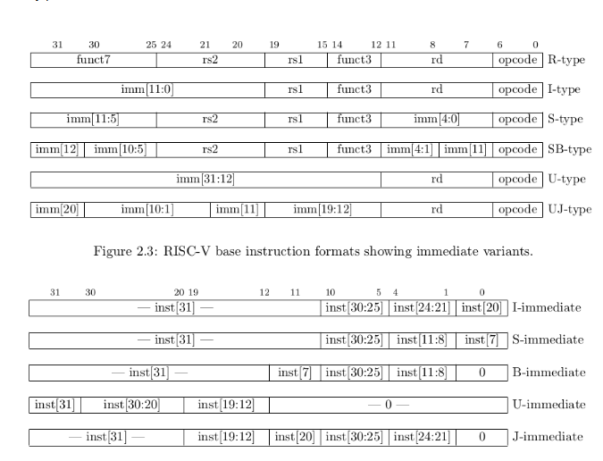
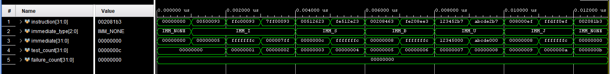

# Phase 3.1 — RV32 Immediate Generator

## Objective

The immediate generator extracts an immediate constant from a 32-bit RISC-V instruction and converts it into the 32-bit value required by the rest of the CPU.

RISC-V instructions always occupy 32 bits in our RV32I core, but different instruction formats store their immediate bits in different positions. The immediate generator rearranges those bits, inserts required zero bits, and sign-extends signed immediates to 32 bits.

This module is combinational. It does not require a clock or reset.

## Immediate encoding reference



The diagram uses the older names **SB-type** and **UJ-type**. These are normally called **B-type** and **J-type** in current RISC-V documentation.

RISC-V keeps the opcode and register fields in consistent instruction positions. Immediate bits are rearranged between formats so the processor needs less hardware to select and assemble them. For signed immediates, `instruction[31]` is always the sign bit.

Image source: [RISC-V: Immediate Encoding Variants](https://stackoverflow.com/questions/39427092/risc-v-immediate-encoding-variants)

## Module interface

| Signal | Direction | Width | Purpose |
| --- | --- | ---: | --- |
| `instruction` | Input | 32 bits | Complete RISC-V instruction |
| `immediate_type` | Input | 3 bits | Selects the immediate format |
| `immediate` | Output | 32 bits | Reconstructed and extended immediate value |

The instruction decoder will eventually examine the opcode and select the correct `immediate_type`. The immediate generator only performs the requested extraction.

## Immediate-type definition

Add this type to `rv32_pkg.sv`:

```systemverilog
typedef enum logic [2:0] {
    IMM_NONE = 3'd0,
    IMM_I = 3'd1,
    IMM_S = 3'd2,
    IMM_B = 3'd3,
    IMM_U = 3'd4,
    IMM_J = 3'd5
} imm_type_t;
```

## RTL implementation

File: `rtl/core/rv32_imm_gen.sv`

```systemverilog
module rv32_imm_gen (
    input logic [31:0] instruction,
    input rv32_pkg::imm_type_t immediate_type,
    output logic [31:0] immediate
);

    import rv32_pkg::*;

    always_comb begin
        case (immediate_type)
            IMM_I: immediate = {{20{instruction[31]}}, instruction[31:20]};
            IMM_S: immediate = {{20{instruction[31]}}, instruction[31:25], instruction[11:7]};
            IMM_B: immediate = {{19{instruction[31]}}, instruction[31], instruction[7], instruction[30:25], instruction[11:8], 1'b0};
            IMM_U: immediate = {instruction[31:12], 12'b0};
            IMM_J: immediate = {{11{instruction[31]}}, instruction[31], instruction[19:12], instruction[20], instruction[30:21], 1'b0};
            IMM_NONE: immediate = 32'b0;
            default: immediate = 32'b0;
        endcase
    end

endmodule
```

## How each immediate format works

### I-type

Used by immediate ALU operations, loads, and `JALR`.

```systemverilog
immediate = {{20{instruction[31]}}, instruction[31:20]};
```

- Immediate bits: `instruction[31:20]`
- Size before extension: 12 bits
- Signed range: `-2048` to `2047`
- The sign bit is copied 20 times to produce a 32-bit signed value.

Example: `addi x1, x0, 5` contains the 12-bit value `5`, which becomes `32'h00000005`.

### S-type

Used by store instructions such as `SB`, `SH`, and `SW`.

```systemverilog
immediate = {{20{instruction[31]}}, instruction[31:25], instruction[11:7]};
```

- Upper immediate bits: `instruction[31:25]`
- Lower immediate bits: `instruction[11:7]`
- Size before extension: 12 bits
- Signed range: `-2048` to `2047`

The immediate is split because the positions used for `rd` in other formats are available to hold the lower store-offset bits. A store has no destination register.

Example: `sw x5, 12(x2)` reconstructs an offset of `12`, or `32'h0000000C`.

### B-type

Used by conditional branches such as `BEQ`, `BNE`, `BLT`, and `BGE`.

```systemverilog
immediate = {{19{instruction[31]}}, instruction[31], instruction[7], instruction[30:25], instruction[11:8], 1'b0};
```

- Reconstructed as `{imm[12], imm[11], imm[10:5], imm[4:1], 1'b0}`
- Effective size: 13 bits
- Signed byte-offset range: `-4096` to `4094`
- Bit 0 is always zero because branch targets are aligned to at least 2-byte boundaries.

Example: a forward branch offset of `8` becomes `32'h00000008`. A backward offset of `-4` becomes `32'hFFFFFFFC`.

### U-type

Used by `LUI` and `AUIPC`.

```systemverilog
immediate = {instruction[31:12], 12'b0};
```

- Instruction bits `31:12` become output bits `31:12`.
- Output bits `11:0` are zero.
- No sign-extension operation is required because all 32 output bits are directly defined.

Example: an upper immediate of `20'h12345` becomes `32'h12345000`.

### J-type

Used by `JAL`.

```systemverilog
immediate = {{11{instruction[31]}}, instruction[31], instruction[19:12], instruction[20], instruction[30:21], 1'b0};
```

- Reconstructed as `{imm[20], imm[19:12], imm[11], imm[10:1], 1'b0}`
- Effective size: 21 bits
- Signed byte-offset range: `-1048576` to `1048574`
- Bit 0 is always zero because jump targets are aligned to at least 2-byte boundaries.

Example: a forward jump offset of `8` becomes `32'h00000008`. A backward offset of `-4` becomes `32'hFFFFFFFC`.

### No immediate

R-type instructions use two registers and do not contain an immediate operand.

```systemverilog
immediate = 32'b0;
```

The `default` case also outputs zero so the combinational logic always assigns a known result.

## Why the output is 32 bits

The encoded immediate may contain only 12, 20, 13, or 21 meaningful bits, but the ALU and register file operate on 32-bit values. The generator therefore converts every format to a full 32-bit operand before it reaches the ALU.

For example, the 12-bit two's-complement value `12'hFFC` represents `-4`. Sign extension turns it into `32'hFFFFFFFC`, which the 32-bit ALU can add directly to a register or program counter.

## Testbench

File: `sim/tb/rv32_imm_gen_tb.sv`

```systemverilog
`timescale 1ns / 1ps

module rv32_imm_gen_tb;

    import rv32_pkg::*;

    logic [31:0] instruction;
    imm_type_t immediate_type;
    logic [31:0] immediate;

    integer test_count;
    integer failure_count;

    rv32_imm_gen dut (
        .instruction(instruction),
        .immediate_type(immediate_type),
        .immediate(immediate)
    );

    task automatic check_immediate (
        input logic [31:0] test_instruction,
        input imm_type_t test_type,
        input logic [31:0] expected_immediate,
        input string test_name
    );
        begin
            instruction = test_instruction;
            immediate_type = test_type;
            #1;
            test_count = test_count + 1;
            if (immediate !== expected_immediate) begin
                failure_count = failure_count + 1;
                $display("FAIL: %s instruction=%h type=%0d expected=%h result=%h", test_name, instruction, immediate_type, expected_immediate, immediate);
            end
            else begin
                $display("PASS: %s immediate=%h", test_name, immediate);
            end
        end
    endtask

    initial begin
        instruction = 32'b0;
        immediate_type = IMM_NONE;
        test_count = 0;
        failure_count = 0;
        #1;

        check_immediate(32'h00500093, IMM_I, 32'h00000005, "I-type positive immediate");
        check_immediate(32'hFFC00093, IMM_I, 32'hFFFFFFFC, "I-type negative immediate");
        check_immediate(32'h7FF00093, IMM_I, 32'h000007FF, "I-type maximum positive immediate");
        check_immediate(32'h00512623, IMM_S, 32'h0000000C, "S-type positive offset");
        check_immediate(32'hFE512E23, IMM_S, 32'hFFFFFFFC, "S-type negative offset");
        check_immediate(32'h00208463, IMM_B, 32'h00000008, "B-type forward branch");
        check_immediate(32'hFE208EE3, IMM_B, 32'hFFFFFFFC, "B-type backward branch");
        check_immediate(32'h123452B7, IMM_U, 32'h12345000, "U-type upper immediate");
        check_immediate(32'hABCDE2B7, IMM_U, 32'hABCDE000, "U-type high-bit immediate");
        check_immediate(32'h008000EF, IMM_J, 32'h00000008, "J-type forward jump");
        check_immediate(32'hFFDFF0EF, IMM_J, 32'hFFFFFFFC, "J-type backward jump");
        check_immediate(32'h002081B3, IMM_NONE, 32'h00000000, "R-type has no immediate");

        if (failure_count == 0) begin
            $display("All %0d rv32_imm_gen tests passed.", test_count);
        end
        else begin
            $fatal(1, "%0d of %0d rv32_imm_gen tests failed.", failure_count, test_count);
        end
        $finish;
    end

endmodule
```

## Test coverage

| Test | Instruction | Type | Expected output | Purpose |
| --- | --- | --- | --- | --- |
| 1 | `00500093` | I | `00000005` | Positive sign extension |
| 2 | `FFC00093` | I | `FFFFFFFC` | Negative sign extension |
| 3 | `7FF00093` | I | `000007FF` | Maximum positive 12-bit immediate |
| 4 | `00512623` | S | `0000000C` | Split positive store offset |
| 5 | `FE512E23` | S | `FFFFFFFC` | Split negative store offset |
| 6 | `00208463` | B | `00000008` | Forward aligned branch offset |
| 7 | `FE208EE3` | B | `FFFFFFFC` | Backward branch and sign extension |
| 8 | `123452B7` | U | `12345000` | Upper 20-bit placement |
| 9 | `ABCDE2B7` | U | `ABCDE000` | U-type with output bit 31 set |
| 10 | `008000EF` | J | `00000008` | Forward aligned jump offset |
| 11 | `FFDFF0EF` | J | `FFFFFFFC` | Backward jump and sign extension |
| 12 | `002081B3` | None | `00000000` | R-type produces no immediate |

## Vivado XSim output

```text
PASS: I-type positive immediate immediate=00000005
PASS: I-type negative immediate immediate=fffffffc
PASS: I-type maximum positive immediate immediate=000007ff
PASS: S-type positive offset immediate=0000000c
PASS: S-type negative offset immediate=fffffffc
PASS: B-type forward branch immediate=00000008
PASS: B-type backward branch immediate=fffffffc
PASS: U-type upper immediate immediate=12345000
PASS: U-type high-bit immediate immediate=abcde000
PASS: J-type forward jump immediate=00000008
PASS: J-type backward jump immediate=fffffffc
PASS: R-type has no immediate immediate=00000000
All 12 rv32_imm_gen tests passed.
$finish called at time : 13 ns : File "C:/root_pqnq/RISC-V/streamcore-rv/sim/tb/rv32_imm_gen_tb.sv" Line 163
```

## Waveform



The waveform shows each test instruction, the selected immediate type, and the reconstructed 32-bit output. `failure_count` remains zero throughout the test sequence.

## Result and next step

The immediate generator passed all 12 directed tests, covering every supported immediate format, positive and negative sign extension, split encodings, alignment zeros, and the no-immediate case.

The immediate-generator portion of Phase 3 is complete. The next module is the **instruction decoder**, which will decode the opcode, `funct3`, and `funct7` fields and select signals such as `immediate_type`, the ALU operation, register write enable, branch control, and memory control.

## References

- [RISC-V Unprivileged ISA Specification — RV32I Base Integer Instruction Set](https://docs.riscv.org/reference/isa/v20260120/unpriv/rv32.html)
- [RISC-V: Immediate Encoding Variants](https://stackoverflow.com/questions/39427092/risc-v-immediate-encoding-variants)
