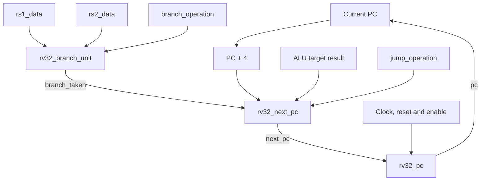
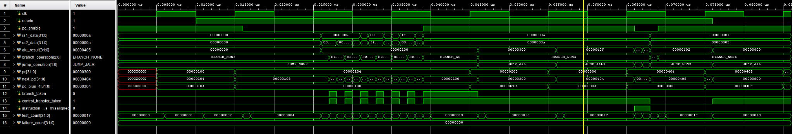

# Phase 4 — RV32 Control Flow

## Objective

Phase 4 implements the logic that determines which instruction address the CPU executes next. It adds a clocked program counter, all six RV32I conditional branch comparisons, `JAL` and `JALR` next-address handling, program-counter enable support, and instruction-address alignment detection.

The completed control-flow path supports:

- Normal sequential execution using `PC + 4`
- Taken and untaken conditional branches
- Signed and unsigned branch comparisons
- Direct jumps using `JAL`
- Register-indirect jumps using `JALR`
- `JALR` target bit-zero clearing
- A parameterized reset vector
- PC stalls using `pc_enable`
- Misaligned branch and jump target detection

## Repository structure

```text
rtl/core/rv32_pc.sv
rtl/core/rv32_branch_unit.sv
rtl/core/rv32_next_pc.sv
rtl/core/rv32_control_flow.sv
sim/tb/rv32_control_flow_tb.sv
```

The recommended Git branch for this phase is:

```text
phase-4-control-flow
```

## Control-flow architecture

The existing decoder selects the branch or jump operation and configures the existing ALU to calculate a possible target address. Phase 4 compares branch operands, chooses between the target and `PC + 4`, and stores the selected address in the PC register.



The ALU target input represents:

```text
Taken branch target = PC + B-type immediate
JAL target = PC + J-type immediate
JALR target = rs1 + I-type immediate
```

The ALU is not instantiated inside `rv32_control_flow`. The later CPU datapath supplies the calculated `alu_result` to this module.

## Next-address selection

| Current instruction state | Selected `next_pc` |
| --- | --- |
| Normal instruction | `PC + 4` |
| Untaken branch | `PC + 4` |
| Taken branch | `alu_result` |
| `JAL` | `alu_result` |
| `JALR` | `{alu_result[31:1], 1'b0}` |

RISC-V memory addresses are byte-addressed. Each RV32I instruction occupies four bytes, so normal sequential execution increments the PC by four rather than one.

## Branch unit

File: `rtl/core/rv32_branch_unit.sv`

The branch unit compares two 32-bit register values according to the decoder's `branch_operation`. It is entirely combinational and does not calculate the branch target.

```systemverilog
module rv32_branch_unit (
    input logic [31:0] rs1_data,
    input logic [31:0] rs2_data,
    input rv32_pkg::branch_op_t branch_operation,

    output logic branch_taken
);

    import rv32_pkg::*;

    always_comb begin
        case (branch_operation)
            BRANCH_NONE: branch_taken = 1'b0;
            BRANCH_EQ: branch_taken = rs1_data == rs2_data;
            BRANCH_NE: branch_taken = rs1_data != rs2_data;
            BRANCH_LT: branch_taken = $signed(rs1_data) < $signed(rs2_data);
            BRANCH_GE: branch_taken = $signed(rs1_data) >= $signed(rs2_data);
            BRANCH_LTU: branch_taken = rs1_data < rs2_data;
            BRANCH_GEU: branch_taken = rs1_data >= rs2_data;
            default: branch_taken = 1'b0;
        endcase
    end

endmodule
```

## Branch conditions

| Control | Instruction | Condition |
| --- | --- | --- |
| `BRANCH_NONE` | Not a branch | Never taken |
| `BRANCH_EQ` | `BEQ` | `rs1 == rs2` |
| `BRANCH_NE` | `BNE` | `rs1 != rs2` |
| `BRANCH_LT` | `BLT` | Signed `rs1 < rs2` |
| `BRANCH_GE` | `BGE` | Signed `rs1 >= rs2` |
| `BRANCH_LTU` | `BLTU` | Unsigned `rs1 < rs2` |
| `BRANCH_GEU` | `BGEU` | Unsigned `rs1 >= rs2` |

Signed and unsigned comparisons must remain separate. For example:

```text
rs1 = 32'hFFFFFFFF
rs2 = 32'h00000001

Signed:   -1 < 1          -> true
Unsigned: 4294967295 < 1  -> false
```

The branch comparison occurs in parallel with the ALU target calculation. This allows a single-cycle implementation to calculate the target and determine whether the branch is taken during the same cycle.

## Program-counter register

File: `rtl/core/rv32_pc.sv`

The PC module is the only sequential state introduced in this phase. It stores the current instruction address.

```systemverilog
module rv32_pc #(
    parameter logic [31:0] RESET_VECTOR = 32'h00000000
) (
    input logic clk,
    input logic resetn,
    input logic pc_enable,
    input logic [31:0] next_pc,

    output logic [31:0] pc
);

    always_ff @(posedge clk) begin
        if (!resetn) begin
            pc <= RESET_VECTOR;
        end
        else if (pc_enable) begin
            pc <= next_pc;
        end
    end

endmodule
```

Its behaviour is:

```text
resetn = 0               -> pc = RESET_VECTOR
resetn = 1, enable = 1   -> pc = next_pc
resetn = 1, enable = 0   -> pc retains its current value
```

The reset is synchronous, so `resetn` must be low during a rising clock edge. The parameterized reset vector allows simulation to begin at zero while a future SoC memory map can select a different boot address.

`pc_enable` supports future pipeline stalls and memory wait states. No explicit final `else` is required because a flip-flop naturally retains its value when it is not assigned during a clock edge.

## Optimized next-PC selector

File: `rtl/core/rv32_next_pc.sv`

The next-PC selector is combinational. It calculates `PC + 4`, determines whether a control transfer is active, selects the ALU target when required, applies the `JALR` bit-zero rule, and checks instruction alignment.

```systemverilog
module rv32_next_pc (
    input logic [31:0] pc,
    input logic [31:0] alu_result,
    input logic branch_taken,
    input rv32_pkg::jump_op_t jump_operation,
    
    output logic [31:0] next_pc,
    output logic [31:0] pc_plus_4,
    output logic control_transfer_taken,
    output logic instruction_address_misaligned
);

    import rv32_pkg::*;

    always_comb begin
        pc_plus_4 = pc + 32'd4;

        control_transfer_taken = branch_taken ||
                                 (jump_operation == JUMP_JAL) ||
                                 (jump_operation == JUMP_JALR);

        if (control_transfer_taken) next_pc = alu_result;
        else next_pc = pc_plus_4;

        if (jump_operation == JUMP_JALR) next_pc[0] = 1'b0;

        instruction_address_misaligned = control_transfer_taken &&
                                         (next_pc[1:0] != 2'b00);
    end

endmodule
```

## Shared target-path area optimization

Taken branches, `JAL`, and `JALR` use the same `alu_result[31:1]`. Only `JALR` modifies bit zero. The implementation therefore avoids describing separate 32-bit target paths for each control-transfer type.

The optimized selection hardware conceptually consists of:

- One 32-bit selection between `alu_result` and `pc_plus_4`
- One additional bit-zero override for `JALR`
- One small two-bit alignment check

A generic three-input, 32-bit target mux would require approximately 64 one-bit 2-to-1 mux equivalents. The shared structure uses approximately 32 for the main selection plus the small bit-zero override, giving a source-level estimate of about 33 mux equivalents before the alignment logic. This represents roughly a 48% reduction compared with an unsimplified three-input structure.

Vivado may optimize the more repetitive `case` implementation into similar hardware because the target values share most bits. The optimized RTL is still preferable because it directly expresses the intended shared data path. Actual FPGA LUT and timing differences must be measured using post-synthesis utilization and timing reports.

## Instruction-address alignment

The base RV32I implementation does not currently include compressed 16-bit instructions. Every fetched instruction must therefore begin on a four-byte boundary:

```text
Valid instruction address -> address[1:0] = 2'b00
```

Examples:

```text
32'h00001000 -> aligned
32'h00001004 -> aligned
32'h00001002 -> misaligned
32'h00001006 -> misaligned
```

`JALR` clears bit zero as required by the ISA:

```systemverilog
next_pc[0] = 1'b0;
```

Bit one can still remain high, so a `JALR` result may still be misaligned for an RV32I processor without the compressed extension.

The flag is asserted only when the control transfer is actually taken:

```systemverilog
instruction_address_misaligned = control_transfer_taken &&
                                 (next_pc[1:0] != 2'b00);
```

An untaken branch does not cause an exception even if its unused calculated target is misaligned. A later exception module will use this flag to prevent normal execution and raise an instruction-address-misaligned exception.

## Control-flow connection module

File: `rtl/core/rv32_control_flow.sv`

```systemverilog
module rv32_control_flow #(
    parameter logic [31:0] RESET_VECTOR = 32'h00000000
) (
    input logic clk,
    input logic resetn,
    input logic pc_enable,

    input logic [31:0] rs1_data,
    input logic [31:0] rs2_data,
    input logic [31:0] alu_result,

    input rv32_pkg::branch_op_t branch_operation,
    input rv32_pkg::jump_op_t jump_operation,

    output logic [31:0] pc,
    output logic [31:0] next_pc,
    output logic [31:0] pc_plus_4,
    output logic branch_taken,
    output logic control_transfer_taken,
    output logic instruction_address_misaligned
);

    rv32_branch_unit branch_unit (
        .rs1_data(rs1_data),
        .rs2_data(rs2_data),
        .branch_operation(branch_operation),
        .branch_taken(branch_taken)
    );

    rv32_next_pc next_pc_selector (
        .pc(pc),
        .alu_result(alu_result),
        .branch_taken(branch_taken),
        .jump_operation(jump_operation),
        .next_pc(next_pc),
        .pc_plus_4(pc_plus_4),
        .control_transfer_taken(control_transfer_taken),
        .instruction_address_misaligned(instruction_address_misaligned)
    );

    rv32_pc #(
        .RESET_VECTOR(RESET_VECTOR)
    ) pc_register (
        .clk(clk),
        .resetn(resetn),
        .pc_enable(pc_enable),
        .next_pc(next_pc),
        .pc(pc)
    );

endmodule
```

The apparent feedback from `next_pc` into `pc` is not a combinational loop. `rv32_pc` is a clocked register, so `next_pc` is captured only on a rising clock edge. The stored `pc` value then drives the next combinational calculation.

## Verification objective

The self-checking `rv32_control_flow_tb.sv` testbench instantiates the complete Phase 4 connection module using:

```text
RESET_VECTOR = 32'h00000100
Clock period = 10 ns
```

It verifies both combinational decisions and clocked PC updates.

## Test coverage

| Test area | Coverage |
| --- | --- |
| Reset | Parameterized reset vector and reset priority |
| Sequential execution | `PC + 4` selection and PC update |
| PC enable | PC hold while combinational `next_pc` continues to change |
| `BRANCH_NONE` | Branch output remains false |
| Equality branches | Taken and untaken `BEQ` and `BNE` |
| Signed branches | Taken and untaken `BLT` and `BGE`, including negative operands |
| Unsigned branches | Taken and untaken `BLTU` and `BGEU` |
| Taken branch | Target selection followed by clocked PC update |
| `JAL` | Target selection and PC update |
| `JALR` | Bit-zero clearing and PC update |
| Alignment | Misaligned `JAL` and misaligned `JALR` after bit-zero clearing |
| Untaken branch alignment | Misaligned unused target correctly ignored |
| Recovery | Sequential execution after branches and jumps |

## Vivado XSim output

```text
PASS: reset vector pc=00000100
PASS: normal sequential next PC pc=00000100 next_pc=00000104 branch_taken=0 transfer=0 misaligned=0
PASS: sequential PC update pc=00000104
PASS: next PC remains combinational while PC disabled pc=00000104 next_pc=00000108 branch_taken=0 transfer=0 misaligned=0
PASS: PC enable holds current PC pc=00000104
PASS: BRANCH_NONE pc=00000104 next_pc=00000108 branch_taken=0 transfer=0 misaligned=0
PASS: BEQ taken pc=00000104 next_pc=00000200 branch_taken=1 transfer=1 misaligned=0
PASS: BEQ not taken pc=00000104 next_pc=00000108 branch_taken=0 transfer=0 misaligned=0
PASS: BNE taken pc=00000104 next_pc=00000200 branch_taken=1 transfer=1 misaligned=0
PASS: BNE not taken pc=00000104 next_pc=00000108 branch_taken=0 transfer=0 misaligned=0
PASS: BLT signed taken pc=00000104 next_pc=00000200 branch_taken=1 transfer=1 misaligned=0
PASS: BLT signed not taken pc=00000104 next_pc=00000108 branch_taken=0 transfer=0 misaligned=0
PASS: BGE signed taken pc=00000104 next_pc=00000200 branch_taken=1 transfer=1 misaligned=0
PASS: BGE signed not taken pc=00000104 next_pc=00000108 branch_taken=0 transfer=0 misaligned=0
PASS: BLTU unsigned taken pc=00000104 next_pc=00000200 branch_taken=1 transfer=1 misaligned=0
PASS: BLTU unsigned not taken pc=00000104 next_pc=00000108 branch_taken=0 transfer=0 misaligned=0
PASS: BGEU unsigned taken pc=00000104 next_pc=00000200 branch_taken=1 transfer=1 misaligned=0
PASS: BGEU unsigned not taken pc=00000104 next_pc=00000108 branch_taken=0 transfer=0 misaligned=0
PASS: taken branch target selection pc=00000104 next_pc=00000200 branch_taken=1 transfer=1 misaligned=0
PASS: taken branch PC update pc=00000200
PASS: JAL target selection pc=00000200 next_pc=00000300 branch_taken=0 transfer=1 misaligned=0
PASS: JAL PC update pc=00000300
PASS: JALR bit zero clearing pc=00000300 next_pc=00000404 branch_taken=0 transfer=1 misaligned=0
PASS: JALR PC update pc=00000404
PASS: misaligned JAL target pc=00000404 next_pc=00000502 branch_taken=0 transfer=1 misaligned=1
PASS: misaligned JALR after bit zero clearing pc=00000404 next_pc=00000502 branch_taken=0 transfer=1 misaligned=1
PASS: untaken branch ignores misaligned target pc=00000404 next_pc=00000408 branch_taken=0 transfer=0 misaligned=0
PASS: sequential execution after control transfers pc=00000404 next_pc=00000408 branch_taken=0 transfer=0 misaligned=0
PASS: final sequential PC update pc=00000408
PASS: reset has priority over PC update pc=00000100
All 30 rv32_control_flow tests passed.
```

The XSim warnings about missing timescales in RTL files are harmless. The testbench provides the simulation timescale, and synthesis does not use simulation delay units.

## Waveform



The waveform demonstrates:

- Reset loading `PC = 32'h00000100`
- Sequential `PC + 4` execution
- PC hold while `pc_enable` is low
- Taken and untaken branch comparisons
- Signed and unsigned branch behaviour
- Taken branch and jump target selection
- `JALR` bit-zero clearing
- Misalignment assertion only for active control transfers
- Reset priority at the end of the test
- `failure_count` remaining zero throughout the simulation

## Phase 4 result

All 30 directed control-flow tests passed. The branch comparator, program-counter register, optimized next-PC selector, alignment detection, and connection module operate correctly together.

Phase 4 is complete and ready to be committed to `phase-4-control-flow`. Once the branch is reviewed and merged into `main`, the project can proceed to Phase 5: load/store handling and the memory interface.

## Reference

- [RISC-V Unprivileged ISA Specification — RV32I Base Integer Instruction Set](https://docs.riscv.org/reference/isa/v20260120/unpriv/rv32.html)
