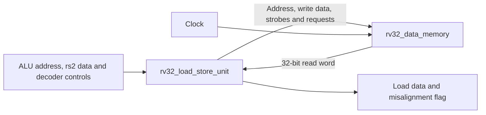
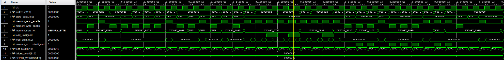

# Phase 5 — RV32 Load/Store Unit and Data Memory

## Objective

Phase 5 implements the complete RV32I data-memory path. It converts the effective byte address calculated by the ALU into aligned 32-bit memory transactions and supports all eight base load/store instructions:

- `LB`
- `LBU`
- `LH`
- `LHU`
- `LW`
- `SB`
- `SH`
- `SW`

The completed memory stage provides:

- 32-bit word-aligned memory addresses
- Little-endian byte-lane selection
- Four independent byte-write strobes
- Area-conscious byte and halfword store-data replication
- Byte, halfword and word load extraction
- Signed and unsigned load extension
- Misaligned-access detection
- Suppression of invalid memory reads and writes
- A parameterized local data-memory array
- A connection module joining the load/store unit and data memory

## Repository structure

```text
rtl/core/rv32_load_store_unit.sv
rtl/core/rv32_memory_stage.sv
rtl/memory/rv32_data_memory.sv
sim/tb/rv32_memory_stage_tb.sv
```

The Git branch used for this phase is:

```text
phase-5-load-store-unit
```

## Memory-stage architecture

The decoder created in Phase 3 identifies the memory access type. The ALU created in Phase 1 calculates the effective byte address using `rs1 + immediate`. Phase 5 then aligns and formats the request before it reaches data memory.



The Vivado elaborated-design schematic confirms the direct connections between the two Phase 5 blocks:


The load/store unit is combinational. The data memory uses combinational reads and clocked writes.

## CPU-side inputs

| Signal | Source | Purpose |
| --- | --- | --- |
| `address` | ALU result | Effective byte address calculated as `rs1 + immediate` |
| `store_data` | Register-file `rs2_data` | Value written by `SB`, `SH` or `SW` |
| `memory_read_enable` | Decoder | Identifies a load instruction |
| `memory_write_enable` | Decoder | Identifies a store instruction |
| `memory_size` | Decoder | Selects byte, halfword or word access |
| `load_unsigned` | Decoder | Selects sign extension or zero extension |

The decoder combinations are:

| Instruction | Read | Write | Size | Unsigned |
| --- | ---: | ---: | --- | ---: |
| `LB` | 1 | 0 | `MEMORY_BYTE` | 0 |
| `LBU` | 1 | 0 | `MEMORY_BYTE` | 1 |
| `LH` | 1 | 0 | `MEMORY_HALF` | 0 |
| `LHU` | 1 | 0 | `MEMORY_HALF` | 1 |
| `LW` | 1 | 0 | `MEMORY_WORD` | Ignored |
| `SB` | 0 | 1 | `MEMORY_BYTE` | Ignored |
| `SH` | 0 | 1 | `MEMORY_HALF` | Ignored |
| `SW` | 0 | 1 | `MEMORY_WORD` | Ignored |

## Byte addressing and word alignment

RISC-V memory is byte-addressed. The two least-significant address bits select a byte within a 32-bit word:

| `address[1:0]` | Selected byte lane | Word bits |
| --- | ---: | --- |
| `00` | 0 | `[7:0]` |
| `01` | 1 | `[15:8]` |
| `10` | 2 | `[23:16]` |
| `11` | 3 | `[31:24]` |

The data memory always receives an aligned address:

```systemverilog
assign memory_address = {address[31:2], 2'b00};
```

For example:

```text
CPU byte address = 32'h00001003
Memory address   = 32'h00001000
Byte offset      = 2'b11
```

The original `address[1:0]` value remains available inside the load/store unit for lane selection.

## Little-endian ordering

ForgeRV follows RISC-V little-endian byte ordering. For the stored word:

```text
32'h80FF7F01
```

the byte addresses contain:

| Offset | Byte |
| ---: | --- |
| 0 | `01` |
| 1 | `7F` |
| 2 | `FF` |
| 3 | `80` |

This is why four sequential byte stores containing `AA`, `BB`, `CC` and `DD` at offsets zero through three produce:

```text
32'hDDCCBBAA
```

## Optimized store-data path

A direct implementation could shift a 32-bit store value by 0, 8, 16 or 24 bits. That describes an offset-controlled 32-bit selection network even though disabled byte lanes are ignored by memory.

The Phase 5 implementation avoids this unnecessary full-width store shifter. For `SB`, the low byte is replicated into every byte lane:

```systemverilog
memory_write_data = {4{store_data[7:0]}};
```

For `SH`, the low halfword is replicated twice:

```systemverilog
memory_write_data = {2{store_data[15:0]}};
```

The four-bit write strobe then identifies which copy is valid.

### Byte stores

If `store_data[7:0] = 8'hAA`, the write-data bus is `32'hAAAAAAAA`:

| Offset | Write strobe | Written lane |
| --- | --- | --- |
| `00` | `0001` | Byte 0 |
| `01` | `0010` | Byte 1 |
| `10` | `0100` | Byte 2 |
| `11` | `1000` | Byte 3 |

### Halfword stores

If `store_data[15:0] = 16'hAABB`, the write-data bus is `32'hAABBAABB`:

| Offset | Write strobe | Written halfword |
| --- | --- | --- |
| `00` | `0011` | Lower halfword |
| `10` | `1100` | Upper halfword |

Offsets `01` and `11` are rejected as misaligned.

### Word stores

An aligned `SW` uses the original 32-bit value and enables every lane:

```text
memory_write_data   = store_data
memory_write_strobe = 4'b1111
```

### Approximate alignment-logic reduction

A generic four-way 32-bit mux can be represented by approximately 96 one-bit 2-to-1 mux equivalents. Shifting only the four-bit strobe across four positions requires approximately 12 such mux equivalents. At the source-architecture level, this removes roughly 84 mux equivalents, or about 87.5% of the offset-controlled store-alignment selection fabric.

This is an architectural estimate rather than a guaranteed FPGA utilization result. Vivado can remove unused logic and exploit LUT input sharing, so the actual LUT saving must be measured using the post-synthesis utilization report. Replication itself is wiring and does not require four independent data-storage blocks.

The same interface maps naturally onto a future AXI `WSTRB` signal because memory ignores write-data lanes whose strobe bits are zero.

## Load-data alignment

Data memory returns the complete aligned 32-bit word. The load/store unit shifts the selected byte to bit zero:

```systemverilog
shifted_read_data = memory_read_data >> {address[1:0], 3'b000};
```

The generated shift amounts are:

| `address[1:0]` | Shift amount |
| --- | ---: |
| `00` | 0 bits |
| `01` | 8 bits |
| `10` | 16 bits |
| `11` | 24 bits |

The selected value is then extended to 32 bits:

| Load | Selected bits | Result |
| --- | --- | --- |
| `LB` | `[7:0]` | Sign-extended |
| `LBU` | `[7:0]` | Zero-extended |
| `LH` | `[15:0]` | Sign-extended |
| `LHU` | `[15:0]` | Zero-extended |
| `LW` | `[31:0]` | Unchanged |

For example, loading `8'h80` gives:

```text
LB  -> 32'hFFFFFF80
LBU -> 32'h00000080
```

Unlike the store path, the load path genuinely needs to select and move the requested memory bits into the least-significant position. The shared read-data shift therefore remains necessary.

## Misaligned accesses

The alignment requirement depends on the access size:

| Size | Required address bits |
| --- | --- |
| Byte | Always aligned |
| Halfword | `address[0] == 1'b0` |
| Word | `address[1:0] == 2'b00` |

The flag is only evaluated for active memory operations. When a load or store is misaligned:

```text
memory_access_misaligned = 1
memory_read_request      = 0
memory_write_request     = 0
memory_write_strobe      = 0000
load_data                = 00000000
```

Suppressing the request prevents an invalid store from modifying memory. A later exception unit will convert this flag into the appropriate RISC-V load-address-misaligned or store-address-misaligned exception.

## Load/store unit

File: `rtl/core/rv32_load_store_unit.sv`

```systemverilog
module rv32_load_store_unit (
    input logic [31:0] address,
    input logic [31:0] store_data,
    input logic memory_read_enable,
    input logic memory_write_enable,
    input rv32_pkg::memory_size_t memory_size,
    input logic load_unsigned,
    input logic [31:0] memory_read_data,

    output logic [31:0] memory_address,
    output logic [31:0] memory_write_data,
    output logic [3:0] memory_write_strobe,
    output logic memory_read_request,
    output logic memory_write_request,
    output logic [31:0] load_data,
    output logic memory_access_misaligned
);

    import rv32_pkg::*;

    logic [31:0] shifted_read_data;

    assign memory_address = {address[31:2], 2'b00};

    always_comb begin
        memory_access_misaligned = 1'b0;
        memory_write_data = store_data;
        memory_write_strobe = 4'b1111;

        if (memory_read_enable || memory_write_enable) begin
            case (memory_size)
                MEMORY_BYTE: memory_access_misaligned = 1'b0;
                MEMORY_HALF: memory_access_misaligned = address[0];
                MEMORY_WORD: memory_access_misaligned = address[1:0] != 2'b00;
                default: memory_access_misaligned = 1'b0;
            endcase
        end

        case (memory_size)
            MEMORY_BYTE: memory_write_data = {4{store_data[7:0]}};
            MEMORY_HALF: memory_write_data = {2{store_data[15:0]}};
            MEMORY_WORD: memory_write_data = store_data;
            default: memory_write_data = 32'b0;
        endcase

        case (memory_size)
            MEMORY_BYTE: memory_write_strobe = 4'b0001 << address[1:0];
            MEMORY_HALF: memory_write_strobe = 4'b0011 << address[1:0];
            MEMORY_WORD: memory_write_strobe = 4'b1111;
            default: memory_write_strobe = 4'b0000;
        endcase

        if (!memory_write_enable || memory_access_misaligned) begin
            memory_write_strobe = 4'b0000;
        end

        memory_read_request = memory_read_enable &&
                              (memory_size != MEMORY_NONE) &&
                              !memory_access_misaligned;

        memory_write_request = memory_write_enable &&
                               (memory_size != MEMORY_NONE) &&
                               !memory_access_misaligned;

        load_data = 32'b0;
        shifted_read_data = memory_read_data >> {address[1:0], 3'b000};

        if (memory_read_request) begin
            case (memory_size)
                MEMORY_BYTE: begin
                    if (load_unsigned) load_data = {24'b0, shifted_read_data[7:0]};
                    else load_data = {{24{shifted_read_data[7]}}, shifted_read_data[7:0]};
                end

                MEMORY_HALF: begin
                    if (load_unsigned) load_data = {16'b0, shifted_read_data[15:0]};
                    else load_data = {{16{shifted_read_data[15]}}, shifted_read_data[15:0]};
                end

                MEMORY_WORD: load_data = shifted_read_data;

                default: load_data = 32'b0;
            endcase
        end
    end

endmodule
```

The module contains no clock or reset because it stores no architectural state. Every output is assigned on every combinational path, preventing latch inference.

The decoder guarantees that `memory_read_enable` and `memory_write_enable` are not asserted simultaneously.

## Data memory

File: `rtl/memory/rv32_data_memory.sv`

```systemverilog
module rv32_data_memory #(
    parameter DEPTH_WORDS = 1024
) (
    input logic clk,
    input logic memory_read_request,
    input logic memory_write_request,
    input logic [31:0] memory_address,
    input logic [31:0] memory_write_data,
    input logic [3:0] memory_write_strobe,

    output logic [31:0] memory_read_data
);

    localparam ADDRESS_WIDTH = $clog2(DEPTH_WORDS);

    logic [31:0] memory [0:DEPTH_WORDS-1];
    logic [ADDRESS_WIDTH-1:0] word_address;

    assign word_address = memory_address[ADDRESS_WIDTH+1:2];

    always_comb begin
        if (memory_read_request) memory_read_data = memory[word_address];
        else memory_read_data = 32'b0;
    end

    always_ff @(posedge clk) begin
        if (memory_write_request) begin
            if (memory_write_strobe[0]) memory[word_address][7:0] <= memory_write_data[7:0];
            if (memory_write_strobe[1]) memory[word_address][15:8] <= memory_write_data[15:8];
            if (memory_write_strobe[2]) memory[word_address][23:16] <= memory_write_data[23:16];
            if (memory_write_strobe[3]) memory[word_address][31:24] <= memory_write_data[31:24];
        end
    end

endmodule
```

The default configuration contains:

```text
1024 words × 32 bits = 4096 bytes = 4 KiB
```

`word_address` begins at address bit two because bits `[1:0]` identify byte positions inside a word. With `DEPTH_WORDS = 1024`, `ADDRESS_WIDTH = 10` and the index is `memory_address[11:2]`.

The memory depth should currently be a power of two, and software must keep addresses inside the implemented range. The model deliberately omits a bounds comparator to avoid adding hardware to every access.

## Why data memory has no reset

The memory array is not cleared by the CPU reset. Resetting every stored bit would add substantial reset routing and can prevent efficient RAM inference. Software or a memory initialization file is responsible for initializing locations before they are read.

The testbench follows this rule by writing each location before testing its load behaviour.

## Combinational-read implementation

The current implementation uses a combinational read and a clocked write:

```text
Load  -> result is available in the current combinational cycle
Store -> selected bytes update on the next rising clock edge
```

This allows the Phase 6 single-cycle datapath to complete a load without introducing a memory wait state. On a Xilinx FPGA, a larger combinational-read array will normally use distributed memory rather than block RAM. A later implementation can replace this local memory with a synchronous block-RAM or AXI adapter while retaining the load/store formatting logic.

The theoretical 32-bit byte-address space contains `2^32` bytes, but the instantiated memory capacity is `4 × DEPTH_WORDS` bytes. The default Phase 5 configuration deliberately implements only 4 KiB.

## Memory-stage connection module

File: `rtl/core/rv32_memory_stage.sv`

```systemverilog
module rv32_memory_stage #(
    parameter DEPTH_WORDS = 1024
) (
    input logic clk,
    input logic [31:0] address,
    input logic [31:0] store_data,
    input logic memory_read_enable,
    input logic memory_write_enable,
    input rv32_pkg::memory_size_t memory_size,
    input logic load_unsigned,

    output logic [31:0] load_data,
    output logic memory_access_misaligned
);

    logic [31:0] memory_address;
    logic [31:0] memory_write_data;
    logic [3:0] memory_write_strobe;
    logic memory_read_request;
    logic memory_write_request;
    logic [31:0] memory_read_data;

    rv32_load_store_unit load_store_unit (
        .address(address),
        .store_data(store_data),
        .memory_read_enable(memory_read_enable),
        .memory_write_enable(memory_write_enable),
        .memory_size(memory_size),
        .load_unsigned(load_unsigned),
        .memory_read_data(memory_read_data),

        .memory_address(memory_address),
        .memory_write_data(memory_write_data),
        .memory_write_strobe(memory_write_strobe),
        .memory_read_request(memory_read_request),
        .memory_write_request(memory_write_request),
        .load_data(load_data),
        .memory_access_misaligned(memory_access_misaligned)
    );

    rv32_data_memory #(
        .DEPTH_WORDS(DEPTH_WORDS)
    ) data_memory (
        .clk(clk),
        .memory_read_request(memory_read_request),
        .memory_write_request(memory_write_request),
        .memory_address(memory_address),
        .memory_write_data(memory_write_data),
        .memory_write_strobe(memory_write_strobe),

        .memory_read_data(memory_read_data)
    );

endmodule
```

The connection module introduces no additional datapath logic. It provides a reusable Phase 5 sub-top and passes the `DEPTH_WORDS` parameter into the memory instance.

## Store timing

For a store operation:

1. The ALU address, `rs2` value and decoder controls enter the memory stage.
2. The combinational load/store unit aligns the address and generates write data and strobes.
3. A valid, aligned store asserts `memory_write_request`.
4. The data memory updates the selected byte lanes on the rising clock edge.
5. Bytes whose strobe bits are zero preserve their previous values.

## Load timing

For a load operation:

1. The load/store unit aligns the address and asserts `memory_read_request`.
2. Data memory returns the selected 32-bit word combinationally.
3. The load/store unit shifts the requested byte or halfword into the low bits.
4. Signed loads are sign-extended and unsigned loads are zero-extended.
5. The final 32-bit `load_data` value is presented to the future writeback multiplexer.

## Verification objective

The self-checking `rv32_memory_stage_tb.sv` testbench instantiates the complete Phase 5 sub-top using:

```text
DEPTH_WORDS = 256
Clock period = 10 ns
```

Internal sub-top connections are checked through the testbench hierarchy. This verifies both the final memory contents and the LSU-generated address, write data, strobe and request signals.

## Test coverage

| Test area | Coverage |
| --- | --- |
| Word access | Aligned `SW` followed by `LW` |
| Byte stores | `SB` at offsets 0, 1, 2 and 3 |
| Endianness | Four byte stores combine into `32'hDDCCBBAA` |
| Halfword stores | Lower and upper aligned `SH` operations |
| Partial writes | Unselected bytes preserve their previous values |
| Signed byte loads | Positive, `8'hFF` and `8'h80` cases |
| Unsigned byte loads | Zero extension of `8'hFF` and `8'h80` |
| Signed halfword loads | Positive and negative halfwords |
| Unsigned halfword loads | Zero extension of `16'h80FF` |
| Word loads | Complete 32-bit word remains unchanged |
| Misaligned halfword stores | Offsets 1 and 3 are suppressed |
| Misaligned word stores | Offsets 1, 2 and 3 are suppressed |
| Misaligned loads | `LH` and `LW` return zero and flag the access |
| Disabled writes | No request, no strobes and no memory modification |
| Disabled reads | No request and zero load data |
| `MEMORY_NONE` | No memory transaction is generated |

## Vivado XSim output

```text
PASS: SW aligned address=00000020 write_data=deadbeef strobe=1111 misaligned=0
PASS: LW after SW address=00000020 load_data=deadbeef misaligned=0
PASS: initialize byte-store word address=00000040 write_data=00000000 strobe=1111 misaligned=0
PASS: SB byte offset 0 address=00000040 write_data=aaaaaaaa strobe=0001 misaligned=0
PASS: SB byte offset 1 address=00000041 write_data=bbbbbbbb strobe=0010 misaligned=0
PASS: SB byte offset 2 address=00000042 write_data=cccccccc strobe=0100 misaligned=0
PASS: SB byte offset 3 address=00000043 write_data=dddddddd strobe=1000 misaligned=0
PASS: little-endian byte-store result address=00000040 load_data=ddccbbaa misaligned=0
PASS: initialize halfword-store word address=00000060 write_data=aabbccdd strobe=1111 misaligned=0
PASS: SH lower halfword address=00000060 write_data=11221122 strobe=0011 misaligned=0
PASS: SH preserves upper bytes address=00000060 load_data=aabb1122 misaligned=0
PASS: SH upper halfword address=00000062 write_data=33443344 strobe=1100 misaligned=0
PASS: combined halfword-store result address=00000060 load_data=33441122 misaligned=0
PASS: initialize load-test word address=00000080 write_data=80ff7f01 strobe=1111 misaligned=0
PASS: LB positive byte address=00000081 load_data=0000007f misaligned=0
PASS: LB negative byte address=00000082 load_data=ffffffff misaligned=0
PASS: LBU zero extension address=00000082 load_data=000000ff misaligned=0
PASS: LB highest byte address=00000083 load_data=ffffff80 misaligned=0
PASS: LBU highest byte address=00000083 load_data=00000080 misaligned=0
PASS: LH positive halfword address=00000080 load_data=00007f01 misaligned=0
PASS: LH negative halfword address=00000082 load_data=ffff80ff misaligned=0
PASS: LHU zero extension address=00000082 load_data=000080ff misaligned=0
PASS: LW complete word address=00000080 load_data=80ff7f01 misaligned=0
PASS: initialize misalignment-test word address=000000a0 write_data=12345678 strobe=1111 misaligned=0
PASS: misaligned SH offset 1 address=000000a1 write_data=babebabe strobe=0000 misaligned=1
PASS: misaligned SH offset 3 address=000000a3 write_data=babebabe strobe=0000 misaligned=1
PASS: misaligned SH writes suppressed address=000000a0 load_data=12345678 misaligned=0
PASS: misaligned SW offset 1 address=000000a1 write_data=deadbeef strobe=0000 misaligned=1
PASS: misaligned SW offset 2 address=000000a2 write_data=deadbeef strobe=0000 misaligned=1
PASS: misaligned SW offset 3 address=000000a3 write_data=deadbeef strobe=0000 misaligned=1
PASS: misaligned SW writes suppressed address=000000a0 load_data=12345678 misaligned=0
PASS: misaligned LH address=000000a1 load_data=00000000 misaligned=1
PASS: misaligned LW address=000000a2 load_data=00000000 misaligned=1
PASS: initialize disabled-write word address=000000c0 write_data=0badf00d strobe=1111 misaligned=0
PASS: disabled write ignored
PASS: disabled write preserved memory address=000000c0 load_data=0badf00d misaligned=0
PASS: disabled read returns no load data
PASS: MEMORY_NONE generates no request
All 38 rv32_memory_stage tests passed.
```

The XSim warnings about missing timescales in RTL files are harmless. The testbench supplies `` `timescale 1ns / 1ps``, and synthesis does not use simulation delay units.

## Waveform



The waveform demonstrates:

- Clocked word, byte and halfword stores
- Correct byte strobes for every byte lane
- Little-endian word assembly
- Signed and unsigned byte loads
- Signed and unsigned halfword loads
- Complete word loads
- Misalignment assertion for invalid halfword and word addresses
- Disabled requests producing no memory transaction
- `failure_count` remaining zero throughout the simulation

## Phase 5 result

All 38 directed memory-stage tests passed. The optimized load/store unit, byte-write strobes, sign and zero extension, misalignment suppression, parameterized data memory and Phase 5 connection module operate correctly together.

Phase 5 is complete and ready to be committed to `phase-5-load-store-unit`. After reviewing and pushing the branch, it can be merged into `main`. The project can then proceed to Phase 6: integration of the existing modules into the first complete RV32I core.

## Reference

- [RISC-V Unprivileged ISA Specification — RV32I Base Integer Instruction Set](https://docs.riscv.org/reference/isa/v20260120/unpriv/rv32.html)
