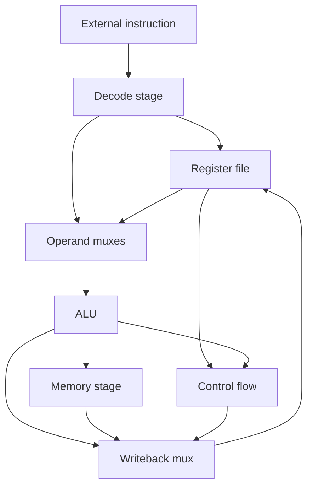
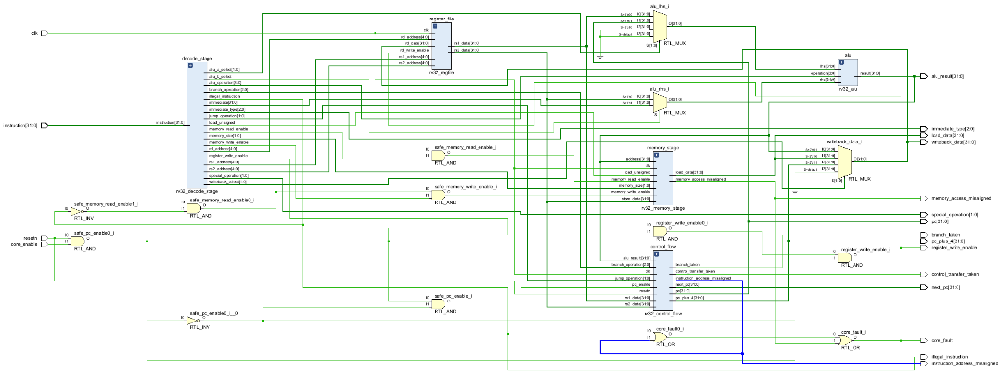
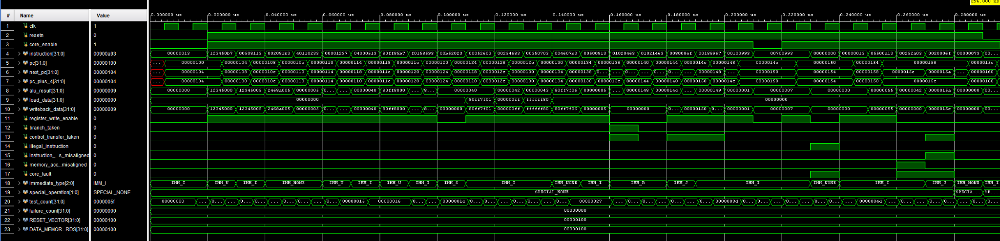

# Phase 6 — RV32 Core Integration Architecture

## Objective

Phase 6 connects the verified sub-top modules from Phases 1 through 5 into the first complete ForgeRV single-cycle processor. Each existing sub-top remains a single independent block. Phase 6 adds only the inter-block datapath, operand-selection logic, writeback selection, instruction memory and the final `rv32_core` integration module.

This document is the Phase 6 architecture and interface outline. It does not mark Phase 6 as complete; implementation and full-program verification still remain.

The recommended Git branch is:

```text
phase-6-core-integration
```

## Collapsed-block rule

The Phase 6 diagram treats each verified sub-top as one block:

- `rv32_decode_stage` includes the decoder and immediate generator.
- `rv32_control_flow` includes the PC register, branch unit and next-PC selector.
- `rv32_memory_stage` includes the load/store unit and data memory.
- `rv32_alu` represents the complete arithmetic and logical unit.
- `rv32_regfile` represents the complete 32 × 32-bit register file.

The internal implementation of these blocks is intentionally not expanded in the overall architecture diagram.

## Overall Phase 6 block scheme


Editable diagrams.net source:

```text
Diagrams/phase_6_overall_block_scheme.drawio
```

Solid coloured lines represent 32-bit datapath values. Dashed purple lines represent decoder control signals. The actual SystemVerilog top will describe these connections directly; the `.drawio` file is the architecture reference rather than a Vivado Block Design.

## Main instruction flow

Every instruction begins with the current PC and completes before the next active clock edge:

```text
PC
→ instruction memory
→ decode stage
→ register read and immediate generation
→ ALU / branch / memory operation
→ writeback selection
→ register write and next-PC update
```

Because this is a single-cycle processor, there are no pipeline registers between these blocks in Phase 6.

## Phase 6 block inventory

| Block | Status | Purpose |
| --- | --- | --- |
| `rv32_instruction_memory` | New in Phase 6 | Stores and returns program instructions |
| `rv32_decode_stage` | Completed in Phase 3 | Decodes instructions and generates immediates and controls |
| `rv32_regfile` | Completed in Phase 2 | Supplies two operands and stores one writeback result |
| ALU operand muxes | New glue logic | Selects ALU `lhs` and `rhs` sources |
| `rv32_alu` | Completed in Phase 1 | Performs arithmetic, logic, comparisons and shifts |
| `rv32_control_flow` | Completed in Phase 4 | Stores the PC and handles branches and jumps |
| `rv32_memory_stage` | Completed in Phase 5 | Handles loads, stores, alignment and local data memory |
| Writeback mux | New glue logic | Selects ALU, memory or `PC + 4` for `rd` |
| `rv32_core` | New in Phase 6 | Instantiates and connects the complete processor |

## Instruction memory interface

`rv32_instruction_memory` is the first new storage block required in Phase 6.

### Inputs

| Signal | Width | Source | Purpose |
| --- | ---: | --- | --- |
| `address` | 32 | `rv32_control_flow.pc` | Byte address of the instruction being fetched |

### Outputs

| Signal | Width | Destination | Purpose |
| --- | ---: | --- | --- |
| `instruction` | 32 | `rv32_decode_stage.instruction` | Complete RV32I instruction word |

The initial instruction memory should use a combinational read so the complete instruction can pass through the single-cycle datapath. The word index is derived from `address[...:2]` because every RV32I instruction is four bytes.

A memory-file parameter can later load compiled assembly using `$readmemh`.

## Decode-stage interface

File: `rtl/core/rv32_decode_stage.sv`


The decode stage is treated as one block even though it internally contains `rv32_decoder` and `rv32_imm_gen`.

### Inputs

| Signal | Width | Source | Purpose |
| --- | ---: | --- | --- |
| `instruction` | 32 | Instruction memory | Instruction to decode |

### Register and immediate outputs

| Signal | Width | Destination | Purpose |
| --- | ---: | --- | --- |
| `rs1_address` | 5 | Register file | First source-register address |
| `rs2_address` | 5 | Register file | Second source-register address |
| `rd_address` | 5 | Register file | Destination-register address |
| `immediate` | 32 | ALU right-input mux | Reconstructed and extended immediate |
| `immediate_type` | 3 | Debug and verification | Identifies I, S, B, U, J or no immediate |

### ALU control outputs

| Signal | Width | Destination | Purpose |
| --- | ---: | --- | --- |
| `alu_operation` | 4 | `rv32_alu.operation` | Selects the ALU function |
| `alu_a_select` | 2 | ALU left-input mux | Selects `rs1`, PC or zero |
| `alu_b_select` | 1 | ALU right-input mux | Selects `rs2` or the immediate |

### Control-flow outputs

| Signal | Width | Destination | Purpose |
| --- | ---: | --- | --- |
| `branch_operation` | 3 | Control-flow block | Selects the branch comparison |
| `jump_operation` | 2 | Control-flow block | Selects no jump, `JAL` or `JALR` |

### Memory outputs

| Signal | Width | Destination | Purpose |
| --- | ---: | --- | --- |
| `memory_read_enable` | 1 | Memory stage | Enables a load operation |
| `memory_write_enable` | 1 | Memory stage | Enables a store operation |
| `memory_size` | 2 | Memory stage | Selects byte, halfword or word |
| `load_unsigned` | 1 | Memory stage | Selects zero extension instead of sign extension |

### Writeback and status outputs

| Signal | Width | Destination | Purpose |
| --- | ---: | --- | --- |
| `writeback_select` | 2 | Writeback mux | Selects ALU, memory, `PC + 4` or no writeback |
| `register_write_enable` | 1 | Register-file write gate | Enables the destination-register write |
| `special_operation` | 2 | Core status / later exception unit | Identifies `FENCE`, `ECALL` and `EBREAK` |
| `illegal_instruction` | 1 | Core status / write gate | Identifies an unsupported or invalid encoding |

## Register-file interface

File: `rtl/core/rv32_regfile.sv`


### Inputs

| Signal | Width | Source | Purpose |
| --- | ---: | --- | --- |
| `clk` | 1 | Core clock | Captures a register write on the rising edge |
| `rs1_address` | 5 | Decode stage | Selects the first source register |
| `rs2_address` | 5 | Decode stage | Selects the second source register |
| `rd_write_enable` | 1 | Safe write-enable gate | Enables a destination write |
| `rd_address` | 5 | Decode stage | Selects the destination register |
| `rd_data` | 32 | Writeback mux | Value written into the destination register |

### Outputs

| Signal | Width | Destination | Purpose |
| --- | ---: | --- | --- |
| `rs1_data` | 32 | ALU mux and control-flow block | First register operand |
| `rs2_data` | 32 | ALU mux, control-flow and memory stage | Second operand and store data |

Both read ports are combinational. The write port is clocked. Reads from `x0` always return zero and writes to `x0` are ignored.

## ALU operand-selection interface

The ALU input muxes are new Phase 6 glue logic. They can be written directly inside `rv32_core.sv` because they do not need independent state.

### Left operand

| `alu_a_select` | Selected `alu_lhs` | Used by |
| --- | --- | --- |
| `ALU_A_RS1` | `rs1_data` | Register arithmetic, immediate arithmetic, loads, stores and `JALR` |
| `ALU_A_PC` | `pc` | Branch targets, `JAL` and `AUIPC` |
| `ALU_A_ZERO` | `32'b0` | `LUI` |

### Right operand

| `alu_b_select` | Selected `alu_rhs` | Used by |
| --- | --- | --- |
| `ALU_B_RS2` | `rs2_data` | Register-register ALU operations |
| `ALU_B_IMMEDIATE` | `immediate` | Immediate ALU operations, address calculations and control-transfer targets |

The mux outputs connect directly to `rv32_alu.lhs` and `rv32_alu.rhs`.

## ALU interface

File: `rtl/core/rv32_alu.sv`


The elaborated schematic expands the arithmetic and logic internally, but the Phase 6 architecture uses one `rv32_alu` block.

### Inputs

| Signal | Width | Source | Purpose |
| --- | ---: | --- | --- |
| `lhs` | 32 | ALU left-input mux | First ALU operand |
| `rhs` | 32 | ALU right-input mux | Second ALU operand |
| `operation` | 4 | Decode stage | Selects ADD, SUB, shifts, comparisons or logic |

### Outputs

| Signal | Width | Destinations | Purpose |
| --- | ---: | --- | --- |
| `result` | 32 | Writeback mux, memory stage and control-flow block | ALU value, effective address or control-transfer target |

The same `alu_result` signal fans out to three blocks. Decoder controls determine which destination actually uses it.

## Control-flow interface

File: `rtl/core/rv32_control_flow.sv`


The Phase 6 diagram keeps the PC register, branch unit and next-PC selector collapsed into this single block.

### Inputs

| Signal | Width | Source | Purpose |
| --- | ---: | --- | --- |
| `clk` | 1 | Core clock | Captures the next PC |
| `resetn` | 1 | Core reset | Loads the configured reset vector |
| `pc_enable` | 1 | Core enable / safety logic | Enables the PC update |
| `rs1_data` | 32 | Register file | First branch operand |
| `rs2_data` | 32 | Register file | Second branch operand |
| `alu_result` | 32 | ALU | Branch or jump target |
| `branch_operation` | 3 | Decode stage | Selects the branch condition |
| `jump_operation` | 2 | Decode stage | Selects `JAL`, `JALR` or no jump |

### Outputs

| Signal | Width | Destination | Purpose |
| --- | ---: | --- | --- |
| `pc` | 32 | Instruction memory and ALU mux | Current instruction address |
| `next_pc` | 32 | Debug and verification | Address presented to the PC register |
| `pc_plus_4` | 32 | Writeback mux | Link value for `JAL` and `JALR` |
| `branch_taken` | 1 | Debug and verification | Result of the selected branch comparison |
| `control_transfer_taken` | 1 | Debug and verification | Indicates a taken branch or active jump |
| `instruction_address_misaligned` | 1 | Core status / future exception unit | Indicates an invalid taken target address |

## Memory-stage interface

File: `rtl/core/rv32_memory_stage.sv`


The load/store unit and local data-memory array remain collapsed into one Phase 6 block.

### Inputs

| Signal | Width | Source | Purpose |
| --- | ---: | --- | --- |
| `clk` | 1 | Core clock | Captures store writes |
| `address` | 32 | ALU result | Effective byte address |
| `store_data` | 32 | Register-file `rs2_data` | Value used by `SB`, `SH` and `SW` |
| `memory_read_enable` | 1 | Decode stage | Enables a load |
| `memory_write_enable` | 1 | Decode stage | Enables a store |
| `memory_size` | 2 | Decode stage | Selects byte, halfword or word |
| `load_unsigned` | 1 | Decode stage | Selects zero extension for `LBU` and `LHU` |

### Outputs

| Signal | Width | Destination | Purpose |
| --- | ---: | --- | --- |
| `load_data` | 32 | Writeback mux | Extended load result |
| `memory_access_misaligned` | 1 | Core status / register write gate | Indicates an invalid halfword or word address |

The memory stage already suppresses misaligned memory requests and clears write strobes, so an invalid store cannot modify data memory.

## Writeback-selection interface

The writeback mux is new combinational glue logic. It selects the value returned to `rv32_regfile.rd_data`.

| `writeback_select` | Writeback value | Instruction classes |
| --- | --- | --- |
| `WB_ALU` | `alu_result` | Register ALU, immediate ALU, `LUI`, `AUIPC` |
| `WB_MEMORY` | `load_data` | `LB`, `LBU`, `LH`, `LHU`, `LW` |
| `WB_PC_PLUS_4` | `pc_plus_4` | `JAL`, `JALR` |
| `WB_NONE` | `32'b0` | Branches, stores and instructions without register results |

The writeback mux output connects to:

```text
writeback_data → rv32_regfile.rd_data
```

## Direct inter-block signal map

| Source | Signal | Destination |
| --- | --- | --- |
| Control flow | `pc` | Instruction-memory address |
| Control flow | `pc` | ALU left-input mux |
| Instruction memory | `instruction` | Decode stage |
| Decode stage | `rs1_address`, `rs2_address`, `rd_address` | Register file |
| Decode stage | `immediate`, `alu_a_select`, `alu_b_select` | ALU operand muxes |
| Decode stage | `alu_operation` | ALU |
| Decode stage | `branch_operation`, `jump_operation` | Control flow |
| Decode stage | Memory controls | Memory stage |
| Decode stage | `writeback_select` | Writeback mux |
| Decode stage | `register_write_enable` | Register write gate |
| Register file | `rs1_data`, `rs2_data` | ALU operand muxes |
| Register file | `rs1_data`, `rs2_data` | Control flow |
| Register file | `rs2_data` | Memory-stage store data |
| ALU operand muxes | `alu_lhs`, `alu_rhs` | ALU |
| ALU | `alu_result` | Writeback mux |
| ALU | `alu_result` | Memory-stage address |
| ALU | `alu_result` | Control-flow target |
| Memory stage | `load_data` | Writeback mux |
| Control flow | `pc_plus_4` | Writeback mux |
| Writeback mux | `writeback_data` | Register-file `rd_data` |

## Core safety gates

The decoder defaults invalid instructions to no memory access and no register write. The Phase 6 core should add a final safe register-write enable:

```systemverilog
safe_register_write_enable = register_write_enable &&
                             !illegal_instruction &&
                             !memory_access_misaligned;
```

The PC update should also be prevented when the selected instruction address is misaligned:

```systemverilog
safe_pc_enable = core_enable && !instruction_address_misaligned;
```

Full architectural traps are deferred until the exception and CSR phase. During Phase 6, these gates prevent invalid instructions or addresses from causing unwanted state changes.

## Clocked and combinational blocks

### Clocked state changes

| Block | Rising-edge action |
| --- | --- |
| Control flow | PC captures `next_pc` |
| Register file | `rd_data` is written into `rd_address` |
| Memory stage | Selected bytes are written during a store |

### Combinational behaviour

| Block | Current-cycle action |
| --- | --- |
| Instruction memory | Returns instruction at the PC address |
| Decode stage | Generates addresses, immediate and controls |
| Register file reads | Returns `rs1_data` and `rs2_data` |
| Operand muxes | Select ALU operands |
| ALU | Calculates result, address or target |
| Branch unit inside control flow | Determines whether a branch is taken |
| Memory-stage load path | Reads, selects and extends load data |
| Writeback mux | Selects the register result |

## Single-cycle instruction paths

### Register ALU instruction

```text
PC → instruction → decode → register file → ALU → writeback → register file
```

### Load instruction

```text
PC → instruction → decode → register file → ALU address
   → data memory → load extension → writeback → register file
```

### Store instruction

```text
PC → instruction → decode → register file → ALU address
   → store alignment and strobes → data-memory write
```

### Branch or jump

```text
PC → instruction → decode → register operands and immediate
   → branch comparison plus ALU target → next-PC selector → PC register
```

## Expected critical path

The first single-cycle core will probably be limited by the load path:

```text
PC
→ instruction memory
→ decode
→ register-file read
→ ALU address calculation
→ combinational data-memory read
→ load alignment and extension
→ writeback mux
→ register-file write input
```

Phase 7 will split this path with pipeline registers and add forwarding and hazard handling.

## Proposed `rv32_core` external interface

The minimum functional core only requires a clock and reset when both instruction and data memories are instantiated internally. Debug outputs are recommended for Phase 6 verification.

### Required inputs

| Signal | Width | Purpose |
| --- | ---: | --- |
| `clk` | 1 | Processor clock |
| `resetn` | 1 | Active-low synchronous core reset |
| `core_enable` | 1 | Enables execution and supports future stalls |

### Recommended verification outputs

| Signal | Width | Purpose |
| --- | ---: | --- |
| `pc` | 32 | Current instruction address |
| `instruction` | 32 | Current instruction word |
| `alu_result` | 32 | Current ALU result |
| `writeback_data` | 32 | Value selected for register writeback |
| `register_write_enable` | 1 | Final safe register-write enable |
| `illegal_instruction` | 1 | Invalid instruction indicator |
| `instruction_address_misaligned` | 1 | Invalid instruction-target indicator |
| `memory_access_misaligned` | 1 | Invalid data-access indicator |
| `special_operation` | 2 | Allows the testbench to detect `EBREAK` |

These debug outputs do not define additional processor state. They expose existing internal signals for self-checking simulation and can be removed or disabled in a later synthesis top.

## Phase 6 implementation files

The proposed Phase 6 additions are:

```text
rtl/memory/rv32_instruction_memory.sv
rtl/core/rv32_core.sv
sim/tb/rv32_core_tb.sv
sim/programs/phase_6_test.S
sim/programs/phase_6_test.hex
```

The operand and writeback muxes can initially remain inside `rv32_core.sv`. They only need separate files if later reuse or timing optimization makes that worthwhile.

## Phase 6 completion criteria

Phase 6 will be complete when:

- Instruction memory loads a compiled RV32I program.
- The PC fetches sequential instructions correctly.
- Register-register and immediate ALU instructions update the correct registers.
- Loads and stores use the correct effective addresses and data sizes.
- Taken and untaken branches update the PC correctly.
- `JAL` and `JALR` write `PC + 4` and select the correct targets.
- `LUI` and `AUIPC` produce correct results.
- Writes to `x0` remain ignored.
- Illegal and misaligned operations cause no unintended state changes.
- A complete assembly test program reaches its expected final register and memory state.
- The core-level self-checking testbench finishes with zero failures.

## Current Phase 6 status

The Phase 6 datapath interconnect has now been implemented as:

```text
rtl/core/rv32_core_interconnect.sv
```

It compiles, elaborates and passes all 95 checks in the integrated self-checking testbench. The interconnect milestone is therefore complete. Instruction-memory integration and compiled-program execution remain before the complete Phase 6 processor can be marked finished under the original completion criteria.

## Implemented `rv32_core_interconnect`

The implemented module connects the verified Phase 1–5 sub-top modules while accepting the current instruction as an external input. Keeping `instruction` external allows the integrated datapath to be verified before instruction memory is added.



The module contains no additional architectural storage. The clocked state remains inside:

- `rv32_regfile`, which stores the 32 integer registers.
- `rv32_control_flow`, which stores the PC.
- `rv32_memory_stage`, which contains the data-memory array.

The operand muxes, writeback mux and safety equations are combinational glue logic.

## Interconnect external interface

### Inputs

| Signal | Width | Purpose |
| --- | ---: | --- |
| `clk` | 1 | Clocks the register file, PC and data-memory writes |
| `resetn` | 1 | Active-low reset for core state and safety gating |
| `core_enable` | 1 | Allows the processor to run or holds its clocked state |
| `instruction` | 32 | Current instruction supplied to the decode stage |

### Datapath and PC outputs

| Signal | Width | Purpose |
| --- | ---: | --- |
| `pc` | 32 | Current program-counter value |
| `next_pc` | 32 | Combinational value proposed for the next PC update |
| `pc_plus_4` | 32 | Sequential PC value and link value for `JAL`/`JALR` |
| `alu_result` | 32 | Arithmetic result, effective address or control-transfer target |
| `load_data` | 32 | Sign- or zero-extended result from the memory stage |
| `writeback_data` | 32 | Final value supplied to the register-file write port |

### Control and status outputs

| Signal | Width | Purpose |
| --- | ---: | --- |
| `register_write_enable` | 1 | Final safe write enable supplied to the register file |
| `branch_taken` | 1 | Result of the selected branch comparison |
| `control_transfer_taken` | 1 | Indicates a taken branch, `JAL` or `JALR` |
| `illegal_instruction` | 1 | Indicates an unsupported opcode or function encoding |
| `instruction_address_misaligned` | 1 | Indicates a taken target that is not four-byte aligned |
| `memory_access_misaligned` | 1 | Indicates an invalid halfword or word data address |
| `core_fault` | 1 | Combined illegal-instruction or alignment-fault indication |
| `immediate_type` | 3 | Exposes the selected immediate format for verification |
| `special_operation` | 2 | Exposes `FENCE`, `ECALL` or `EBREAK` decoding |

## Sub-top connections

### Decode stage

`rv32_decode_stage` receives the complete 32-bit instruction. It produces the three register addresses, reconstructed immediate, ALU controls, branch and jump controls, memory controls, writeback selection and status outputs.

The address outputs connect directly to `rv32_regfile`:

```text
rs1_address → register_file.rs1_address
rs2_address → register_file.rs2_address
rd_address  → register_file.rd_address
```

### Register file

The register file exposes two simultaneous combinational read values:

```text
rs1_data → ALU left-input mux and control-flow branch comparator
rs2_data → ALU right-input mux, branch comparator and memory store data
```

Its single clocked write port receives:

```text
rd_write_enable = register_write_enable
rd_address      = decoded rd_address
rd_data         = writeback_data
```

### ALU

The ALU receives the selected `alu_lhs`, selected `alu_rhs` and decoded `alu_operation`. Its result fans out to three independent destinations:

```text
alu_result → writeback mux
alu_result → memory-stage effective address
alu_result → control-flow branch or jump target
```

Only the instruction's decoded controls determine which destination is active.

### Memory stage

The memory-stage address comes from `alu_result`, while store data always comes from `rs2_data`. A load returns `load_data` to the writeback mux. A misaligned access asserts `memory_access_misaligned` and the load/store unit internally suppresses the request or write strobe.

### Control flow

The control-flow block receives the two register operands for branch comparisons and `alu_result` for the calculated target. It supplies `pc`, `next_pc`, `pc_plus_4`, the branch result and instruction-address alignment status.

## ALU operand-selection equations

### Left operand

```systemverilog
case (alu_a_select)
    ALU_A_RS1: alu_lhs = rs1_data;
    ALU_A_PC: alu_lhs = pc;
    ALU_A_ZERO: alu_lhs = 32'b0;
    default: alu_lhs = 32'b0;
endcase
```

The value on the left of each assignment is `alu_lhs`, the first ALU operand. The value on the right is the independent source selected by `alu_a_select`:

- `alu_lhs = rs1_data` supplies the first register operand for register arithmetic, immediate arithmetic, loads, stores and `JALR`.
- `alu_lhs = pc` supplies the current instruction address for `AUIPC`, branch-target and `JAL` calculations.
- `alu_lhs = 32'b0` provides zero for `LUI`, where only the generated upper immediate is required.
- The default also supplies zero so an invalid selector cannot propagate an unknown operand into the ALU.

### Right operand

```systemverilog
case (alu_b_select)
    ALU_B_RS2: alu_rhs = rs2_data;
    ALU_B_IMMEDIATE: alu_rhs = immediate;
    default: alu_rhs = 32'b0;
endcase
```

The value on the left is `alu_rhs`, the second ALU operand. The right side is selected independently from either the second register port or the generated immediate:

- `alu_rhs = rs2_data` is used by register-register ALU instructions.
- `alu_rhs = immediate` is used by immediate arithmetic, load/store address calculations and control-transfer targets.
- The default drives zero for safe deterministic behaviour.

Together, `alu_a_select` and `alu_b_select` allow the same ALU to serve arithmetic, address generation and control-flow calculations without duplicating adders.

## Writeback-selection equations

```systemverilog
case (writeback_select)
    WB_ALU: writeback_data = alu_result;
    WB_MEMORY: writeback_data = load_data;
    WB_PC_PLUS_4: writeback_data = pc_plus_4;
    default: writeback_data = 32'b0;
endcase
```

`writeback_data` is the value on the left and is connected to `rv32_regfile.rd_data`. Each independent value on the right represents one possible producer:

- `alu_result` returns arithmetic, logical, `LUI` or `AUIPC` results.
- `load_data` returns data read and extended by the memory stage.
- `pc_plus_4` returns the link address for `JAL` and `JALR`.
- Zero is selected for branches, stores, invalid selectors and operations that do not write `rd`.

The writeback value alone cannot modify a register. A rising clock edge and an asserted final `register_write_enable` are also required.

## Safety-gating equations

### Safe memory-read enable

```systemverilog
assign safe_memory_read_enable = resetn &&
                                 core_enable &&
                                 !illegal_instruction &&
                                 memory_read_enable;
```

`safe_memory_read_enable` on the left is the only read enable presented to the memory stage. Every independent term on the right must be true because they are joined by AND operations:

- `resetn` must be high, meaning reset is inactive.
- `core_enable` must be high, meaning the core is allowed to execute.
- `!illegal_instruction` must be high, meaning the decoder accepted the instruction.
- `memory_read_enable` must be high, meaning the instruction is a supported load.

If any term is false, no memory read request is generated.

### Safe memory-write enable

```systemverilog
assign safe_memory_write_enable = resetn &&
                                  core_enable &&
                                  !illegal_instruction &&
                                  memory_write_enable;
```

`safe_memory_write_enable` on the left is the only write enable presented to the memory stage. The right-side terms require the core to be out of reset, enabled, executing a legal instruction and decoding a valid store.

Memory alignment is not fed back into this equation because `memory_access_misaligned` is produced inside the memory stage from the request and calculated address. The load/store unit independently suppresses its request and clears its write strobe when it detects misalignment, avoiding a combinational feedback loop.

### Combined fault indication

```systemverilog
assign core_fault = illegal_instruction ||
                    instruction_address_misaligned ||
                    memory_access_misaligned;
```

`core_fault` on the left represents the combined current-instruction failure state. The right side uses OR operations, so any one independent fault is sufficient:

- `illegal_instruction` detects an invalid opcode, `funct3` or `funct7` combination.
- `instruction_address_misaligned` detects an invalid taken branch or jump target.
- `memory_access_misaligned` detects an invalid halfword or word data address.

### Safe register-write enable

```systemverilog
assign register_write_enable = resetn &&
                               core_enable &&
                               decoded_register_write_enable &&
                               !core_fault;
```

`register_write_enable` on the left is connected to the register-file write port. All independent conditions on the right must be true:

- Reset must be inactive.
- The core must be enabled.
- The decoder must identify an instruction that normally writes `rd`.
- No illegal-instruction or alignment fault may be active.

This prevents a faulting load, jump or invalid instruction from corrupting a destination register.

### Safe PC enable

```systemverilog
assign safe_pc_enable = resetn &&
                        core_enable &&
                        !core_fault;
```

`safe_pc_enable` on the left controls whether the PC captures `next_pc`. On the right, reset must be inactive, the core must be enabled and the current instruction must not have raised a fault.

When a fault occurs, the current implementation holds the PC on the faulting instruction. This is deliberate temporary behaviour because trap redirection and CSRs have not yet been implemented.

## Elaborated integration result



*Figure 6.2 — Vivado elaboration of the complete Phase 6 interconnect. The diagram shows the decode stage, register file, operand muxes, ALU, memory stage, control-flow block, writeback mux and safety gates connected as one synthesizable hierarchy.*

The elaborated design confirms that:

- Each verified sub-top remains a separate instantiated block.
- The two operand-selection `case` statements synthesize into ALU input multiplexers.
- The writeback-selection `case` statement synthesizes into a three-source result multiplexer.
- The safe enables synthesize into small AND/NOT networks.
- `core_fault` synthesizes into OR logic combining the three fault sources.
- No accidental extra architectural register was added by the interconnect.

## Core-level testbench design

File:

```text
sim/tb/rv32_core_interconnect_tb.sv
```

The testbench drives encoded RV32I instructions directly into the external `instruction` input. This tests the integrated datapath independently of instruction memory.

### Instruction-encoding functions

The testbench contains separate functions for R, I, S, B, U and J encodings. Each function places register addresses, function fields and immediate fragments into their correct instruction positions. This avoids manually calculating a new hexadecimal instruction for every test.

### Instruction timing tasks

`drive_instruction` waits for a falling edge before changing `instruction`. This gives the combinational decode, register read, ALU, memory and writeback path half a cycle to settle before the next rising edge.

`commit_instruction` waits for the following rising edge and then delays by one nanosecond. The clocked register file, PC or data memory can therefore update before the testbench checks the result.

### Self-checking tasks

- `check_32` compares 32-bit values such as PC, ALU results, loaded data and register contents.
- `check_1` compares single-bit enables, branch decisions and fault flags.
- `check_immediate_type` verifies that the decode stage selected the expected immediate format.
- `test_count` records every comparison.
- `failure_count` records mismatches and must remain zero.

The testbench uses case-inequality comparisons (`!==`) so an unknown `X` or high-impedance `Z` value fails instead of accidentally being treated as correct.

## Verification coverage

| Area | Verified behaviour |
| --- | --- |
| Reset | Reset vector loaded and register writes suppressed |
| ALU-left mux | `rs1_data`, `pc` and zero selections |
| ALU-right mux | `rs2_data` and immediate selections |
| ALU writeback | `LUI`, `ADDI`, `ADD`, `SUB` and `AUIPC` results |
| Register file | Clocked commits and later use of written values |
| Store path | Effective address and aligned `SW` operation |
| Load path | `LW`, `LBU`, `LB`, zero extension and sign extension |
| Load-to-ALU path | A loaded value reused by a following arithmetic instruction |
| Branch control | Taken `BEQ` and untaken `BNE` |
| Jump control | `JAL` target/link and `JALR` bit-zero clearing/link |
| PC control | Sequential, branch, jump, disabled-core and fault hold behaviour |
| Core enable | Register and PC state held while disabled and resumed when enabled |
| Illegal instruction | Fault raised with register and PC updates suppressed |
| Data alignment | Misaligned `LW` detected without changing its destination register |
| Instruction alignment | Misaligned `JAL` detected without changing the PC |
| Special decoding | `ECALL` decoded as `SPECIAL_ECALL` |
| Reset priority | Active reset returns the PC to `RESET_VECTOR` |

## Simulation result

Vivado XSim compiled and elaborated the complete hierarchy, then executed all 95 self-checking comparisons with zero failures:

```text
PASS: reset vector value=00000100
PASS: register write disabled during reset value=0
PASS: LUI immediate type value=4
PASS: LUI ALU result value=12345000
PASS: LUI writeback selection value=12345000
PASS: LUI register write enabled value=1
PASS: LUI register commit value=12345000
PASS: LUI sequential PC update value=00000104
PASS: ADDI immediate type value=1
PASS: ADDI ALU result value=12345005
PASS: ADDI writeback selection value=12345005
PASS: ADDI register commit value=12345005
PASS: ADDI sequential PC update value=00000108
PASS: ADD has no immediate value=0
PASS: ADD ALU result value=2468a005
PASS: ADD register commit value=2468a005
PASS: SUB ALU result value=00000005
PASS: SUB register commit value=00000005
PASS: AUIPC ALU result value=00001110
PASS: AUIPC writeback selection value=00001110
PASS: AUIPC register commit value=00001110
PASS: memory base register value=00000040
PASS: store value construction value=80ff7f01
PASS: store value register value=80ff7f01
PASS: SW immediate type value=2
PASS: SW effective address value=00000040
PASS: aligned SW has no fault value=0
PASS: SW does not write a register value=0
PASS: LW effective address value=00000040
PASS: LW load data value=80ff7f01
PASS: LW writeback selection value=80ff7f01
PASS: LW register write enabled value=1
PASS: LW register commit value=80ff7f01
PASS: LBU zero extension value=000000ff
PASS: LBU register commit value=000000ff
PASS: LB sign extension value=ffffff80
PASS: LB register commit value=ffffff80
PASS: loaded value used by ALU value=80ff7f06
PASS: load-to-ALU register commit value=80ff7f06
PASS: BEQ immediate type value=3
PASS: BEQ branch taken value=1
PASS: BEQ control transfer value=1
PASS: BEQ target selection value=00000140
PASS: BEQ PC update value=00000140
PASS: BNE branch not taken value=0
PASS: BNE no control transfer value=0
PASS: BNE sequential next PC value=00000144
PASS: BNE sequential PC update value=00000144
PASS: JAL immediate type value=5
PASS: JAL ALU target value=0000014c
PASS: JAL link writeback value=00000148
PASS: JAL next PC value=0000014c
PASS: JAL control transfer value=1
PASS: JAL link register commit value=00000148
PASS: JAL PC update value=0000014c
PASS: JALR raw ALU target value=00000149
PASS: JALR cleared target bit zero value=00000148
PASS: JALR link writeback value=00000150
PASS: aligned JALR has no address fault value=0
PASS: JALR link register commit value=00000150
PASS: JALR PC update value=00000148
PASS: core hold test register initialized value=00000001
PASS: core disable suppresses register write value=0
PASS: core disable holds next PC externally value=0000014c
PASS: core disable holds PC value=0000014c
PASS: core disable preserves register value=00000001
PASS: core re-enable restores register write value=1
PASS: core re-enable updates register value=00000007
PASS: core re-enable updates PC value=00000150
PASS: invalid opcode detected value=1
PASS: invalid opcode raises core fault value=1
PASS: invalid opcode suppresses register write value=0
PASS: invalid opcode proposed next PC value=00000154
PASS: invalid opcode holds PC value=00000150
PASS: legal NOP clears illegal flag value=0
PASS: legal NOP clears core fault value=0
PASS: legal NOP advances PC value=00000154
PASS: misaligned load destination initialized value=00000055
PASS: misaligned LW effective address value=00000042
PASS: misaligned LW detected value=1
PASS: misaligned LW raises core fault value=1
PASS: misaligned LW suppresses register write value=0
PASS: misaligned LW holds PC value=00000158
PASS: misaligned LW preserves destination value=00000055
PASS: misaligned JAL target value=0000015a
PASS: misaligned JAL detected value=1
PASS: misaligned JAL raises core fault value=1
PASS: misaligned JAL suppresses register write value=0
PASS: misaligned JAL holds PC value=00000158
PASS: ECALL special operation value=2
PASS: ECALL is a supported instruction value=0
PASS: ECALL does not write a register value=0
PASS: ECALL sequential PC update value=0000015c
PASS: reset suppresses register write value=0
PASS: reset priority returns PC to vector value=00000100
All 95 rv32_core_interconnect tests passed.
$finish called at time : 296 ns
```



*Figure 6.3 — Complete 296 ns self-checking simulation. The waveform shows sequential and redirected PC values, all three writeback paths, branch and jump pulses, temporary fault indications, immediate-type changes and a zero failure count.*

### Waveform interpretation

- From reset through the early ALU tests, `pc` advances in four-byte increments while `writeback_data` matches the expected ALU result.
- During the memory tests, `load_data` changes to the stored word, zero-extended byte and sign-extended byte values.
- `branch_taken` and `control_transfer_taken` pulse for the taken `BEQ` and jump instructions.
- `pc` changes directly to the calculated targets for `BEQ`, `JAL` and `JALR`.
- During `core_enable = 0`, the current PC and register state remain unchanged.
- `illegal_instruction`, `memory_access_misaligned` and `instruction_address_misaligned` each cause `core_fault` to assert during their corresponding tests.
- The PC remains held during each fault and resumes once a legal aligned instruction replaces the faulting input.
- `failure_count` remains `32'b0` for the complete simulation.
- The final reset returns `pc` to `32'h00000100`.

## Vivado timescale warnings

XSim reported warnings because the testbench declares:

```systemverilog
`timescale 1ns / 1ps
```

while the synthesizable RTL files do not declare a timescale. These warnings do not indicate a functional problem. XSim selected a one-picosecond simulation resolution, compiled every module and completed all tests successfully.

The warnings can be removed later by adding a common timescale directive to the RTL sources or by using project-level time-unit settings. They have no effect on synthesized hardware.

## Updated completion state

| Phase 6 item | State |
| --- | --- |
| Interface and connection architecture | Complete |
| ALU operand muxes | Implemented and verified |
| Writeback mux | Implemented and verified |
| Safe memory, register and PC gating | Implemented and verified |
| Phase 1–5 sub-top interconnection | Implemented and verified |
| `rv32_core_interconnect` elaboration | Successful |
| Integrated self-checking testbench | 95 of 95 checks passed |
| Instruction memory | Not yet integrated |
| Final `rv32_core` wrapper | Not yet implemented |
| Compiled assembly-program execution | Not yet tested |

The verified interconnect now provides the complete execution datapath required by the final core. The next task is to connect instruction memory to `pc` and `instruction`, place the interconnect inside the final `rv32_core` wrapper and run a compiled assembly program without testbench-driven instruction injection.

## Post-route timing characterization

The first physical implementation was constrained to a 125 MHz core clock:

```text
Target clock period = 8.000 ns
Target frequency    = 125.00 MHz
```

The latest routed timing result reports:

```text
Worst negative slack = -10.747 ns
```

Negative setup slack means the longest register-to-register path cannot complete within the requested 8 ns clock period. The approximate period required by the current routed circuit is:

```text
Required period ≈ target period + |worst negative slack|
                ≈ 8.000 ns + 10.747 ns
                ≈ 18.747 ns
```

The corresponding estimated maximum clock frequency is:

```text
Fmax ≈ 1 / 18.747 ns
     ≈ 53.34 MHz
```

| Timing quantity | Current result |
| --- | ---: |
| Requested frequency | 125.00 MHz |
| Requested period | 8.000 ns |
| Latest worst negative slack | -10.747 ns |
| Estimated minimum period | 18.747 ns |
| Estimated current maximum frequency | **53.34 MHz** |
| Fraction of the 125 MHz target reached | 42.7% |
| Frequency increase required to reach 125 MHz | Approximately 2.34× |

The 53.34 MHz value is a post-route timing estimate for this particular synthesis, placement and routing result. It is not yet a measured FPGA operating limit. A final maximum frequency should be confirmed by repeating implementation with progressively shorter clock periods and then testing the resulting bitstream on the FPGA.

## Critical path identified by Vivado

The worst path is the single-cycle load-to-register-writeback path. It begins at a clocked register-file storage element, passes through the complete load datapath and ends at the register-file write input:

```text
Register-file read
→ ALU operand and effective-address logic
→ distributed data-memory address network
→ asynchronous data-memory read
→ memory output selection
→ load lane selection and extension
→ writeback selection
→ register-file write input
```

The detailed timing report captured the following structure on the critical path:

| Path property | Reported value |
| --- | ---: |
| Data-path delay | 18.819 ns |
| Logic delay | 3.215 ns |
| Routing delay | 15.604 ns |
| Logic levels | 13 |
| Logic-delay share | 17.1% |
| Routing-delay share | 82.9% |
| Main primitives | `RAMD32`, `LUT5`, `LUT6`, `RAMS64E`, `MUXF7`, `MUXF8` |

These detailed values came from the initial routed report with `WNS = -11.165 ns`. A later implementation improved WNS to `-10.747 ns`, producing the current 53.34 MHz estimate. The exact logic-versus-route split can move slightly between implementation runs, but the path structure and routing-dominated limitation remain the important findings.

## Sources of frequency loss

### 1. Complete load execution occurs in one clock cycle

The main architectural limitation is the single-cycle datapath. A load must read `rs1`, calculate the effective address, read data memory, select the required byte or halfword, extend it, select the memory writeback source and reach the destination-register input before the next rising edge.

This is substantially longer than an ordinary ALU instruction. Because the clock period must accommodate the slowest legal instruction, the load path sets the frequency limit for the whole processor.

### 2. Data memory uses an asynchronous distributed-RAM read

The current data memory returns read data combinationally in the same cycle. This behaviour supports the single-cycle design but prevents the memory from using the FPGA's fastest normal block-RAM arrangement, whose read path is clocked.

Vivado implemented the memory using distributed LUT RAM and output multiplexers. The critical path includes a `RAMS64E`, a `MUXF7` and a `MUXF8`, showing that the 256-word memory requires both distributed storage and selection logic before the loaded data is available.

### 3. Routing dominates the delay

The measured path contains approximately 3.215 ns of logic delay but 15.604 ns of routing delay. Therefore, replacing one small Boolean expression with another equivalent expression is unlikely to create a large improvement by itself.

The larger problem is that the signal travels between physically separated register-file, ALU, memory and writeback resources. The FPGA must route that complete loop across the device within one cycle.

### 4. Several internal nets have very high fanout

The high-fanout report includes internal nets with fanouts of 768, 640, 515 and 512. A single driver feeding hundreds of loads requires a large routing tree. This adds capacitance, consumes routing resources and can force the connected logic farther apart.

The highest-fanout signals are associated with the ALU/effective-address network and the distributed memory implementation. This agrees with the timing report: memory addressing and routing, rather than the raw 32-bit addition alone, are the dominant problems.

### 5. One general ALU is shared by multiple instruction paths

The general ALU produces arithmetic results, load/store addresses and control-transfer targets. Sharing the hardware saves area, but the ALU result and its operand-selection logic fan out toward the writeback, memory and control-flow blocks.

For loads and stores, the address is always `rs1_data + immediate`. A dedicated load/store address adder would consume more hardware but could be placed beside the memory stage and reduce the distance and fanout of the effective-address path.

### 6. Load formatting adds logic after the memory read

The memory returns an aligned 32-bit word. The load/store unit must then use the two low address bits to select a byte or halfword and must perform either sign extension or zero extension. The writeback multiplexer follows this formatting logic.

This means the memory output is not the end of the load path. Several more selection stages must still be crossed before the result reaches `rd_data`.

### 7. The register file also uses distributed FPGA resources

The two combinational register-file read ports and one clocked write port map to distributed-RAM primitives such as `RAMD32`. This provides the behaviour required by the current core, but it places the beginning and end of the critical path in configurable-logic slices rather than in a compact dedicated processor register-file structure.

The physical distance between the read copy, load datapath and write copy contributes to the large routing component.

### 8. The path contains 13 combinational levels

The report shows 13 logic levels, including nine `LUT6` elements in addition to the memory and multiplexer primitives. Although the individual LUT delays are small, every level adds a net that must also be routed. The accumulation of many short logic operations and long interconnect segments creates the 18 ns-class total delay.

### 9. Debug exposure can influence placement, but it is not the primary cause

The timing wrapper reduces the external pin count by selecting internal debug values through a smaller output interface. False-path constraints prevent the debug output timing itself from setting the core clock limit.

However, debug selection logic can still share internal signals and slightly influence placement or fanout. It should be reduced or removed for final frequency measurements, but the timing report shows that the fundamental problem is still the single-cycle register-file-to-memory-to-register-file path.

## Factors that are not currently the main limitation

| Factor | Timing evidence |
| --- | --- |
| Hold timing | No failing hold endpoints were reported |
| Clock uncertainty | Approximately 0.035 ns, very small compared with the data-path delay |
| Clock skew | Small compared with the 10.747 ns setup failure |
| General routing congestion | Vivado reported no congestion windows above level 5 |
| Simulation correctness | All 95 functional interconnect tests passed; the problem is physical timing, not the tested logic function |

## Timing-optimization priority

The recommended order for single-cycle hardware optimization is:

1. Add a dedicated load/store effective-address adder near the memory stage.
2. Reorganize data memory into explicitly banked 64-word byte lanes to reduce address fanout and large output selection networks.
3. Replace the variable load-data shift with explicit byte and halfword lane selection.
4. Replicate only the worst high-fanout address/control drivers and keep each copy local to its consumers.
5. Compare Vivado physical-optimization directives after each RTL change.
6. Apply light floorplanning only after the datapath topology has been improved.
7. If 125 MHz remains unreachable, add a pipeline boundary or a second cycle for memory access.

Every optimization should be checked with the unchanged 95-test functional testbench and then measured again using the same device, clock constraint and implementation settings. This makes the frequency gain attributable to the hardware change rather than to a different test or constraint.
