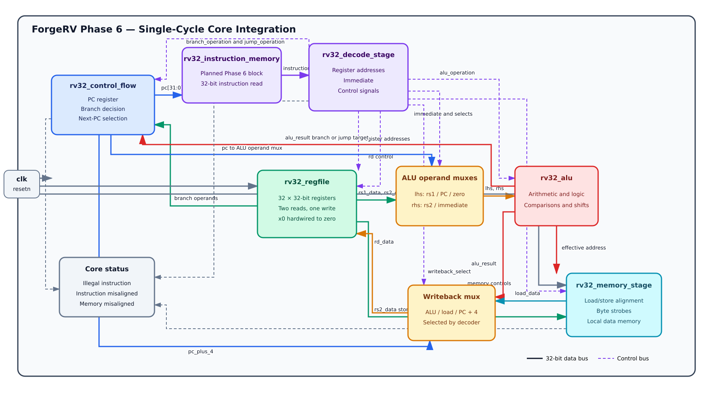
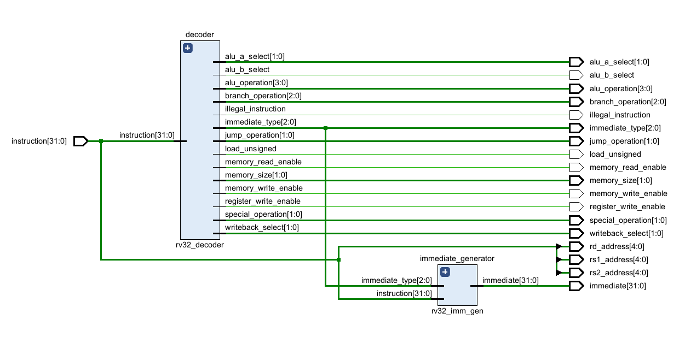
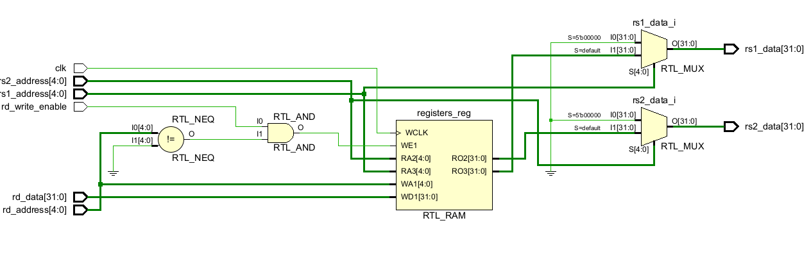
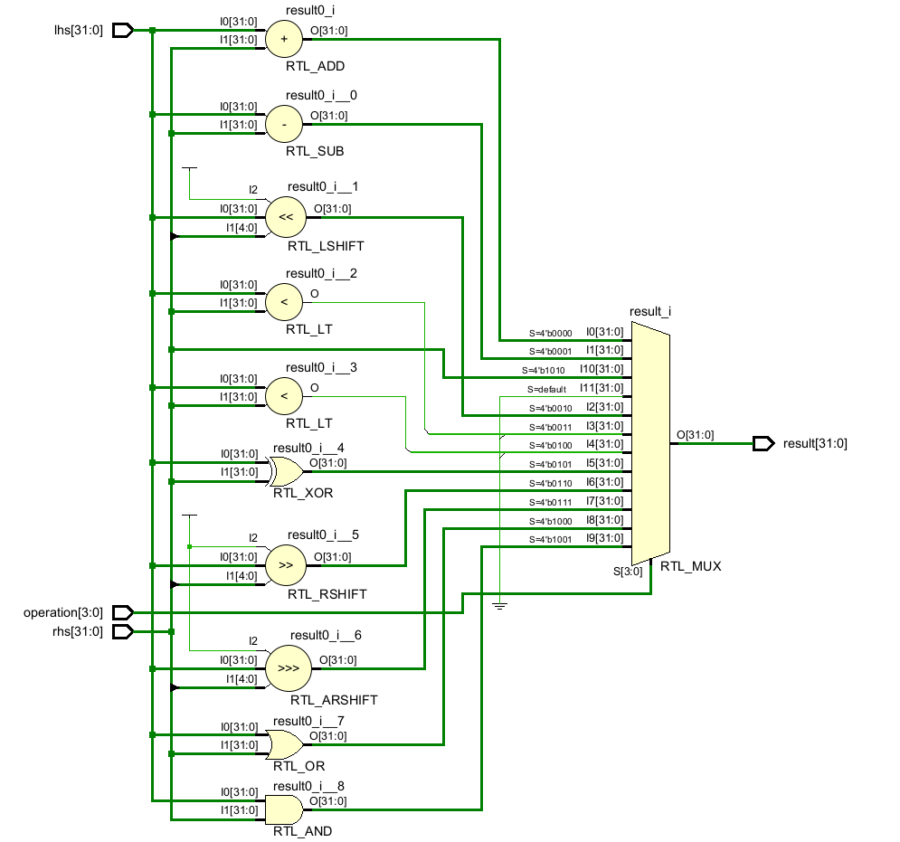
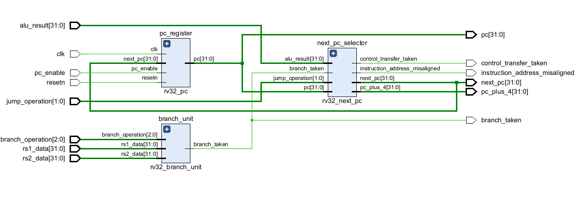
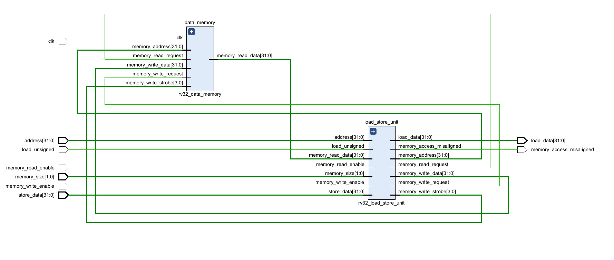

# Phase 6 — RV32 Core Integration Architecture

## Objective

Phase 6 connects the verified sub-top modules from Phases 1 through 5 into the first complete ForgeRV single-cycle processor. Each existing sub-top remains a single independent block. Phase 6 adds only the inter-block datapath, operand-selection logic, writeback selection, instruction memory and the final `rv32_core` integration module.

This document is the Phase 6 architecture and interface outline. It does not mark Phase 6 as complete; implementation and full-program verification still remain.

The recommended Git branch is:

```text
phase-6-core-integration
```

## Collapsed-block rule

The Phase 6 diagram treats each verified sub-top as one block:

- `rv32_decode_stage` includes the decoder and immediate generator.
- `rv32_control_flow` includes the PC register, branch unit and next-PC selector.
- `rv32_memory_stage` includes the load/store unit and data memory.
- `rv32_alu` represents the complete arithmetic and logical unit.
- `rv32_regfile` represents the complete 32 × 32-bit register file.

The internal implementation of these blocks is intentionally not expanded in the overall architecture diagram.

## Overall Phase 6 block scheme



Editable diagrams.net source:

```text
Diagrams/phase_6_overall_block_scheme.drawio
```

Solid coloured lines represent 32-bit datapath values. Dashed purple lines represent decoder control signals. The actual SystemVerilog top will describe these connections directly; the `.drawio` file is the architecture reference rather than a Vivado Block Design.

## Main instruction flow

Every instruction begins with the current PC and completes before the next active clock edge:

```text
PC
→ instruction memory
→ decode stage
→ register read and immediate generation
→ ALU / branch / memory operation
→ writeback selection
→ register write and next-PC update
```

Because this is a single-cycle processor, there are no pipeline registers between these blocks in Phase 6.

## Phase 6 block inventory

| Block | Status | Purpose |
| --- | --- | --- |
| `rv32_instruction_memory` | New in Phase 6 | Stores and returns program instructions |
| `rv32_decode_stage` | Completed in Phase 3 | Decodes instructions and generates immediates and controls |
| `rv32_regfile` | Completed in Phase 2 | Supplies two operands and stores one writeback result |
| ALU operand muxes | New glue logic | Selects ALU `lhs` and `rhs` sources |
| `rv32_alu` | Completed in Phase 1 | Performs arithmetic, logic, comparisons and shifts |
| `rv32_control_flow` | Completed in Phase 4 | Stores the PC and handles branches and jumps |
| `rv32_memory_stage` | Completed in Phase 5 | Handles loads, stores, alignment and local data memory |
| Writeback mux | New glue logic | Selects ALU, memory or `PC + 4` for `rd` |
| `rv32_core` | New in Phase 6 | Instantiates and connects the complete processor |

## Instruction memory interface

`rv32_instruction_memory` is the first new storage block required in Phase 6.

### Inputs

| Signal | Width | Source | Purpose |
| --- | ---: | --- | --- |
| `address` | 32 | `rv32_control_flow.pc` | Byte address of the instruction being fetched |

### Outputs

| Signal | Width | Destination | Purpose |
| --- | ---: | --- | --- |
| `instruction` | 32 | `rv32_decode_stage.instruction` | Complete RV32I instruction word |

The initial instruction memory should use a combinational read so the complete instruction can pass through the single-cycle datapath. The word index is derived from `address[...:2]` because every RV32I instruction is four bytes.

A memory-file parameter can later load compiled assembly using `$readmemh`.

## Decode-stage interface

File: `rtl/core/rv32_decode_stage.sv`



The decode stage is treated as one block even though it internally contains `rv32_decoder` and `rv32_imm_gen`.

### Inputs

| Signal | Width | Source | Purpose |
| --- | ---: | --- | --- |
| `instruction` | 32 | Instruction memory | Instruction to decode |

### Register and immediate outputs

| Signal | Width | Destination | Purpose |
| --- | ---: | --- | --- |
| `rs1_address` | 5 | Register file | First source-register address |
| `rs2_address` | 5 | Register file | Second source-register address |
| `rd_address` | 5 | Register file | Destination-register address |
| `immediate` | 32 | ALU right-input mux | Reconstructed and extended immediate |
| `immediate_type` | 3 | Debug and verification | Identifies I, S, B, U, J or no immediate |

### ALU control outputs

| Signal | Width | Destination | Purpose |
| --- | ---: | --- | --- |
| `alu_operation` | 4 | `rv32_alu.operation` | Selects the ALU function |
| `alu_a_select` | 2 | ALU left-input mux | Selects `rs1`, PC or zero |
| `alu_b_select` | 1 | ALU right-input mux | Selects `rs2` or the immediate |

### Control-flow outputs

| Signal | Width | Destination | Purpose |
| --- | ---: | --- | --- |
| `branch_operation` | 3 | Control-flow block | Selects the branch comparison |
| `jump_operation` | 2 | Control-flow block | Selects no jump, `JAL` or `JALR` |

### Memory outputs

| Signal | Width | Destination | Purpose |
| --- | ---: | --- | --- |
| `memory_read_enable` | 1 | Memory stage | Enables a load operation |
| `memory_write_enable` | 1 | Memory stage | Enables a store operation |
| `memory_size` | 2 | Memory stage | Selects byte, halfword or word |
| `load_unsigned` | 1 | Memory stage | Selects zero extension instead of sign extension |

### Writeback and status outputs

| Signal | Width | Destination | Purpose |
| --- | ---: | --- | --- |
| `writeback_select` | 2 | Writeback mux | Selects ALU, memory, `PC + 4` or no writeback |
| `register_write_enable` | 1 | Register-file write gate | Enables the destination-register write |
| `special_operation` | 2 | Core status / later exception unit | Identifies `FENCE`, `ECALL` and `EBREAK` |
| `illegal_instruction` | 1 | Core status / write gate | Identifies an unsupported or invalid encoding |

## Register-file interface

File: `rtl/core/rv32_regfile.sv`



### Inputs

| Signal | Width | Source | Purpose |
| --- | ---: | --- | --- |
| `clk` | 1 | Core clock | Captures a register write on the rising edge |
| `rs1_address` | 5 | Decode stage | Selects the first source register |
| `rs2_address` | 5 | Decode stage | Selects the second source register |
| `rd_write_enable` | 1 | Safe write-enable gate | Enables a destination write |
| `rd_address` | 5 | Decode stage | Selects the destination register |
| `rd_data` | 32 | Writeback mux | Value written into the destination register |

### Outputs

| Signal | Width | Destination | Purpose |
| --- | ---: | --- | --- |
| `rs1_data` | 32 | ALU mux and control-flow block | First register operand |
| `rs2_data` | 32 | ALU mux, control-flow and memory stage | Second operand and store data |

Both read ports are combinational. The write port is clocked. Reads from `x0` always return zero and writes to `x0` are ignored.

## ALU operand-selection interface

The ALU input muxes are new Phase 6 glue logic. They can be written directly inside `rv32_core.sv` because they do not need independent state.

### Left operand

| `alu_a_select` | Selected `alu_lhs` | Used by |
| --- | --- | --- |
| `ALU_A_RS1` | `rs1_data` | Register arithmetic, immediate arithmetic, loads, stores and `JALR` |
| `ALU_A_PC` | `pc` | Branch targets, `JAL` and `AUIPC` |
| `ALU_A_ZERO` | `32'b0` | `LUI` |

### Right operand

| `alu_b_select` | Selected `alu_rhs` | Used by |
| --- | --- | --- |
| `ALU_B_RS2` | `rs2_data` | Register-register ALU operations |
| `ALU_B_IMMEDIATE` | `immediate` | Immediate ALU operations, address calculations and control-transfer targets |

The mux outputs connect directly to `rv32_alu.lhs` and `rv32_alu.rhs`.

## ALU interface

File: `rtl/core/rv32_alu.sv`



The elaborated schematic expands the arithmetic and logic internally, but the Phase 6 architecture uses one `rv32_alu` block.

### Inputs

| Signal | Width | Source | Purpose |
| --- | ---: | --- | --- |
| `lhs` | 32 | ALU left-input mux | First ALU operand |
| `rhs` | 32 | ALU right-input mux | Second ALU operand |
| `operation` | 4 | Decode stage | Selects ADD, SUB, shifts, comparisons or logic |

### Outputs

| Signal | Width | Destinations | Purpose |
| --- | ---: | --- | --- |
| `result` | 32 | Writeback mux, memory stage and control-flow block | ALU value, effective address or control-transfer target |

The same `alu_result` signal fans out to three blocks. Decoder controls determine which destination actually uses it.

## Control-flow interface

File: `rtl/core/rv32_control_flow.sv`



The Phase 6 diagram keeps the PC register, branch unit and next-PC selector collapsed into this single block.

### Inputs

| Signal | Width | Source | Purpose |
| --- | ---: | --- | --- |
| `clk` | 1 | Core clock | Captures the next PC |
| `resetn` | 1 | Core reset | Loads the configured reset vector |
| `pc_enable` | 1 | Core enable / safety logic | Enables the PC update |
| `rs1_data` | 32 | Register file | First branch operand |
| `rs2_data` | 32 | Register file | Second branch operand |
| `alu_result` | 32 | ALU | Branch or jump target |
| `branch_operation` | 3 | Decode stage | Selects the branch condition |
| `jump_operation` | 2 | Decode stage | Selects `JAL`, `JALR` or no jump |

### Outputs

| Signal | Width | Destination | Purpose |
| --- | ---: | --- | --- |
| `pc` | 32 | Instruction memory and ALU mux | Current instruction address |
| `next_pc` | 32 | Debug and verification | Address presented to the PC register |
| `pc_plus_4` | 32 | Writeback mux | Link value for `JAL` and `JALR` |
| `branch_taken` | 1 | Debug and verification | Result of the selected branch comparison |
| `control_transfer_taken` | 1 | Debug and verification | Indicates a taken branch or active jump |
| `instruction_address_misaligned` | 1 | Core status / future exception unit | Indicates an invalid taken target address |

## Memory-stage interface

File: `rtl/core/rv32_memory_stage.sv`



The load/store unit and local data-memory array remain collapsed into one Phase 6 block.

### Inputs

| Signal | Width | Source | Purpose |
| --- | ---: | --- | --- |
| `clk` | 1 | Core clock | Captures store writes |
| `address` | 32 | ALU result | Effective byte address |
| `store_data` | 32 | Register-file `rs2_data` | Value used by `SB`, `SH` and `SW` |
| `memory_read_enable` | 1 | Decode stage | Enables a load |
| `memory_write_enable` | 1 | Decode stage | Enables a store |
| `memory_size` | 2 | Decode stage | Selects byte, halfword or word |
| `load_unsigned` | 1 | Decode stage | Selects zero extension for `LBU` and `LHU` |

### Outputs

| Signal | Width | Destination | Purpose |
| --- | ---: | --- | --- |
| `load_data` | 32 | Writeback mux | Extended load result |
| `memory_access_misaligned` | 1 | Core status / register write gate | Indicates an invalid halfword or word address |

The memory stage already suppresses misaligned memory requests and clears write strobes, so an invalid store cannot modify data memory.

## Writeback-selection interface

The writeback mux is new combinational glue logic. It selects the value returned to `rv32_regfile.rd_data`.

| `writeback_select` | Writeback value | Instruction classes |
| --- | --- | --- |
| `WB_ALU` | `alu_result` | Register ALU, immediate ALU, `LUI`, `AUIPC` |
| `WB_MEMORY` | `load_data` | `LB`, `LBU`, `LH`, `LHU`, `LW` |
| `WB_PC_PLUS_4` | `pc_plus_4` | `JAL`, `JALR` |
| `WB_NONE` | `32'b0` | Branches, stores and instructions without register results |

The writeback mux output connects to:

```text
writeback_data → rv32_regfile.rd_data
```

## Direct inter-block signal map

| Source | Signal | Destination |
| --- | --- | --- |
| Control flow | `pc` | Instruction-memory address |
| Control flow | `pc` | ALU left-input mux |
| Instruction memory | `instruction` | Decode stage |
| Decode stage | `rs1_address`, `rs2_address`, `rd_address` | Register file |
| Decode stage | `immediate`, `alu_a_select`, `alu_b_select` | ALU operand muxes |
| Decode stage | `alu_operation` | ALU |
| Decode stage | `branch_operation`, `jump_operation` | Control flow |
| Decode stage | Memory controls | Memory stage |
| Decode stage | `writeback_select` | Writeback mux |
| Decode stage | `register_write_enable` | Register write gate |
| Register file | `rs1_data`, `rs2_data` | ALU operand muxes |
| Register file | `rs1_data`, `rs2_data` | Control flow |
| Register file | `rs2_data` | Memory-stage store data |
| ALU operand muxes | `alu_lhs`, `alu_rhs` | ALU |
| ALU | `alu_result` | Writeback mux |
| ALU | `alu_result` | Memory-stage address |
| ALU | `alu_result` | Control-flow target |
| Memory stage | `load_data` | Writeback mux |
| Control flow | `pc_plus_4` | Writeback mux |
| Writeback mux | `writeback_data` | Register-file `rd_data` |

## Core safety gates

The decoder defaults invalid instructions to no memory access and no register write. The Phase 6 core should add a final safe register-write enable:

```systemverilog
safe_register_write_enable = register_write_enable &&
                             !illegal_instruction &&
                             !memory_access_misaligned;
```

The PC update should also be prevented when the selected instruction address is misaligned:

```systemverilog
safe_pc_enable = core_enable && !instruction_address_misaligned;
```

Full architectural traps are deferred until the exception and CSR phase. During Phase 6, these gates prevent invalid instructions or addresses from causing unwanted state changes.

## Clocked and combinational blocks

### Clocked state changes

| Block | Rising-edge action |
| --- | --- |
| Control flow | PC captures `next_pc` |
| Register file | `rd_data` is written into `rd_address` |
| Memory stage | Selected bytes are written during a store |

### Combinational behaviour

| Block | Current-cycle action |
| --- | --- |
| Instruction memory | Returns instruction at the PC address |
| Decode stage | Generates addresses, immediate and controls |
| Register file reads | Returns `rs1_data` and `rs2_data` |
| Operand muxes | Select ALU operands |
| ALU | Calculates result, address or target |
| Branch unit inside control flow | Determines whether a branch is taken |
| Memory-stage load path | Reads, selects and extends load data |
| Writeback mux | Selects the register result |

## Single-cycle instruction paths

### Register ALU instruction

```text
PC → instruction → decode → register file → ALU → writeback → register file
```

### Load instruction

```text
PC → instruction → decode → register file → ALU address
   → data memory → load extension → writeback → register file
```

### Store instruction

```text
PC → instruction → decode → register file → ALU address
   → store alignment and strobes → data-memory write
```

### Branch or jump

```text
PC → instruction → decode → register operands and immediate
   → branch comparison plus ALU target → next-PC selector → PC register
```

## Expected critical path

The first single-cycle core will probably be limited by the load path:

```text
PC
→ instruction memory
→ decode
→ register-file read
→ ALU address calculation
→ combinational data-memory read
→ load alignment and extension
→ writeback mux
→ register-file write input
```

Phase 7 will split this path with pipeline registers and add forwarding and hazard handling.

## Proposed `rv32_core` external interface

The minimum functional core only requires a clock and reset when both instruction and data memories are instantiated internally. Debug outputs are recommended for Phase 6 verification.

### Required inputs

| Signal | Width | Purpose |
| --- | ---: | --- |
| `clk` | 1 | Processor clock |
| `resetn` | 1 | Active-low synchronous core reset |
| `core_enable` | 1 | Enables execution and supports future stalls |

### Recommended verification outputs

| Signal | Width | Purpose |
| --- | ---: | --- |
| `pc` | 32 | Current instruction address |
| `instruction` | 32 | Current instruction word |
| `alu_result` | 32 | Current ALU result |
| `writeback_data` | 32 | Value selected for register writeback |
| `register_write_enable` | 1 | Final safe register-write enable |
| `illegal_instruction` | 1 | Invalid instruction indicator |
| `instruction_address_misaligned` | 1 | Invalid instruction-target indicator |
| `memory_access_misaligned` | 1 | Invalid data-access indicator |
| `special_operation` | 2 | Allows the testbench to detect `EBREAK` |

These debug outputs do not define additional processor state. They expose existing internal signals for self-checking simulation and can be removed or disabled in a later synthesis top.

## Phase 6 implementation files

The proposed Phase 6 additions are:

```text
rtl/memory/rv32_instruction_memory.sv
rtl/core/rv32_core.sv
sim/tb/rv32_core_tb.sv
sim/programs/phase_6_test.S
sim/programs/phase_6_test.hex
```

The operand and writeback muxes can initially remain inside `rv32_core.sv`. They only need separate files if later reuse or timing optimization makes that worthwhile.

## Phase 6 completion criteria

Phase 6 will be complete when:

- Instruction memory loads a compiled RV32I program.
- The PC fetches sequential instructions correctly.
- Register-register and immediate ALU instructions update the correct registers.
- Loads and stores use the correct effective addresses and data sizes.
- Taken and untaken branches update the PC correctly.
- `JAL` and `JALR` write `PC + 4` and select the correct targets.
- `LUI` and `AUIPC` produce correct results.
- Writes to `x0` remain ignored.
- Illegal and misaligned operations cause no unintended state changes.
- A complete assembly test program reaches its expected final register and memory state.
- The core-level self-checking testbench finishes with zero failures.

## Current Phase 6 status

The interfaces and block-level connection plan are now defined. The next implementation task is `rv32_instruction_memory.sv`, followed by the ALU operand muxes, writeback mux and complete `rv32_core.sv` integration.
