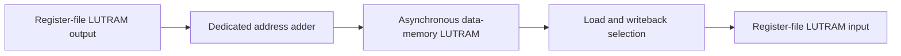

# Phase 7 — Maximum Clock Frequency Optimization

## Objective

Phase 7 investigated how far the current ForgeRV core could be accelerated without changing its single-cycle architecture. The aim was to improve maximum clock frequency through RTL and hardware-structure changes while preserving the existing RV32I behavior.

The controlled implementation used:

- AMD/Xilinx XC7Z020-1 FPGA on the PYNQ-Z2
- Vivado 2025.2
- 256 × 32-bit data memory
- 8.000 ns clock constraint, equivalent to 125 MHz
- Post-route static timing analysis
- The same functional CPU interface and instruction behavior

The 256-word memory was used as the optimization baseline. The same architectural lessons can later be applied to 512- or 1024-word memories, but changing memory depth during an experiment would make the timing comparisons unreliable.

## Timing terminology and equations

### Setup slack

Setup slack measures whether a data path finishes before the next active clock edge:

```text
setup slack = required arrival time - actual arrival time
```

- Positive slack means the path meets timing.
- Zero slack means the path arrives exactly at the deadline.
- Negative slack means the path is too slow.

For example, a worst negative slack of `-7.566 ns` under an `8.000 ns` constraint means that the design needs approximately:

```text
minimum clock period = constrained period + |WNS|
                     = 8.000 ns + 7.566 ns
                     = 15.566 ns
```

The estimated maximum clock frequency is therefore:

```text
Fmax = 1 / minimum clock period
     = 1000 / 15.566
     = 64.24 MHz
```

The factor of 1000 is used because the period is in nanoseconds and the result is required in megahertz.

### Comparing two timing results

A positive change in WNS is an improvement:

```text
WNS improvement = new WNS - old WNS
```

For the initial and final implementations:

```text
WNS improvement = -7.566 - (-11.165)
                = +3.599 ns
```

The required period was reduced by the same amount:

```text
initial period = 8.000 + 11.165 = 19.165 ns
final period   = 8.000 + 7.566  = 15.566 ns
period reduction = 19.165 - 15.566 = 3.599 ns
```

This is an `18.78%` reduction in the minimum period:

```text
period reduction = 3.599 / 19.165 × 100
                 = 18.78%
```

Because frequency is the reciprocal of period, the frequency gain is larger:

```text
initial Fmax = 1000 / 19.165 = 52.18 MHz
final Fmax   = 1000 / 15.566 = 64.24 MHz
frequency gain = 64.24 - 52.18 = 12.06 MHz
percentage gain = 12.06 / 52.18 × 100 = 23.11%
```

## Results summary

| Implementation | WNS | Estimated minimum period | Estimated Fmax | Change from best |
| --- | ---: | ---: | ---: | ---: |
| Initial single-cycle implementation | -11.165 ns | 19.165 ns | 52.18 MHz | -12.06 MHz |
| Dedicated load/store address adder | -7.907 ns | 15.907 ns | 62.87 MHz | -1.37 MHz |
| Direct byte/halfword selectors — best result | **-7.566 ns** | **15.566 ns** | **64.24 MHz** | **Best** |
| Four independent 256 × 8-bit memory lanes | -7.887 ns | 15.887 ns | 62.94 MHz | -1.30 MHz |
| Four local address adders with protected hierarchy | -9.094 ns | 17.094 ns | 58.50 MHz | -5.74 MHz |
| Unconditionally read data memory | -9.105 ns | 17.105 ns | 58.46 MHz | -5.78 MHz |

The exact timing of a placed-and-routed FPGA design depends on mapping and placement. Therefore, a change that removes one logical operation does not guarantee that WNS will improve. The complete routed path must always be measured.

## Initial critical-path problem

The original worst path crossed almost the entire single-cycle load datapath:


The original reported path contained:

- 18.819 ns data-path delay
- 3.215 ns logic delay
- 15.604 ns routing delay
- 13 logic levels
- WNS of -11.165 ns

Routing represented approximately:

```text
route percentage = 15.604 / 18.819 × 100
                 = 82.92%
```

This immediately showed that the problem was not simply that addition or shifting was slow. The route passed through many separated resources and high-fanout nets. The optimization strategy therefore had to reduce both logic depth and the physical distance between dependent operations.

## Improvement 1 — Dedicated load/store address adder

> Design hypothesis: Load and store instructions always calculate `rs1 + immediate`. They do not need to pass through the general ALU operand multiplexers and the full ALU operation-selection network. A dedicated adder should create a shorter and more direct effective-address path.

### Original path

The original implementation selected the ALU operands and then used the main ALU to calculate the memory address:

```text
register file → ALU A/B multiplexers → general ALU → memory stage
```

The ALU also supports subtraction, comparisons, Boolean operations and shifts. Even though Vivado does not physically execute every operation in sequence, the input selection and output-selection logic around those operations still affects logic depth and placement.

### New hardware

```systemverilog
module rv32_address_adder (
    input logic [31:0] base,
    input logic [31:0] offset,
    output logic [31:0] address
);

    assign address = base + offset;

endmodule
```

The core interconnect supplies:

```systemverilog
.base(rs1_data),
.offset(immediate),
.address(memory_address_result)
```

The memory stage then receives `memory_address_result` rather than `alu_result`.

### Why it improved timing

The load/store address no longer depended on:

- `alu_a_select`
- `alu_b_select`
- the general ALU result multiplexer
- placement shared with unrelated ALU functions

The measured checkpoint changed from:

| Metric | Initial | Dedicated adder | Improvement |
| --- | ---: | ---: | ---: |
| WNS | -11.165 ns | -7.907 ns | +3.258 ns |
| Required period | 19.165 ns | 15.907 ns | -3.258 ns |
| Estimated Fmax | 52.18 MHz | 62.87 MHz | +10.69 MHz |

Mathematically:

```text
WNS gain = -7.907 - (-11.165) = +3.258 ns
Fmax gain = 62.87 - 52.18 = 10.69 MHz
frequency improvement = 10.69 / 52.18 × 100 = 20.49%
```

The routed report after this change showed:

- 15.623 ns data-path delay
- 3.703 ns logic delay
- 11.920 ns routing delay
- 10 logic levels

The logic delay increased slightly in that particular placement, but routing delay fell substantially. This is an important FPGA result: reducing the physical length and fan-through of a path can matter more than reducing the nominal count of arithmetic operators.

### Functional verification

The full core-interconnect testbench continued to pass all 95 tests. Loads, stores, ALU instructions, branches, jumps, faults and register writeback remained functionally correct.

## Improvement 2 — Direct byte and halfword selectors

> Design hypothesis: The load/store unit does not require a general 32-bit variable shifter. A byte load only chooses one of four fixed bytes, while a halfword load only chooses one of two fixed halfwords. Describing those choices directly should infer smaller multiplexers with less logic depth.

### Original variable-shift implementation

```systemverilog
shifted_read_data = memory_read_data >> {address[1:0], 3'b000};
```

The shift amount could be `0`, `8`, `16` or `24`. Although the choices were limited, the expression described a variable 32-bit right shift. Vivado could therefore infer a wider shifting/multiplexing structure than required.

The original strobe logic also used shifts:

```systemverilog
MEMORY_BYTE: memory_write_strobe = 4'b0001 << address[1:0];
MEMORY_HALF: memory_write_strobe = 4'b0011 << address[1:0];
```

The four-bit strobe shift was not the main critical-path problem, but it was also replaced with explicit legal choices to keep the hardware intent clear.

### New fixed selectors

```systemverilog
case(address[1:0])
    2'b00: selected_byte = memory_read_data[7:0];
    2'b01: selected_byte = memory_read_data[15:8];
    2'b10: selected_byte = memory_read_data[23:16];
    2'b11: selected_byte = memory_read_data[31:24];
endcase

case(address[1])
    1'b0: selected_half = memory_read_data[15:0];
    1'b1: selected_half = memory_read_data[31:16];
endcase
```

Sign and zero extension are then applied directly to `selected_byte` or `selected_half`.

The resulting hardware is conceptually:

- one 4-to-1, 8-bit byte selector
- one 2-to-1, 16-bit halfword selector
- sign/zero-extension logic
- final selection according to memory size

### Why it improved timing

The fixed selectors reduced the worst-path logic levels from 10 to 7:

```text
logic-level reduction = 10 - 7 = 3 levels
percentage reduction = 3 / 10 × 100 = 30%
```

The measured checkpoint changed from:

| Metric | Before selectors | Direct selectors | Improvement |
| --- | ---: | ---: | ---: |
| WNS | -7.907 ns | -7.566 ns | +0.341 ns |
| Data-path delay | 15.623 ns | 15.311 ns | -0.312 ns |
| Logic delay | 3.703 ns | 3.308 ns | -0.395 ns |
| Routing delay | 11.920 ns | 12.003 ns | +0.083 ns regression |
| Logic levels | 10 | 7 | 3 fewer |
| Estimated Fmax | 62.87 MHz | 64.24 MHz | +1.37 MHz |

The logic improvement was partly offset by a small routing regression:

```text
net path improvement ≈ logic improvement - routing regression
                     ≈ 0.395 ns - 0.083 ns
                     ≈ 0.312 ns
```

This matches the reported data-path reduction from `15.623 ns` to `15.311 ns`.

The WNS improvement is `0.341 ns`, rather than exactly `0.312 ns`, because WNS also includes setup time, clock skew, clock uncertainty and endpoint-specific routing.

The average slack across the worst 20 setup paths also improved by approximately `0.379 ns`. Therefore, this was not merely one unusually favorable endpoint; the whole critical cluster improved.

## Best final single-cycle timing result

The best routed checkpoint produced:

| Metric | Result |
| --- | ---: |
| Clock constraint | 8.000 ns / 125 MHz |
| WNS | -7.566 ns |
| Estimated minimum period | 15.566 ns |
| Estimated Fmax | 64.24 MHz |
| Data-path delay | 15.311 ns |
| Logic delay | 3.308 ns |
| Routing delay | 12.003 ns |
| Routing share | 78.394% |
| Logic levels | 7 |
| Hold slack | +0.160 ns |

The final critical path was:



The path used two `CARRY4` stages, one `MUXF8`, one `LUT5` and three `LUT6` stages. Most of the remaining delay was routing rather than logic.

The most expensive individual routing segment was the memory address output. For example, `address[9]` had fanout 160 and approximately `3.426 ns` of routing delay before reaching memory selection resources. Other address bits had fanouts between 128 and 192.

## Resource use at the best checkpoint

| Block | Total LUTs | Logic LUTs | LUTRAMs | Flip-flops |
| --- | ---: | ---: | ---: | ---: |
| Complete core | 1450 | 1278 | 172 | 32 |
| Register file | 948 | 904 | 44 | 0 |
| ALU | 47 | 47 | 0 | 0 |
| Control flow | 166 | 166 | 0 | 32 |
| Memory stage | 273 | 145 | 128 | 0 |

No block RAMs or DSP blocks were inferred. Both the register file and the asynchronous data memory were implemented largely from LUTRAM and surrounding selection logic.

## Failed experiment 1 — `max_fanout` constraint

> Design hypothesis: The memory-address nets had fanouts as high as 192. Asking Vivado to limit fanout to 32 might cause the tool to replicate the driver and create shorter local routes.

An attribute similar to the following was tested:

```systemverilog
(* max_fanout = 32 *) logic [31:0] memory_address_result;
```

### Result

The routed report was effectively unchanged:

- WNS remained approximately -7.907 ns at that checkpoint
- the major address fanout remained 192
- the critical placements and route were unchanged

### Why it failed

`max_fanout` is a synthesis and implementation hint, not a command that guarantees replication. The address bit was produced by a carry-chain output. Replicating that output would require either duplicating the arithmetic cone or inserting buffers that might add delay. Vivado judged the proposed replication to be less beneficial than retaining the existing route.

The experiment did not make the RTL incorrect; it simply did not change the implemented netlist in a useful way.

## Failed experiment 2 — Explicit 64-word memory banking and LUT buffers

> Design hypothesis: A 256-word memory could be divided into four 64-word banks. Explicit local address buffers could then reduce the number of memory cells driven by each physical address net.

The intended change was:

```text
one high-fanout address net
            ↓
four local copies → four smaller memory banks
```

`LUT1` buffers and preservation attributes were used to force separate physical copies.

### Result

WNS became worse, so the structure was rejected and reverted.

### Why it failed

The original memory was already implemented using FPGA-native distributed-memory primitives such as `RAMS64E`, followed by `MUXF7` and `MUXF8` resources. The manual banking recreated selection logic that Vivado already knew how to infer.

The forced LUT buffers also:

- added a real logic level
- consumed placement sites
- increased local congestion
- restricted logic merging and packing
- prevented Vivado from freely choosing the best physical organization

Reducing fanout is only useful when the duplicated drivers are placed near their loads and the extra selection logic does not exceed the route saved. That condition was not achieved.

## Failed experiment 3 — Four independent 256 × 8-bit byte lanes

> Design hypothesis: Four byte-wide memories should align naturally with the four write strobes and allow each byte lane to be placed independently, without explicit buffer LUTs.

The 32-bit memory was split into:

```text
lane 0: bits 7:0
lane 1: bits 15:8
lane 2: bits 23:16
lane 3: bits 31:24
```

### Result

| Metric | Best design | Four byte lanes | Regression |
| --- | ---: | ---: | ---: |
| WNS | -7.566 ns | -7.887 ns | -0.321 ns |
| Required period | 15.566 ns | 15.887 ns | +0.321 ns |
| Estimated Fmax | 64.24 MHz | 62.94 MHz | -1.30 MHz |

### Why it failed

The split storage was functionally reasonable, but it changed how Vivado shared address decoding and output-selection logic. The four lanes could be placed farther apart, forcing common address signals and write controls to travel to more physical regions.

The original flat memory allowed Vivado to share decoding and pack related distributed-memory primitives. The explicit lanes reduced that freedom. The result demonstrates that a cleaner logical hierarchy is not automatically a faster physical hierarchy.

## Failed experiment 4 — Four local address adders

> Design hypothesis: The large address fanout could be removed at its source by duplicating the effective-address adder. Each byte lane would receive its own carry-chain result, reducing each output's fanout to roughly one lane.

The intended transformation was:

```text
one adder → 128–192 loads per address bit
```

into:

```text
four adders → approximately one quarter of the loads per adder
```

Preservation attributes were used so Vivado would not merge the four adders back into one.

### Result

| Metric | Best design | Four local adders | Regression |
| --- | ---: | ---: | ---: |
| WNS | -7.566 ns | -9.094 ns | -1.528 ns |
| Required period | 15.566 ns | 17.094 ns | +1.528 ns |
| Estimated Fmax | 64.24 MHz | 58.50 MHz | -5.74 MHz |

### Why it failed

The assumption treated fanout as if it were the only cost. In reality, four adders created:

- four carry chains that also required physical placement
- higher fanout on `rs1_data` and `immediate`
- more competition for nearby slices
- greater memory-lane separation
- extra congestion around the load/store datapath

The preservation attributes also stopped Vivado from merging, repacking or restructuring the duplicated logic. The address-output fanout may have been lower, but the complete register-to-register route became longer.

This is the central lesson of the failed banking attempts: optimization must reduce total path delay, not just one net's fanout number.

## Failed experiment 5 — Unconditional data-memory read

> Design hypothesis: The data memory did not need to output zero when `memory_read_request` was low because the load/store unit already prevented invalid load data from being committed. Removing the read-enable multiplexer should remove one 32-bit selection stage.

The original form was:

```systemverilog
always_comb begin
    if (memory_read_request) memory_read_data = memory[word_address];
    else memory_read_data = 32'b0;
end
```

The attempted form was:

```systemverilog
assign memory_read_data = memory[word_address];
```

### Result

| Metric | Best design | Unconditional read | Regression |
| --- | ---: | ---: | ---: |
| WNS | -7.566 ns | -9.105 ns | -1.539 ns |
| Required period | 15.566 ns | 17.105 ns | +1.539 ns |
| Estimated Fmax | 64.24 MHz | 58.46 MHz | -5.78 MHz |

### Why it failed

The Boolean reasoning was valid: externally visible load behavior could remain correct. The timing assumption was not valid, however. Removing the condition changed the memory output cone, which caused Vivado to remap and replace surrounding LUTRAM, selection and writeback logic.

One apparent RTL multiplexer was removed, but the new placement created a slower complete path. FPGA timing is global: a locally simpler equation may create a worse physical netlist because the implementation tool loses a useful packing or control structure.

Without a controlled post-route improvement, the simpler source code cannot be called a hardware optimization. This version was therefore reverted.

## Why the failed changes were still useful

The failed experiments established several important design rules:

1. Fanout is a symptom, not a complete timing metric.
2. Preservation attributes should be used sparingly because they remove implementation freedom.
3. Vivado's native LUTRAM mapping can outperform manual memory banking.
4. Logic depth and routing delay must be measured together.
5. Every structural experiment requires a fresh post-route timing report.
6. Functionally equivalent RTL can produce very different physical designs.

They also prevented the project from carrying forward complicated structures that looked optimized on paper but were measurably slower on the target FPGA.

## Why Phase 7 stops at the single-cycle limit

The best implementation still misses the 8.000 ns target by 7.566 ns. Meeting 125 MHz would require the current minimum period to fall from 15.566 ns to 8.000 ns:

```text
required reduction = 15.566 - 8.000
                   = 7.566 ns
```

This means removing:

```text
7.566 / 15.566 × 100 = 48.61%
```

of the current minimum period.

The critical load path still has to perform all of the following in one cycle:

1. read `rs1` from the register file
2. add the immediate to form the address
3. access asynchronous distributed data memory
4. select a byte, halfword or word
5. sign-extend or zero-extend the load
6. select the writeback source
7. reach the destination register input

With `78.394%` of the final path already caused by routing, another small combinational rewrite is unlikely to remove almost half of the period reliably.

The next major improvement must introduce a cycle boundary. The most practical options are:

- pipeline the core so memory access and writeback occur in later stages
- make loads multi-cycle
- use synchronous block RAM with a registered output

Those changes alter latency and control behavior, so they belong in a later architectural phase rather than being treated as minor Phase 7 RTL optimization.

## Final conclusion

Phase 7 improved the estimated single-cycle maximum frequency from approximately `52.18 MHz` to `64.24 MHz` while retaining the existing instruction behavior.

The final improvement was:

```text
WNS:  -11.165 ns → -7.566 ns
Fmax:  52.18 MHz → 64.24 MHz
Gain:  +12.06 MHz, approximately +23.11%
```

The dedicated load/store address adder produced the largest gain by shortening the load/store address path. Fixed byte and halfword selectors then removed three logic levels and produced a smaller additional gain.

The manual fanout, banking, duplicated-adder and unconditional-read experiments were rejected because post-route timing showed regressions. The final design therefore keeps only changes demonstrated to improve the complete routed implementation.

The best single-cycle checkpoint should be preserved before beginning pipelining or multi-cycle memory work.
