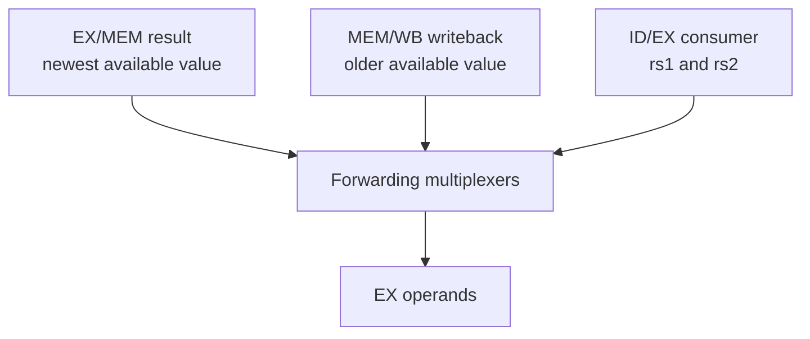
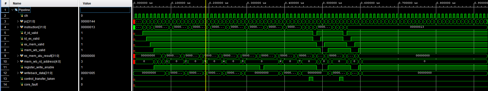
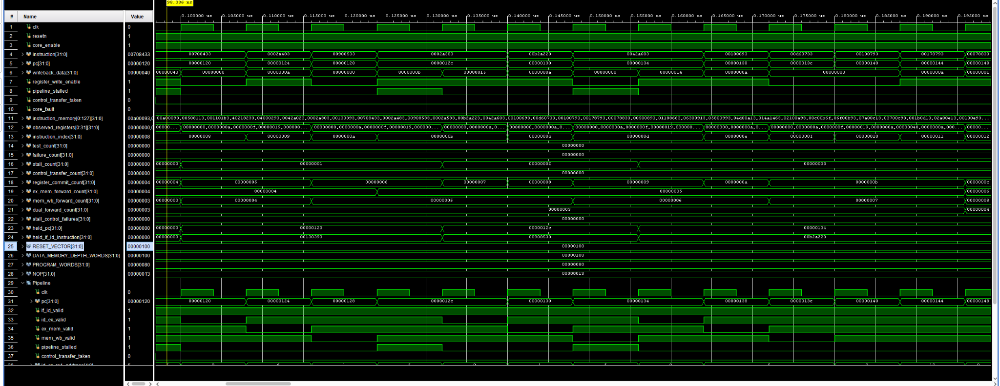
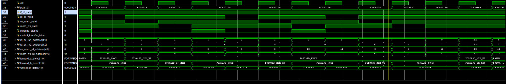
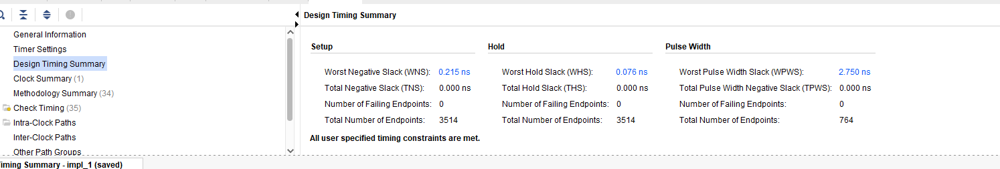
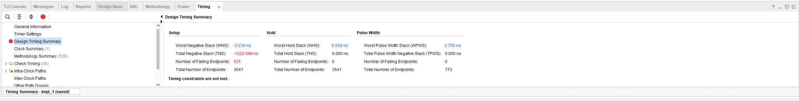

# Phase 8 — Five-Stage Pipelined Core

Phase 8 converts the original non-pipelined RV32I core into a five-stage pipeline and adds the control needed to preserve correct program behaviour when instructions overlap.

The implemented stages are:

1. IF — Instruction Fetch
2. ID — Instruction Decode and Register Read
3. EX — Execute and Control Transfer
4. MEM — Data Memory
5. WB — Register Writeback

The completed phase includes pipeline registers, valid-bit tracking, control-transfer flushing, load-use hazard detection, operand forwarding and a writeback-to-decode bypass.

## Phase status

| Item | Status |
| --- | --- |
| IF/ID pipeline register | Complete |
| ID/EX pipeline register | Complete |
| EX/MEM pipeline register | Complete |
| MEM/WB pipeline register | Complete |
| Pipelined core integration | Complete |
| Branch and jump flushing | Complete |
| Load-use hazard detection | Complete |
| Bubble insertion | Complete |
| EX/MEM forwarding | Complete |
| MEM/WB forwarding | Complete |
| Store-data forwarding | Complete |
| Branch-operand forwarding | Complete |
| WB-to-ID bypass | Complete |
| Self-checking simulation | Passed |
| Final 125 MHz timing target | Not met |

## Overall pipeline flow


The editable architecture diagram is provided at:

```text
Diagrams/phase_8_five_stage_pipeline.drawio
```

## Why the processor was pipelined

The original core completed register reading, decoding, ALU execution, memory access, writeback selection and control-flow decisions inside one clock period. Its worst path therefore crossed several major blocks before reaching the next clocked register.

Pipelining places registers between these operations. Each clock period only needs to contain the combinational work belonging to one pipeline stage.

This changes the performance model from one long critical path to several shorter stage paths:

```text
Single-cycle:
Decode → Register File → ALU → Data Memory → Writeback → Register File

Five-stage pipeline:
IF → register → ID → register → EX → register → MEM → register → WB
```

Once filled, the pipeline can ideally complete one instruction every clock cycle even though each individual instruction takes five stages to travel through the processor.

## Pipeline registers

Each pipeline register stores a valid bit together with the data and control signals required by the following stage.

| Register | Main contents |
| --- | --- |
| IF/ID | `valid`, PC, PC + 4 and instruction |
| ID/EX | Register addresses, register values, immediate and decoded controls |
| EX/MEM | ALU result, memory address, store data, destination register and memory controls |
| MEM/WB | ALU result, loaded data, PC + 4, destination register and writeback control |

Every pipeline register supports:

- `enable` to either advance or hold its current contents.
- `flush` to replace its current instruction with a bubble.
- `valid_in` and `valid_out` to distinguish real instructions from empty pipeline entries.

## Valid bits and bubbles

A bubble is an intentionally empty pipeline entry. It is represented by:

```systemverilog
valid_out <= 1'b0;
```

The associated side-effect controls are also cleared:

```systemverilog
register_write_enable_out <= 1'b0;
memory_read_enable_out <= 1'b0;
memory_write_enable_out <= 1'b0;
writeback_select_out <= WB_NONE;
branch_operation_out <= BRANCH_NONE;
jump_operation_out <= JUMP_NONE;
```

The bubble moves through the remaining stages, but it cannot modify registers, memory or control flow because its valid bit and write enables are cleared.

## Control hazards

Branches and jumps are resolved in EX. Instructions already in IF and ID are younger than the control-transfer instruction and may belong to the wrong path.

When a branch or jump is taken:

```systemverilog
if_id_flush = control_transfer_taken;
id_ex_flush = control_transfer_taken || pipeline_stalled;
```

The next PC is replaced by the calculated target, and IF/ID plus ID/EX are flushed. EX/MEM is not flushed because it contains the branch or jump itself rather than a younger wrong-path instruction.

## Data dependencies

A data dependency occurs when a younger instruction needs a register that an older instruction has not yet written into the register file.

For example:

```assembly
add x3, x1, x2
sub x4, x3, x5
```

The SUB initially reads the old value of `x3`. However, the new ADD result already exists at the EX/MEM boundary. Forwarding routes that result directly into the SUB operand multiplexer without waiting for register writeback.

## Forwarding unit

The forwarding unit compares the source-register addresses of the current ID/EX instruction against destination-register addresses in EX/MEM and MEM/WB.



The selection type is:

```systemverilog
typedef enum logic [1:0] {
    FORWARD_NONE = 2'd0,
    FORWARD_MEM_WB = 2'd1,
    FORWARD_EX_MEM = 2'd2
} forward_sel_t;
```

The forwarding choices are:

| Selection | Operand source |
| --- | --- |
| `FORWARD_NONE` | Value originally captured from the register file |
| `FORWARD_MEM_WB` | Final value selected by the writeback multiplexer |
| `FORWARD_EX_MEM` | Immediately preceding ALU result or PC + 4 |

### Forwarding priority

EX/MEM is checked before MEM/WB because it contains the newest result.

```assembly
addi x3, x0, 1
addi x3, x3, 1
add  x4, x3, x5
```

When the third instruction enters EX:

```text
MEM/WB offers x3 = 1
EX/MEM offers x3 = 2
```

The forwarding logic selects EX/MEM so the third instruction receives the most recent program-order value.

### Forwarded consumers

The forwarded values are used by every EX-stage block that consumes register data:

- ALU operands.
- Branch comparisons.
- JALR base address.
- Load/store base address.
- Store data.

This is necessary because forwarding only the main ALU inputs would leave branches and stores vulnerable to stale register values.

## Why loads cannot immediately use EX/MEM forwarding

For an ALU instruction, the EX result is the final value:

```assembly
add x3, x1, x2
```

```text
EX result = final value for x3
```

For a load, the EX result is only an address:

```assembly
lw x3, 0(x1)
```

```text
EX result  = x1 + 0
MEM result = data_memory[x1 + 0]
```

Forwarding the load from EX/MEM would incorrectly forward the address rather than the value stored at that address. Consequently, EX/MEM forwarding is allowed only for:

```systemverilog
(ex_mem_writeback_select == WB_ALU) ||
(ex_mem_writeback_select == WB_PC_PLUS_4)
```

Once the load reaches MEM/WB, the memory access has completed and its value can be forwarded normally.

## Load-use hazard detection

The hazard unit detects a load in ID/EX followed immediately by an instruction in IF/ID that needs the load destination.

```systemverilog
load_use_hazard = if_id_valid &&
                  id_ex_valid &&
                  id_ex_memory_read_enable &&
                  (id_ex_rd_address != 5'd0) &&
                  (rs1_hazard || rs2_hazard);
```

The conditions ensure that:

- Both entries contain real instructions.
- The older instruction is a load.
- The load is not targeting hardwired register `x0`.
- The younger instruction genuinely uses the matching `rs1` or `rs2` register.

## One-cycle load-use stall

For:

```assembly
lw  x3, 0(x1)
add x4, x3, x2
```

the pipeline performs:

| Cycle | Load | Dependent ADD |
| --- | --- | --- |
| 1 | IF | — |
| 2 | ID | IF |
| 3 | EX address calculation | ID detects dependency |
| 4 | MEM read | ID held; bubble in EX |
| 5 | WB/MEM-WB | EX receives forwarded load value |

During the stall:

```systemverilog
fetch_pc_enable = 1'b0;
if_id_enable = 1'b0;
id_ex_flush = 1'b1;
```

This holds the PC and dependent instruction while allowing the older load to continue into memory.

## WB-to-ID bypass

There is another dependency when WB writes a register during the same cycle that ID reads it. The ID/EX register could otherwise capture the previous register-file value.

The bypass selects `writeback_data` directly when the addresses match:

```systemverilog
if (register_write_enable &&
    (mem_wb_rd_address != 5'd0) &&
    (mem_wb_rd_address == decode_rs1_address))
    decode_rs1_data = writeback_data;
```

The same comparison is implemented for `rs2`.

## Core-level control priorities

The pipeline integrates stalls and control transfers as follows:

```systemverilog
pipeline_stalled = hazard_stall &&
                   !control_transfer_taken;

if_id_flush = control_transfer_taken;
id_ex_flush = pipeline_stalled ||
              control_transfer_taken;
```

A control transfer takes priority because the younger instructions are about to be discarded, making a younger dependency irrelevant.

## Functional verification

Two self-checking testbenches were used.

### Base pipeline test

The initial pipeline test retained spacing NOPs and verified:

- Pipeline fill and overlapping valid instructions.
- Arithmetic and immediate execution.
- Stores and loads.
- Taken and untaken branches.
- JAL and JALR behaviour.
- Wrong-path flushing.
- Core enable and fault behaviour.

The base pipeline test passed all 31 checks.



### Hazard and forwarding test

The updated test removes dependency NOPs and verifies:

- EX/MEM forwarding to `rs1` and `rs2`.
- MEM/WB forwarding to `rs1` and `rs2`.
- Simultaneous forwarding from two different stages.
- EX/MEM priority when two older instructions target the same register.
- Load-use hazards on `rs1` and `rs2`.
- Load-to-store-data hazards.
- Forwarded store base and store data.
- Forwarded branch operands.
- WB-to-ID bypassing.
- Taken branch and JAL flushing.
- Protection of register `x0`.

The simulation completed with zero failures. Exactly three deliberate load-use stalls and two control transfers were observed.



The focused waveform shows the stage valid bits, forwarding selections and register-address comparisons:



During each visible stall:

- `pipeline_stalled` is asserted for one cycle.
- The PC remains unchanged.
- IF/ID remains valid and holds the dependent instruction.
- ID/EX becomes invalid, showing the inserted bubble.
- EX/MEM and MEM/WB continue advancing.
- `FORWARD_MEM_WB` subsequently supplies the completed load value.

## Timing results

The implementation clock constraint is:

```text
Clock period = 8.000 ns
Target frequency = 125.000 MHz
```

### Base pipeline before hazard and forwarding logic

The pipeline-register-only design achieved:

| Metric | Result |
| --- | ---: |
| WNS | +0.215 ns |
| TNS | 0.000 ns |
| Failing endpoints | 0 |
| Estimated minimum period | 7.785 ns |
| Estimated maximum frequency | 128.45 MHz |

The estimate is calculated using:

$$
T_{min} \approx T_{constraint} - WNS
$$

$$
T_{min} \approx 8.000 - 0.215 = 7.785\text{ ns}
$$

$$
F_{max} \approx \frac{1000}{7.785} = 128.45\text{ MHz}
$$



### Final pipeline with hazards and forwarding

After the hazard detector, forwarding comparisons, forwarding multiplexers and WB-to-ID bypass were added, implementation produced:

| Metric | Result |
| --- | ---: |
| Clock requirement | 8.000 ns |
| WNS | -3.234 ns |
| TNS | -1222.698 ns |
| Failing setup endpoints | 525 of 3541 |
| WHS | +0.058 ns |
| Hold failing endpoints | 0 |
| WPWS | +2.750 ns |

The setup timing requirement is not met. The estimated minimum clock period is:

$$
T_{min} \approx 8.000 - (-3.234)
$$

$$
T_{min} \approx 11.234\text{ ns}
$$

Therefore:

$$
F_{max} \approx \frac{1000}{11.234}
$$

$$
\boxed{F_{max} \approx 89.02\text{ MHz}}
$$



This is an estimate derived from the current 8 ns implementation run. A new implementation sweep around an 11.234 ns constraint is required to establish the final routed maximum precisely.

## Timing comparison

| Architecture | Estimated maximum frequency |
| --- | ---: |
| Original non-pipelined core | 64.24 MHz |
| Base five-stage pipeline | 128.45 MHz |
| Final pipeline with forwarding and hazards | 89.02 MHz |

The complete pipeline is approximately 38.57% faster than the original non-pipelined design:

$$
\frac{89.02 - 64.24}{64.24} \times 100 \approx 38.57\%
$$

However, the final forwarding and hazard logic reduced the base pipeline estimate by approximately 30.70%:

$$
\frac{128.45 - 89.02}{128.45} \times 100 \approx 30.70\%
$$

## Why the final frequency decreased

The base pipeline measurement did not yet contain the complete data-hazard solution. The following paths were added afterward:

1. Register-address comparisons from ID/EX to EX/MEM and MEM/WB.
2. Priority logic selecting the newest matching producer.
3. Two 32-bit forwarding multiplexers before the EX datapath.
4. A feedback path from MEM/WB writeback to EX operands.
5. Forwarded-data routes into the ALU, branch unit, memory-address adder and store-data path.
6. WB-to-ID bypass multiplexers before the ID/EX register.
7. Load-use comparisons driving PC and pipeline-register enables.

The longest forwarding path is conceptually:

```text
MEM/WB register
→ writeback selection
→ forwarding comparison and selection
→ forwarded operand mux
→ ALU / branch / address logic
→ EX/MEM register
```

The final design therefore trades some maximum clock frequency for correct dependency handling without software-inserted NOPs.

## Throughput interpretation

The estimated 89.02 MHz frequency represents an ideal peak issue rate near 89 million instructions per second after the pipeline is filled, assuming no stalls or taken control transfers.

Actual throughput is reduced by:

- One cycle for every immediate load-use dependency.
- Two discarded younger instructions after a control transfer resolved in EX.
- Any future memory wait states or external interface backpressure.

Even with the lower final clock frequency, the pipelined design remains faster than the approximately 64.24 MHz non-pipelined architecture and can overlap five different instructions across its stages.

## Phase 8 files

The Phase 8 RTL consists of:

```text
rtl/core/rv32_if_id_reg.sv
rtl/core/rv32_id_ex_reg.sv
rtl/core/rv32_ex_mem_reg.sv
rtl/core/rv32_mem_wb_reg.sv
rtl/core/rv32_hazard_unit.sv
rtl/core/rv32_forwarding_unit.sv
rtl/core/rv32_pipeline_core.sv
rtl/core/rv32_pipeline_timing_top.sv
```

The corresponding self-checking simulations are:

```text
sim/tb/rv32_pipeline_core_tb.sv
sim/tb/rv32_pipeline_hazard_forwarding_tb.sv
```

## Phase conclusion

Phase 8 successfully changes ForgeRV from a non-pipelined processor into a functional five-stage RV32I pipeline. Instructions overlap correctly, wrong-path instructions are flushed, available values are forwarded, unavailable load values create exactly one bubble, and same-cycle WB-to-ID dependencies are bypassed.

The final design passes functional simulation but does not currently satisfy the 125 MHz implementation constraint. Its present estimated maximum frequency is approximately 89.02 MHz. The next timing-oriented work should inspect the post-route critical path through the forwarding and writeback network before deciding whether further combinational optimization or additional pipeline boundaries are required.
