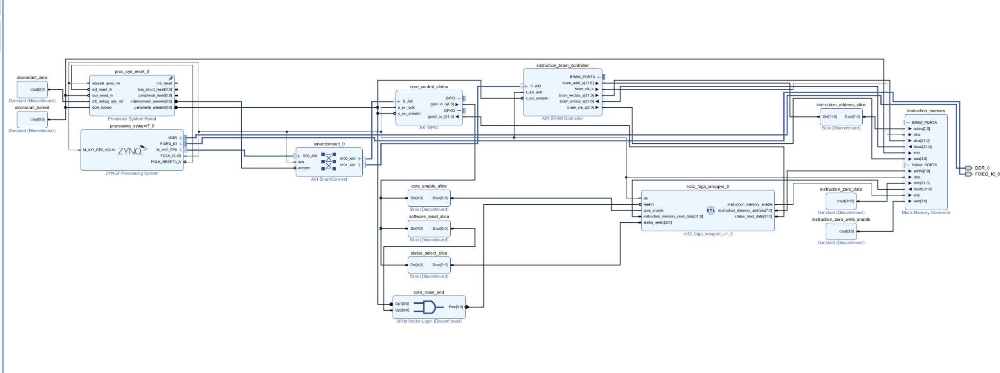
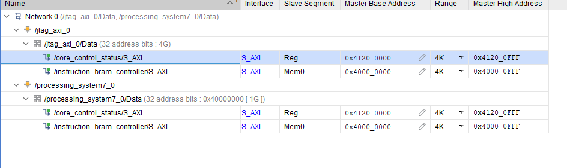
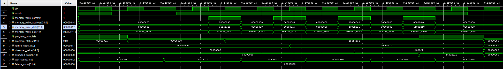
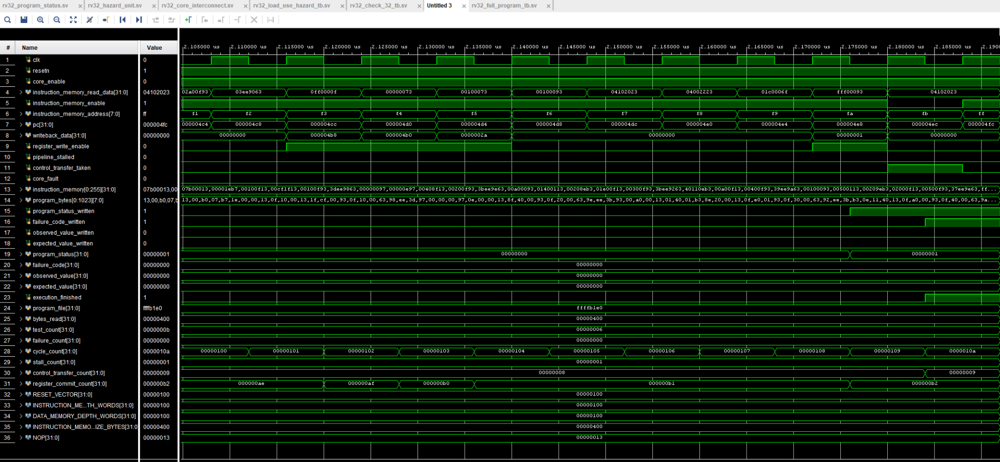
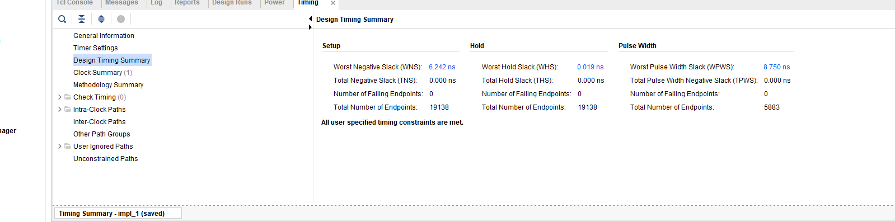
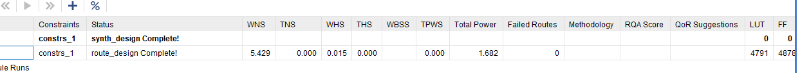
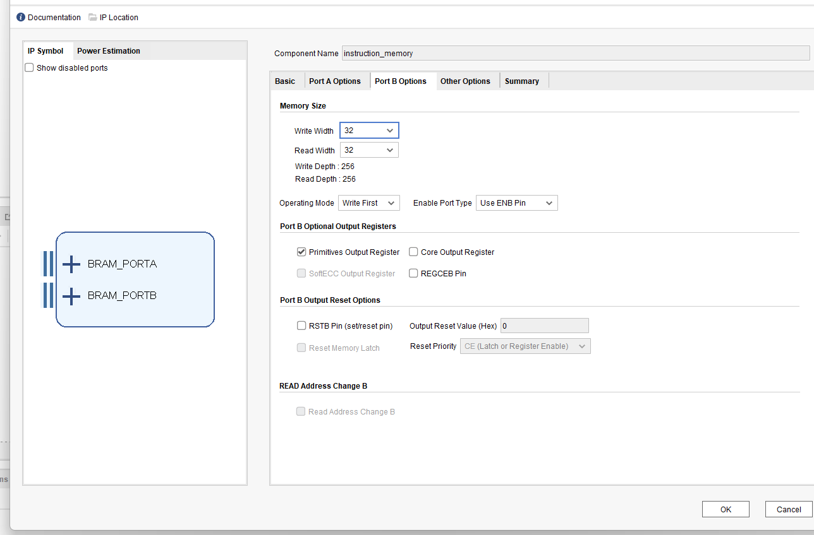
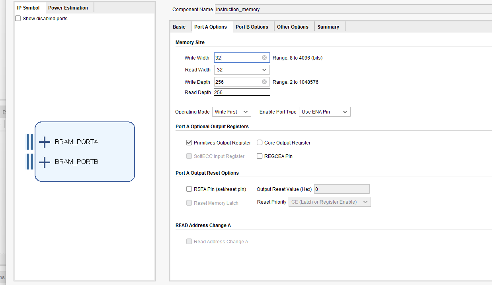

# Phase 9 — PYNQ-Z2 Deployment, Instruction Loading and Physical Verification

## 1. Phase objective

Phase 9 converts ForgeRV from a simulation-only five-stage RV32I processor into a processor that can be programmed, controlled and verified on a physical PYNQ-Z2 board.

The completed system allows the Zynq Processing System to:

- program the Programmable Logic with the ForgeRV bitstream;
- load a compiled RV32I assembly program into dual-port instruction Block RAM;
- hold the processor in reset while instruction memory is modified;
- release reset and enable processor execution;
- observe program completion, faults and diagnostic values through AXI General-Purpose Input/Output;
- verify all 256 instruction words by reading them back before execution; and
- run a self-checking 256-word RV32I program on the physical FPGA.

The final physical execution result was:

```text
Program complete: 1
Core fault: 0
Program status: 0x00000001
Failure code: 0x00000000
Observed value: 0x00000000
Expected value: 0x00000000
Program Counter: 0x000004E0

PASS: all ForgeRV assembly self-tests passed
```

This proves that the complete chain works:

```text
Assembly source
    -> GNU RISC-V assembler and linker
    -> 1,024-byte program.bin
    -> Python loader
    -> AXI memory-mapped transaction
    -> AXI Block RAM Controller
    -> instruction Block RAM Port A
    -> instruction Block RAM Port B
    -> ForgeRV instruction-fetch stage
    -> five-stage pipeline
    -> data-memory status stores
    -> status monitor
    -> AXI GPIO
    -> Python result reader
```

## 2. Final system architecture



The complete Vivado block design separates instruction loading from processor instruction fetching by using the two ports of a true dual-port Block RAM.

### 2.1 Processing System

The Zynq-7000 Processing System contains the ARM processor that runs PYNQ Linux and the Python control scripts. Its main responsibilities are:

- programming the FPGA bitstream;
- issuing AXI writes and reads;
- loading machine instructions into Block RAM;
- controlling ForgeRV reset and enable signals; and
- reading selected processor-status words.

`FCLK_CLK0` supplies the common Programmable Logic clock. The final implementation is constrained to a 20 ns period, corresponding to 50 MHz.

### 2.2 AXI SmartConnect

AXI SmartConnect decodes each Processing System address and routes the transaction to the appropriate slave:

| Address range | AXI peripheral | Purpose |
| --- | --- | --- |
| `0x4000_0000`–`0x4000_0FFF` | Instruction AXI Block RAM Controller | Read and write instruction memory |
| `0x4120_0000`–`0x4120_0FFF` | AXI GPIO | Processor reset, enable, status selection and status readback |

The address window is 4 KiB even though the implemented instruction memory is only 1,024 bytes. The AXI aperture is the address space reserved for routing; the actual legal program capacity remains 256 words.



### 2.3 Dual-port instruction Block RAM

The instruction memory contains 256 words, each 32 bits wide:

```text
256 words x 32 bits = 8,192 bits = 1,024 bytes
```

The two ports have independent responsibilities:

| Port | Owner | Operation |
| --- | --- | --- |
| Port A | Processing System through the AXI Block RAM Controller | Program loading and readback verification |
| Port B | ForgeRV wrapper | Synchronous instruction fetch |

Port A uses a byte-addressed AXI address. Because each instruction word contains four bytes, address bits `[1:0]` are byte offsets and must not enter the Block RAM word address. The address slice therefore performs:

```text
Block RAM word address = AXI byte address[9:2]
```

Port B receives an already-converted eight-bit word address from ForgeRV.

### 2.4 AXI GPIO control and status interface

AXI GPIO avoids exposing hundreds of internal processor signals as FPGA package pins. Channel 1 is a five-bit output from the Processing System to ForgeRV:

| Channel 1 bit | Meaning |
| --- | --- |
| `[0]` | Reset release: `0` holds ForgeRV in reset, `1` releases reset |
| `[1]` | Core enable: `0` holds architectural state, `1` permits execution |
| `[4:2]` | Three-bit status-word selector |

Channel 2 is a 32-bit input to the Processing System. It returns one selected status word:

| Selector | Returned value |
| --- | --- |
| `0` | Program status |
| `1` | Failure code |
| `2` | Observed value |
| `3` | Expected value |
| `4` | Program-complete and core-fault bits |
| `5` | Program Counter |
| `6` | Writeback data |
| `7` | Pipeline activity flags |

This multiplexed interface reduces the top-level logical I/O width while retaining the information required for software-controlled diagnosis.

### 2.5 Processor reset generation

The Processor System Reset block synchronizes reset deassertion to the Programmable Logic clock. Its important inputs are:

| Reset input | Connection | Reason |
| --- | --- | --- |
| `slowest_sync_clk` | `processing_system7_0/FCLK_CLK0` | Reset outputs must be synchronized to the AXI/processor clock |
| `ext_reset_in` | `processing_system7_0/FCLK_RESET0_N` with correct active-low interpretation | Allows the Processing System fabric reset to control the reset block |
| `dcm_locked` | Constant `1` | Indicates that the clock is available and stable |
| `aux_reset_in` | Constant `0` | Auxiliary reset unused |
| `mb_debug_sys_rst` | Constant `0` | MicroBlaze debug reset unused |

`interconnect_aresetn` resets SmartConnect. `peripheral_aresetn` resets AXI GPIO and the AXI Block RAM Controller. These are active-low reset outputs.

## 3. ForgeRV instruction-memory interface

### 3.1 Program Counter to Block RAM address conversion

ForgeRV begins execution at reset vector `0x00000100`. Block RAM word zero must therefore correspond to Program Counter `0x00000100`, not byte address zero.

The instruction offset is:

```text
instruction_offset = Program Counter - RESET_VECTOR
```

The word address is:

```text
instruction_memory_address = instruction_offset >> 2
```

For example:

| Program Counter | Offset from `0x100` | Block RAM word address |
| --- | ---: | ---: |
| `0x100` | `0x000` | `0` |
| `0x104` | `0x004` | `1` |
| `0x17C` | `0x07C` | `31` |
| `0x4FC` | `0x3FC` | `255` |

No divider is synthesized. Removing bits `[1:0]` implements division by four as wiring.

### 3.2 Alignment checking

An RV32I instruction is four bytes wide. A fetch address is therefore aligned only when:

```text
pc[1:0] == 2'b00
```

The misalignment signal is qualified by `fetch_request`. This prevents reset, stall or flushed speculative state from creating a false instruction-address fault.

### 3.3 Range checking

For a 256-word memory beginning at `0x100`, the legal byte-address range is:

```text
0x00000100 <= Program Counter < 0x00000500
```

The final legal instruction is at `0x4FC`. `0x500` is the first invalid address.

### 3.4 Synchronous fetch-response alignment

Block RAM does not behave like a combinational lookup table. The processor supplies an address at one rising clock edge and receives the corresponding instruction after the configured synchronous read latency.

The fetch module therefore registers:

- whether the request was valid;
- the Program Counter associated with the request; and
- the corresponding `pc + 4` value.

These metadata signals must have exactly the same latency as the Block RAM data. If instruction data is delayed by two cycles while metadata is delayed by one cycle, the pipeline associates instruction `I[n-1]` with Program Counter `PC[n]`. That error can remain hidden in straight-line sequences and become visible when a stall or flush changes the request pattern.

## 4. Program build flow

### 4.1 Source program

`program.S` contains a legal-instruction and pipeline self-test. It uses `.option norvc` so every instruction remains exactly 32 bits and no compressed instructions are emitted.

The program validates:

- immutable register `x0`;
- LUI and AUIPC;
- register-register arithmetic and logical operations;
- immediate arithmetic and logical operations;
- signed and unsigned comparisons;
- logical and arithmetic shifts;
- byte, halfword and word stores;
- signed and unsigned byte and halfword loads;
- EX/MEM forwarding;
- MEM/WB forwarding;
- load-use hazard detection and one-cycle stalling;
- taken and not-taken conditional branches;
- JAL and JALR link generation;
- JALR target-bit-zero clearing;
- wrong-path instruction flushing; and
- supported FENCE, ECALL and EBREAK decoding.

The `CHECK` macro writes the check number into `x31` and branches to `failed` if the observed value in `x29` differs from the expected value in `x30`:

```asm
.macro CHECK code
    addi x31, x0, \code
    bne x29, x30, failed
.endm
```

### 4.2 Linker layout

The linker places `.text` at the processor reset vector:

```text
Origin = 0x00000100
Length = 0x00000400 bytes
```

The assertion `SIZEOF(.text) <= 0x400` prevents generation of a program larger than the physical instruction memory.

### 4.3 Full 256-word termination layout

The final layout is intentionally constructed so successful execution loops before the end of memory:

```text
0x4D4  passed
0x4E0  finished self-loop
0x4E4  failed handler
0x4FC  memory_guard self-loop
```

`memory_guard` initializes the final instruction word and makes the binary exactly 1,024 bytes. It is not reached during correct execution.

### 4.4 PowerShell and WSL toolchain

The build script invokes the GNU RISC-V bare-metal toolchain installed inside Ubuntu under Windows Subsystem for Linux. It generates:

- `program.elf`: linked executable with symbols;
- `program.bin`: raw little-endian instruction bytes;
- `program.dump`: disassembly used to check exact machine instructions and label addresses; and
- `program.map`: linker placement information.

The final build must report:

```text
Instructions: 256 / 256
Program size: 1024 / 1024 bytes
Unused instruction words: 0
```

## 5. Python program loader

The loader performs four safety checks before touching programmable hardware:

1. The bitstream file exists.
2. The program binary exists.
3. The binary length is a nonzero multiple of four bytes.
4. The binary does not exceed 1,024 bytes.

Each group of four little-endian bytes is converted into one 32-bit instruction word:

```text
Bytes: B7 10 00 00
Word:  0x000010B7
```

The word is written to the same byte offset in the AXI address window. The AXI Block RAM Controller converts the transaction into a Port A Block RAM operation.

After all writes, the loader reads every word back and compares it with the binary. Execution is prohibited until all 256 comparisons pass. This converts program loading from an assumed operation into a verified operation.

## 6. Program-status monitor

The assembly program reports its result through committed data-memory stores:

| Data-memory address | Meaning |
| --- | --- |
| `0x40` | Program status: `1` for pass, `0xFFFFFFFF` for failure |
| `0x44` | Failure/check code |
| `0x48` | Observed value |
| `0x4C` | Expected value |

The status monitor observes the processor's committed store interface. It does not infer success from a Program Counter location. This distinction matters because a speculative or flushed instruction must never report completion.



## 7. Layered physical verification

Hardware bring-up was intentionally divided into increasingly invasive tests.

### 7.1 Bitstream-only test

This test programs the FPGA and waits while checking that Linux remains responsive. It does not create an Overlay, map AXI addresses or perform MMIO.

Purpose:

- prove that the bitstream itself does not destabilize the Processing System;
- verify that the FPGA manager reaches `operating`; and
- distinguish configuration faults from AXI-transaction faults.

### 7.2 AXI GPIO safety test

With ForgeRV held in reset and disabled, this test:

- maps only the AXI GPIO address range;
- writes zero to the control channel;
- configures channel directions;
- reads every status selector; and
- verifies that Program Counter status reports the reset vector.

This proves the clock, reset, SmartConnect and AXI GPIO path before Block RAM is accessed.

### 7.3 Block RAM address-independence test

The test writes unique patterns to addresses distributed across the complete memory:

```text
0x40000000, 0x40000004, ... , 0x400003FC
```

It writes all patterns before reading any pattern. This is important: an immediate write-followed-by-read test can pass even if different addresses alias, because each read merely observes the most recent write.

The test then reads every selected address and proves that each retains its own value. Original contents are restored afterward.

### 7.4 Program load and full readback

The loader writes all 256 instructions and verifies all 256 values. Passing only the first and last word would not detect intermediate address wiring errors.

### 7.5 Full compiled-program simulation

The exact generated `program.bin` is loaded into the behavioural testbench. This validates the compiled bytes rather than a separately hand-written simulation sequence.



The successful simulation completed in 266 processor cycles, with one load-use stall, nine control transfers, 178 register commits, status `1`, failure code `0` and no core fault.

### 7.6 Physical execution

The execution script follows this sequence:

1. Assert reset and disable the core.
2. Verify that completion and fault status are clear.
3. Release reset while keeping the core disabled.
4. Enable the core.
5. Poll completion and fault status.
6. Disable the core immediately after completion.
7. Read all diagnostic status words.
8. Return the processor to reset and disabled state in a `finally` block.

The final physical program completed successfully and remained at the legal `finished` loop address `0x4E0`.

## 8. Final timing analysis



The final implementation uses a 20 ns clock period:

```text
Clock frequency = 1 / 20 ns = 50 MHz
```

### 8.1 Setup timing

The timing report gives:

```text
Worst Negative Slack = +6.242 ns
Total Negative Slack = 0.000 ns
Failing setup endpoints = 0
Total setup endpoints = 19,138
```

Despite its name, “Worst Negative Slack” can be positive. A positive value means the slowest setup path arrives before its deadline.

The estimated critical-path delay is:

```text
Critical path delay = Required period - WNS
                    = 20.000 ns - 6.242 ns
                    = 13.758 ns
```

An estimated frequency ceiling is therefore:

```text
Estimated Fmax = 1 / 13.758 ns
               = 72.68 MHz
```

This is an estimate, not a guaranteed operating frequency. A true frequency qualification requires applying a tighter clock constraint, rerunning implementation and confirming nonnegative setup, hold and pulse-width slack at the new period.

At 50 MHz, the setup margin is:

```text
6.242 ns / 20.000 ns = 31.21% of one clock period
```

### 8.2 Hold timing

```text
Worst Hold Slack = +0.019 ns
Total Hold Slack = 0.000 ns
Failing hold endpoints = 0
```

Hold timing checks that new data does not arrive too quickly after the active clock edge. The positive 0.019 ns value means the design passes, although this is the smallest reported timing margin. Vivado's routed timing model includes clock skew and minimum-delay routing when calculating this value.

### 8.3 Pulse-width timing

```text
Worst Pulse Width Slack = +8.750 ns
Total Pulse Width Negative Slack = 0.000 ns
Failing pulse-width endpoints = 0
```

Pulse-width timing checks that clocks and control pulses remain high and low for long enough to satisfy the FPGA primitive requirements. The large positive margin means this class of constraint is comfortably met.

### 8.4 Improvement over the earlier integrated implementation

The earlier routed integration reported `WNS = +5.429 ns` at the same 20 ns requirement.



Earlier estimated critical delay:

```text
20.000 ns - 5.429 ns = 14.571 ns
```

Final estimated critical delay:

```text
20.000 ns - 6.242 ns = 13.758 ns
```

Change:

```text
Delay reduction = 14.571 ns - 13.758 ns = 0.813 ns
Earlier estimated Fmax = 68.63 MHz
Final estimated Fmax = 72.68 MHz
Estimated Fmax improvement = 5.90%
```

## 9. Detailed error history and root-cause analysis

This section is written as a diagnostic reference. Each error is described by symptom, mechanism, affected path, correction and proof.

### 9.1 Timescale warnings

#### Symptom

XSim repeatedly reported that synthesizable modules did not declare a timescale while the testbench did.

#### Meaning

Synthesizable processor logic contains no `#` timing delays. Its function is clock-edge based, so the warning does not indicate incorrect hardware. XSim warns because a delayed construct inside a module without a local timescale could otherwise be interpreted inconsistently.

#### Correct response

Either add a consistent directive such as `` `timescale 1ns/1ps`` to simulation sources or use SystemVerilog `timeunit`/`timeprecision`. Do not treat this warning as the cause of an RTL functional failure unless the affected module actually contains delay controls.

### 9.2 Excessive top-level I/O count

#### Symptom

Vivado reported approximately 238 top-level I/O ports but only 125 available package pins.

#### Mechanism

When internal buses such as `alu_result`, `load_data`, `writeback_data`, fault flags and debug buses are exposed from the synthesis top, Vivado interprets every bit as a physical package connection. A 32-bit bus consumes 32 pins.

#### Correction

A dedicated FPGA wrapper retains internal signals and exposes only clock, reset, core control, Block RAM fetch signals and a multiplexed status interface. AXI GPIO carries control and status through memory-mapped registers instead of physical pins.

### 9.3 Duplicate design unit

#### Symptom

Vivado reported that `rv32_core_interconnect` was defined in both the RTL source and a testbench source.

#### Mechanism

The testbench file accidentally declared a module using the design module's name. SystemVerilog libraries cannot contain two definitions with the same design-unit name.

#### Correction

The testbench top must have a unique name such as `rv32_core_interconnect_tb`, and the real module must be instantiated inside it.

### 9.4 “Cannot find port” elaboration failure

#### Symptom

XSim reported that it could not find ports such as `address` or `instruction_memory_address` on an instantiated module.

#### Mechanism

The instantiation and module declaration belonged to different interface revisions. SystemVerilog named-port connections are exact; a renamed, removed or newly added port must be updated at every instantiation.

#### Correction

Check the module declaration first, then update the pipeline core, FPGA top, wrapper and each testbench. Clean stale simulation products after changing an interface.

### 9.5 Greyed-out AXI Block RAM Controller properties

#### Symptom

Memory depth and related fields in the AXI Block RAM Controller were greyed out and could not be edited.

#### Mechanism

The controller was configured to use an external Block RAM interface. In this mode, memory geometry is propagated from the connected Block Memory Generator, so the controller displays derived properties as read-only.

#### Correct response

Configure width, depth, memory type and optional registers in the Block Memory Generator. The controller's automatic depth is not the source of truth for an external memory.

### 9.6 PowerShell linker-option parser errors

#### Symptom

PowerShell reported `Missing argument in parameter list` at options such as `-Wl,--no-relax`.

#### Mechanism

PowerShell parsed the comma-separated linker option as PowerShell syntax instead of passing it as one literal compiler argument.

#### Correction

Quote each linker argument, for example `"-Wl,--no-relax"`, or construct an argument array and pass it to the compiler.

### 9.7 RISC-V compiler not found after WSL installation

#### Symptom

Windows PowerShell could not find `riscv64-unknown-elf-gcc` even though it was installed in Ubuntu.

#### Mechanism

Windows and WSL have separate executable environments and `PATH` values. Installing the toolchain in WSL does not expose it as a Windows executable.

#### Correction

Invoke the compiler through `wsl`, convert the project directory to `/mnt/c/...`, and perform compilation inside Ubuntu.

### 9.8 WSL path-conversion failure

#### Symptom

`wslpath` received a collapsed path such as `C:\root_pqnqRISC-Vstreamcore-rvscripts`.

#### Mechanism

Backslashes were consumed by nested shell quoting before `wslpath` received the argument.

#### Correction

Use an explicit WSL path such as `/mnt/c/root_pqnq/RISC-V/streamcore-rv/scripts`, or quote and pass the Windows path without an intermediate shell interpreting backslashes.

### 9.9 Missing instruction controller in `overlay.ip_dict`

#### Symptom

PYNQ listed only `core_control_status` and `processing_system7_0`; `instruction_bram_controller` was absent.

#### Mechanism

The hardware-handoff parser did not expose the controller as a named PYNQ IP object in that image/configuration. This did not prove the AXI slave was absent from hardware; the Address Editor still assigned it a physical address.

#### Correction

Use a direct `MMIO` mapping with the verified physical base address `0x40000000` and range `0x1000`. The mapping is valid only after confirming the final Address Editor assignment.

### 9.10 Loader appeared stuck during FPGA programming or MMIO creation

#### Symptom

The script stopped printing after creating the Bitstream or while creating an MMIO mapping.

#### Mechanism

Two different blocking operations were initially combined:

- FPGA programming; and
- the first AXI transaction to newly configured hardware.

If the AXI clock was absent, reset was asserted or a slave never returned READY/VALID, an MMIO access could block indefinitely. The combined script made it unclear which operation failed.

#### Correction

Split bring-up into bitstream-only, AXI GPIO and Block RAM tests. Print and flush progress before each operation. Do not access Block RAM until GPIO transactions prove that the interconnect clock and reset are working.

### 9.11 Linux kernel Oops after unsafe MMIO access

#### Symptom

An instruction readback mismatch was followed by an ARM kernel Oops, loss of SSH connectivity and a required board restart.

#### Mechanism

The processor issued a memory-mapped AXI transaction to a Programmable Logic slave that did not complete correctly. A user-space Python timeout cannot safely cancel a bus transaction already blocked inside the kernel's memory-access path. The crash was not caused by an incorrect RISC-V instruction; it was caused by an unhealthy AXI path.

#### Safe diagnostic rule

Never repeatedly probe an unverified MMIO address after a timeout. Reboot, run the bitstream-only test, verify reset and clock nets, then test one known-safe AXI GPIO register before attempting Block RAM.

### 9.12 AXI transaction timeout

#### Symptom

JTAG-to-AXI or Processing System accesses timed out. The Integrated Logic Analyzer showed an address request without a completed data response, or no AXI activity after the request was issued.

#### Mechanism

An AXI read completes only when all relevant handshakes occur:

```text
ARVALID && ARREADY   -> read address accepted
RVALID  && RREADY    -> read data accepted
```

A write requires address, data and response handshakes:

```text
AWVALID && AWREADY
WVALID  && WREADY
BVALID  && BREADY
```

If a reset remains asserted, the slave never receives a clock, an address is unmapped, or the memory response latency is inconsistent, one of these handshakes never completes.

#### Correction

Verify, in order:

1. `FCLK_CLK0` is present and free-running.
2. SmartConnect and peripheral `aresetn` signals are high.
3. The master address is assigned to the slave in that master's address space.
4. AR/AW handshakes reach SmartConnect.
5. The selected slave produces R/B responses.

### 9.13 Unassigned JTAG AXI address segments

#### Symptom

Vivado reported that AXI GPIO and Block RAM slave segments were not assigned in `/jtag_axi_0/Data` even though Processing System mappings existed.

#### Mechanism

Every AXI master has its own address space. Assigning an address for `processing_system7_0/Data` does not automatically assign the same address in the JTAG AXI master's view.

#### Correction

Assign both peripherals under both masters when JTAG AXI is present, using identical nonoverlapping addresses. If JTAG AXI is removed from the production design, exclude its unused segments instead.

### 9.14 Debug hub not detected and stale `.ltx` file

#### Symptom

Hardware Manager reported no supported debug cores, dropped an Integrated Logic Analyzer from the probes file or could not detect the debug hub.

#### Mechanism

The `.bit` file and `.ltx` file came from different implementation runs, or the programmed bitstream did not include the Integrated Logic Analyzer/debug hub. Debug-core UUIDs must match exactly.

#### Correction

Program the `.bit` and `.ltx` generated by the same implementation run. Ensure the debug hub uses a free-running clock. Remove the Integrated Logic Analyzer and JTAG AXI from the production design once protocol diagnosis is complete.

### 9.15 Block RAM “address aliasing” with the previous word returned

#### Symptom

The address-independence test showed a distinctive sequence:

```text
Read address 0 returned the value written to the final tested address.
Read address 1 returned the value written to address 0.
Read address 2 returned the value written to address 1.
...
```

#### Why this was not ordinary address aliasing

True address aliasing would cause multiple logical addresses to modify the same physical word. The observed cyclic one-transaction shift instead showed that each read returned the previous registered memory response.

#### Mechanism

The AXI Block RAM Controller's expected read latency, the Block Memory Generator's optional output register and the port-enable behaviour were not aligned. The controller completed transaction `n` while the visible registered data still belonged to transaction `n-1`.

#### Correction and proof

The Port A controller/memory latency and enable configuration were aligned. The independence test was rerun with unique values distributed from the first through final word. Every address then returned its own value, proving that both address slicing and response timing were correct.

### 9.16 Program readback returned the final instruction at address zero

#### Symptom

The loader expected the first word of `program.bin` at byte offset zero but observed `0x0000006F`, the final self-loop instruction.

#### Mechanism

This was the same stale registered-read phenomenon seen by the address-independence test. The first read returned the previously visible final-word response. It was not an endianness problem: an endianness problem would reorder bytes within each word, not rotate complete words across addresses.

### 9.17 FPGA-only CHECK 32 failure

#### Symptom

The exact binary passed behavioural simulation but physical execution reported failure code `0x20`, corresponding to CHECK 32:

```asm
lw   x2, 192(x0)
addi x29, x2, 1
```

#### Why CHECK 32 was uniquely sensitive

CHECK 31 proved that ordinary stores and loads worked. CHECK 32 added an immediate load-use dependency. A load result becomes available after the Memory stage, so the following dependent instruction must be stalled for one cycle and then receive the value from MEM/WB forwarding.


#### Mechanism

The RTL fetch module modeled a one-cycle synchronous Port B response. The physical Block Memory Generator had an additional primitive output register on Port B. Instruction data and the registered fetch metadata therefore did not have identical latency. Straight-line execution could appear plausible, but the load-use stall changed request enable timing and exposed the mismatch.

#### Correction

The extra Port B primitive output register was removed so that physical instruction latency matched `rv32_instruction_fetch`. The full binary was rebuilt into the new bitstream and physical CHECK 32 passed.



Port A and Port B must be considered separately. Port A communicates through an AXI controller that has its own latency management; Port B connects directly to the CPU fetch interface.



### 9.18 Program passed but `core_fault` asserted at Program Counter `0x500`

#### Symptom

After the latency correction, the physical result became:

```text
Program complete: 1
Program status: 1
Failure code: 0
Core fault: 1
Program Counter: 0x500
```

#### Interpretation

The entire assembly test had passed. The remaining fault occurred after completion and was unrelated to instruction semantics.

#### Mechanism

The legal memory ended at `0x4FC`, but the original `finished` label assembled at `0x500`. Even when a loop is legal, a five-stage pipeline fetches sequential younger instructions before the jump resolves in Execute. A terminal jump placed at the boundary can therefore request `0x500` speculatively.

#### Correction

The successful path now falls directly into `finished` at `0x4E0`. Several legal words remain after it, giving the jump time to resolve and flush speculative instructions. `memory_guard` explicitly occupies `0x4FC`.

#### Proof

Final physical execution reported Program Counter `0x4E0`, `core_fault = 0`, status `1` and failure code zero.

### 9.19 Program size became 1,020 bytes

#### Symptom

After removing the redundant `jal x0, finished`, the build contained 255 instructions and produced a 1,020-byte binary.

#### Mechanism

```text
255 instructions x 4 bytes = 1,020 bytes
```

The linker defines a maximum memory capacity; it does not automatically pad `.text` to fill the region. Consequently, the loader would leave the final Block RAM word unchanged.

#### Correction

An explicit legal `memory_guard` self-loop was added at `0x4FC`, producing exactly 256 words and deterministically initializing the final memory location.

### 9.20 Positive WNS misunderstood as a failure

#### Symptom

The report field is named Worst Negative Slack, which can make a positive number appear suspicious.

#### Meaning

Slack is defined as:

```text
Slack = required arrival time - actual arrival time
```

- Negative slack: data arrives late and timing fails.
- Zero slack: data arrives exactly at the limit.
- Positive slack: data arrives early and timing passes.

The final `+6.242 ns` value is therefore a timing pass with substantial setup margin.

## 10. Troubleshooting runbook

If were being completely honest, this part is extremely tedious and sometimes requires 
some trial and error. The safest way to diagnose this design is to stop at the first failing layer. 
Some of my takeaways from this project are as follows. 

### 10.1 If FPGA programming hangs or Linux disappears

1. Power-cycle the board.
2. Run only the bitstream-only test.
3. Do not create an MMIO mapping.
4. Check `/sys/class/fpga_manager/fpga0/state`.
5. If the bitstream-only test passes, the fault is likely in AXI access rather than FPGA configuration.

### 10.2 If AXI GPIO access hangs

1. Confirm `FCLK_CLK0` drives the Processing System Reset block and SmartConnect.
2. Confirm `dcm_locked = 1`.
3. Confirm `interconnect_aresetn` and `peripheral_aresetn` are high after reset release.
4. Confirm AXI GPIO is mapped at `0x41200000` in the Processing System master address space.
5. Use JTAG AXI and an Integrated Logic Analyzer only after confirming the `.bit` and `.ltx` match.

### 10.3 If Block RAM accesses hang

1. Keep ForgeRV reset asserted and core enable low.
2. Verify AXI GPIO first.
3. Confirm the Block RAM Controller mapping at `0x40000000`.
4. Confirm Port A clock and reset.
5. Confirm `bram_addr_a`, `bram_en_a`, `bram_we_a`, `bram_wrdata_a` and `bram_rddata_a` are connected to the same memory port.

### 10.4 If every immediate write/read passes but program loading fails

Run the address-independence test that performs all writes before any reads. Immediate write/read testing cannot prove that addresses are independent.

### 10.5 If each read returns the previous address's value

Investigate read latency and output-register clock enable. Do not change byte order or address slicing first; complete-word rotation is a response-alignment symptom.

### 10.6 If readback is perfect but execution fails

The Processing System-to-Port-A path is working. Focus on the Port-B-to-fetch path:

- Port B output latency;
- Port B enable timing;
- fetch metadata latency;
- stall behaviour;
- flush behaviour; and
- stale bitstream versus current RTL.

### 10.7 If only a load-use check fails

Inspect, cycle by cycle:

```text
IF/ID uses rs1 or rs2
ID/EX is a valid load
ID/EX destination matches source
pipeline_stalled = 1 for exactly one cycle
Program Counter and IF/ID are held
ID/EX receives a bubble
load advances to MEM/WB
forwarding selects MEM/WB
dependent Execute operand equals loaded data
```

### 10.8 If status reports pass and fault simultaneously

Read the fault Program Counter. If it is at or beyond the instruction-memory boundary, inspect terminal-loop placement and speculative fetch headroom before investigating arithmetic logic.

### 10.9 If timing fails

1. Confirm the clock period used by the report.
2. Open the worst setup path.
3. Separate logic delay from route delay.
4. Identify the source and destination pipeline registers.
5. Determine whether the path crosses an intended stage boundary.
6. Check high-fanout control and address signals.
7. Rerun implementation after each architectural change; synthesis estimates are not final routed timing.

## 11. Final evidence summary

| Verification layer | Final result |
| --- | --- |
| FPGA programming | PASS |
| Linux responsiveness after programming | PASS |
| AXI GPIO control and status | PASS |
| Block RAM first/intermediate/final address independence | PASS |
| 256-word program write/readback | PASS |
| Exact compiled binary behavioural simulation | PASS |
| Load-use stall and forwarding | PASS |
| Physical assembly self-test | PASS |
| Program completion | `1` |
| Core fault | `0` |
| Program status | `0x00000001` |
| Failure code | `0x00000000` |
| Terminal Program Counter | `0x000004E0` |
| Setup WNS at 50 MHz | `+6.242 ns` |
| Hold WHS | `+0.019 ns` |
| Pulse-width slack | `+8.750 ns` |
| Estimated timing ceiling | `72.68 MHz` |

## 12. Phase conclusion

Phase 9 establishes that ForgeRV is no longer only a behavioural processor model. A compiled RV32I program is transferred by software, stored in physical Block RAM, fetched through a synchronous FPGA memory interface, executed by the five-stage pipeline and verified through committed architectural side effects.

The most important engineering result is the layered verification method. The final design was reached by independently proving FPGA configuration, reset generation, AXI control, memory address independence, program integrity, fetch latency, pipeline hazard handling, terminal control flow and routed timing. That method makes future additions—larger memories, interrupts, custom instructions or accelerators—significantly easier to diagnose.
